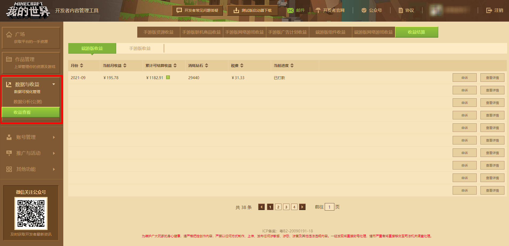
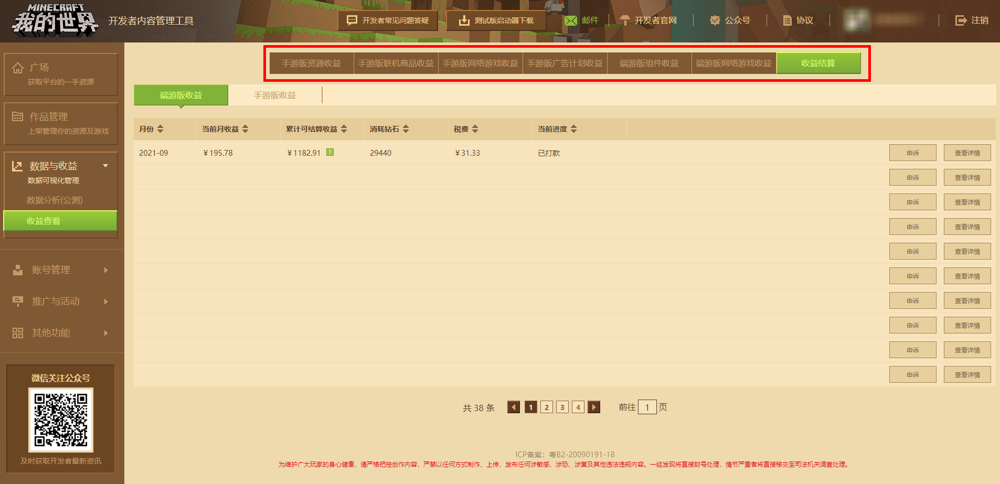
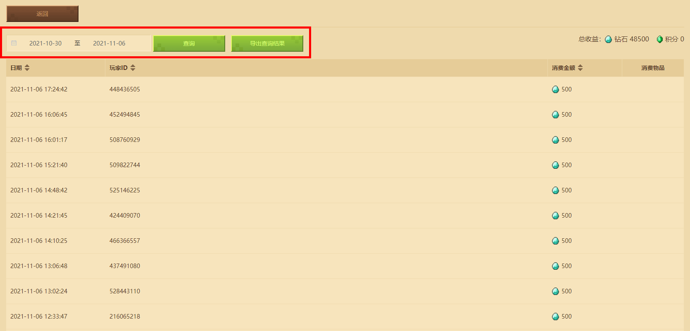
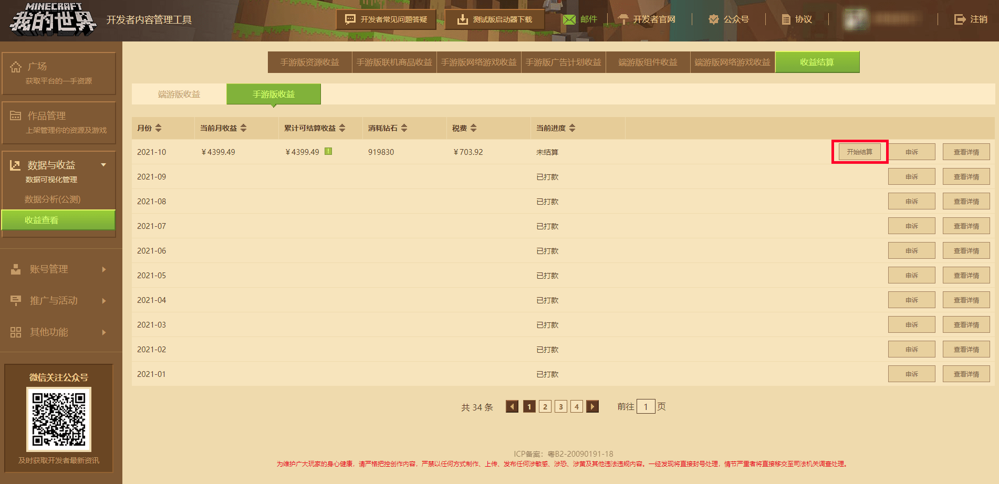

# 收益查看和结算

在开发者平台左侧点击 **【数据与收益】** ，然后点击 **【收益结算】** ，再选择最后的收益结算，即可看到开发者平台每月的结算收益流水。详情如下图所示：

在上方可以切换不同类型的作品，单独查看收益。

使用搜索功能可以快速定位到其中一个作品类型下的单个商品，点击查看收益按钮查看收益。

在查看收益界面中，设定想要查询的时间范围即可根据日期统计收益，同时也可以导出查询的结果。

## 如何正确结算收益

当端游或手游单个平台当月 **累计收益满1000元** 即可在下个月结算提现。若累计收益未满1000元则不能进行结算，也可以累计多个月的收益满1000元后进行统一结算；如果一直不能满1k，可以选择年度结算，即每过完一个自然年的下个年初，平台会对上一年不满1K的收益，统一为开发者进行结算。

满足结算条件的月份，会在该月结算信息生成后，在收益结算页下找到 **【开始结算】** 的按钮。

在开始结算前开发者应当检查账号的结算信息，若银行信息有误，请通过开发者邮箱：minecraftstarter@163.com与官方人员取得联系，以便进行银行信息修改业务。 **可修改的银行信息有：银行卡号、开户银行、开户支行、开户行地址、持卡人姓名。**

若更改资料使用到新银行卡，需开发者提供本人手持新银行卡正反面和旧银行卡正反面、新银行卡和旧银行卡正反面相片，否则需提供本人手持银行卡的正反面和银行卡正反面相片。

结算相关疑问，可以查看开发者常见问题答疑，若无法解决，可通过开发者常见问题答疑内的反馈其他问题与官方取得联系。

