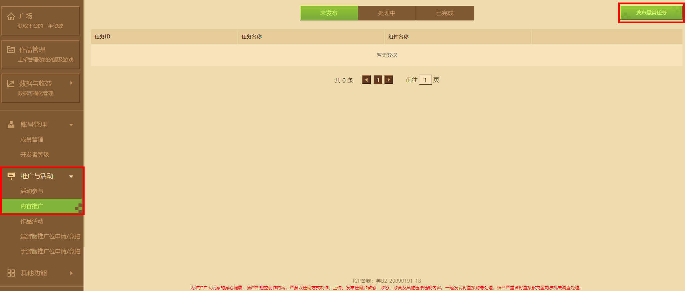
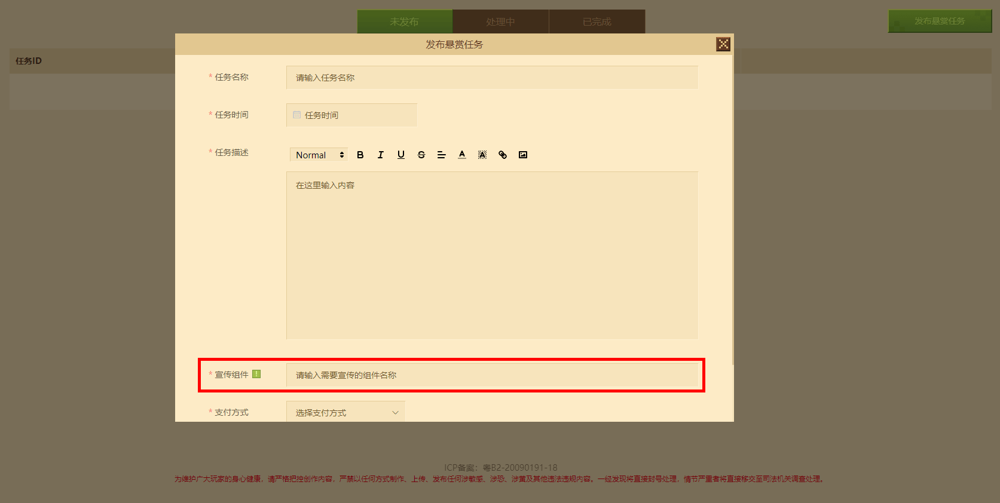
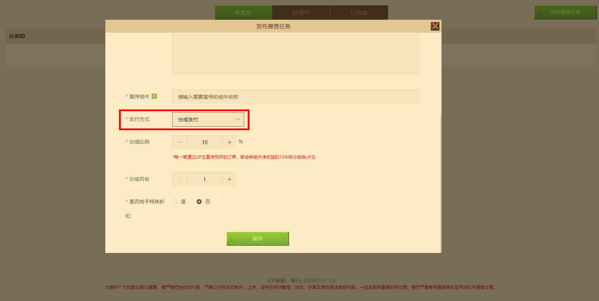
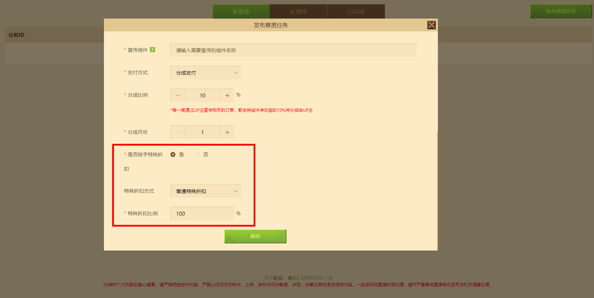
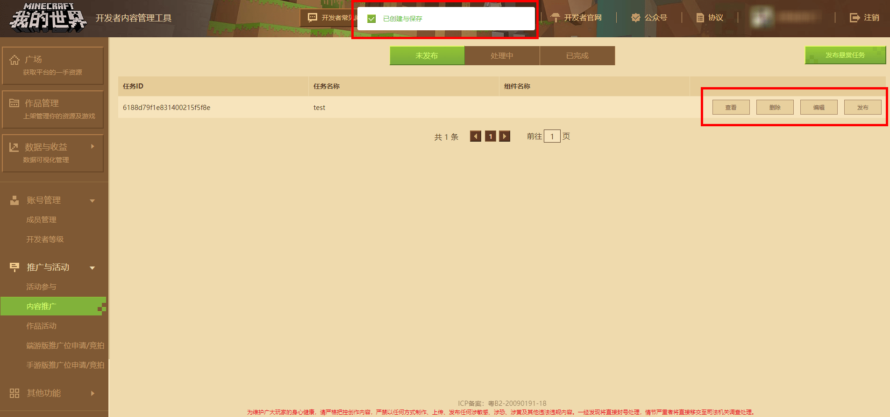
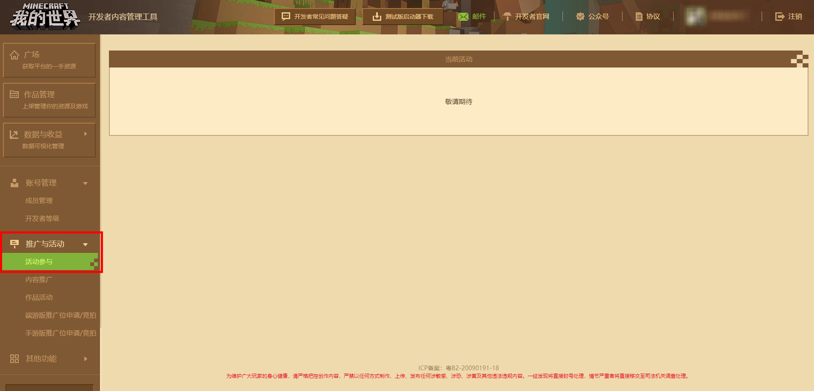

# 推广与活动

我的世界为了帮助广大开发者的作品宣传和发展，推出了多种多样的活动及推广，提升作品曝光、销量等。

## 内容推广

 **【内容推广】** 是为了协助开发者推广组件作品而开发的功能，开发者可以通过“内容推广”功能 **发布悬赏任务** ，以收益分成的方式发布推广任务，通过 **内容创作者带货** 的方式获得组件的曝光机会；双方在推广与分成的需求达成一致后即可进行合作推广。

进入《我的世界》开发者平台，点击 **【推广与活动】** 打开下拉表→点击下拉表中的 **“内容推广”** 按钮，即可进入“内容推广”管理界面；点击右上方【发布悬赏任务】按钮，即可进行悬赏任务设置。

### 发布悬赏任务

点击 **“发布悬赏任务”** 按钮后，即可进入设置页面，开发者可依据个人需求，完善任务名称、任务时间、任务描述等信息。

点击宣传组件选项，即可打开下拉表，输入关键词，即可自动联想该开发者账户内符合关键词的钻石定价组件。

点击 **支付方式** 选项，即可打开下拉表，选择向内容创作者支付报酬的方式，并填写报酬比例（目前暂只支持分成支付），通过内容创作者带货销售的组件，将由系统依据开发者填写的分成比例，自动向内容创作者支付分成报酬；如玩家通过非内容创作者带货的方式进行下载（包括但不限于资源中心，专题页面等），则无需向内容创作者支付分成报酬。

另外，开发者也可以通过 **给予特殊折** 扣促进内容创作者带货的效果，在“给予特殊折扣”选项中勾选是，开发者可自行设置特殊折扣比例，玩家通过内容创作者带货下载的组件将获得额外折扣； **如同一组件已经于资源中心已设置折扣，则给予特殊折扣将基于资源中心的折后价给予折上折。** 

设置完毕后，点击 **【保存】** 按钮，即可发布任务。

## 活动参与

进入《我的世界》开发者平台，点击 **【推广与活动】** 打开下拉表→点击下拉表中的 **“活动参加”** 按钮，即可进入“活动参加”管理界面；

活动参与模块主要为：面向全体开发者征集的作品特卖折扣活动。

当有活动举办中时，如希望能参加活动，则可以将自己符合活动的作品勾选上，并点击添加按钮，即可成功送审活动组件，官方将在一定的工作日内进行审核，符合条件的组件即可成功参加特卖活动。

**注意：部分活动中，参与特卖的组件将不支持广告观看，请根据活动注明谨慎选择。** 

