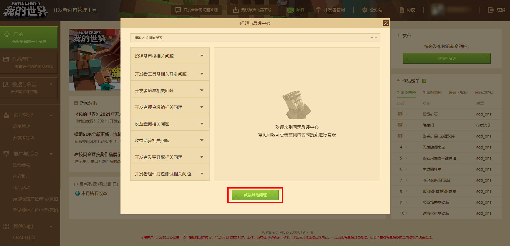
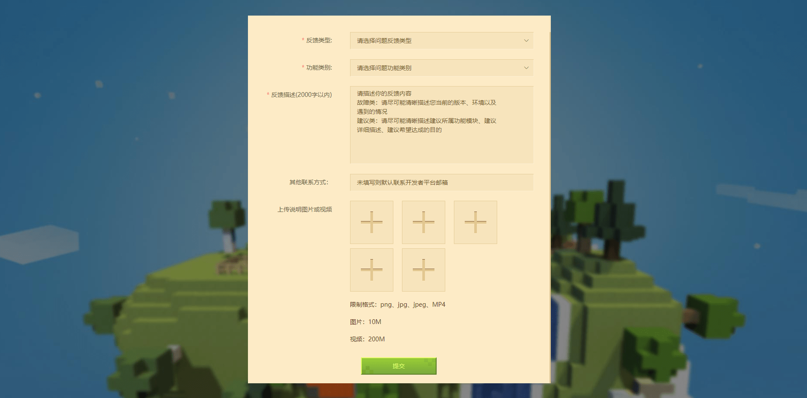
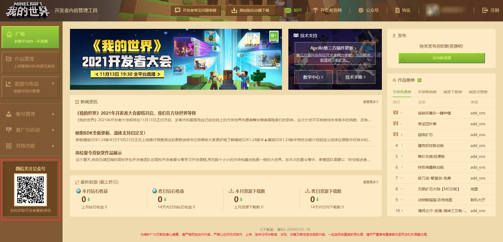

# 活动官方社群与反馈渠道

## 反馈问题答疑

在开发者平台的 **【开发者常见问题答疑】** 中，除了一些常见的问题解答外，还可以点击 **【反馈其它问题】** 按钮，针对自身遇到的问题进行反馈。

打开页面后，根据提示填写全部信息后点击 **【提交】** 按钮即可。

## 其它反馈渠道

#### 开发者QQ小站：

[点击此此链接](https://qun.qq.com/qqweb/qunpro/share?_wv=3&_wwv=128&inviteCode=1VX5Hn&from=181074&biz=ka&shareSource=5#/pc)加入我的世界开发者QQ小站频道。频道主要用于开发者之间的交流及官⽅活动发布，频道申请时需要备注开发者昵称及开发者邮箱。

#### 我的世界开发者B站号

关注我的世界开发者B站号获取获取开发者相关资讯和技术指导。

#### 我的世界开发者公众号

关注我的世界开发者公众号进行反馈并获取开发者相关资讯和技术指导。

#### 官方开发者论坛：

[http://mc.netease.com/forum-111-1.html (opens new window)](http://mc.netease.com/forum-111-1.html)，⼀般⽤于举报违规组件，或是对违规处理结果存疑时进⾏申诉。

