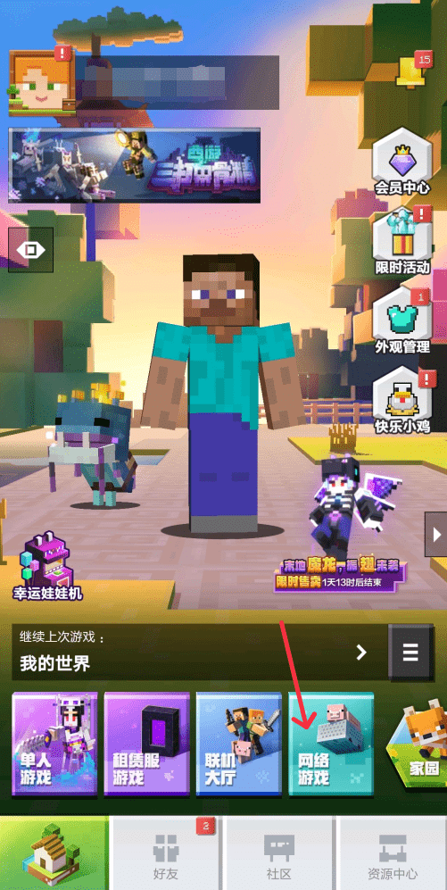
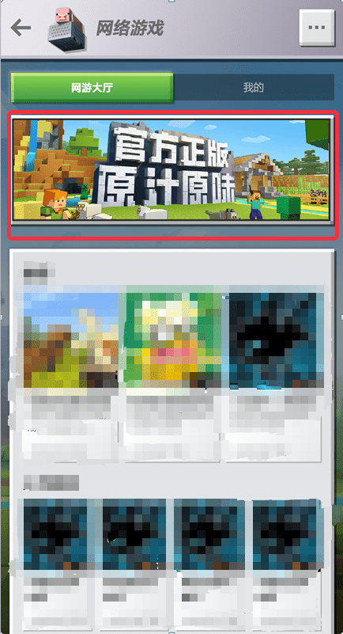
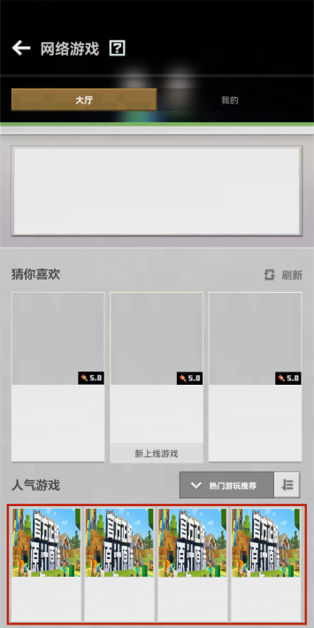

# 《我的世界》中国版PE网络游戏推广申请

### 什么是PE网络游戏？

PE网络游戏是指开发者通过官方提供的服务器资源进行玩法搭建的多人游戏服务，玩家可以在移动端点击【网络游戏】进入。

网络游戏解除了本地联机的多种限制，让玩家与玩家间可以不受时间和地区因素干扰，遇见更多兴趣相投的玩家好友。

为了使更多优质内容获得平台展示机会，PE网络游戏专区现进行**推广改版试行**。详细申请资源位及规则如下：

### 资源位—网络游戏轮播图推广位 

轮播图位于网络游戏页面的顶端，用于展示**上新**或**举办活动(含重大更新)**的网络游戏。

 

#### **展示周期**

轮播图将在**每个周二18：00~下周二17：59**展示，共7天。每个推荐周期最多有**3个**轮播图名额。若同期有新老服均申请轮播图推广位且质量相当时，将优先通过新服的申请。

#### **申请规则**

1）服主最晚可在推荐周期开始之前**3天**提出申请。例如2021.10.19~2021.10.26的推荐，最晚需在2021.10.16  18:00之前提出申请。

2）申请类型：网络游戏上新或活动，且同一推荐周期，最多只能申请一种类型。

3）每个网络游戏**终生可获得2次**上新轮播图机会，此机会需要在**上线半年之内**使用。若同期有其他非上新轮播图申请，新游可优先拿到轮播图。

2）运营活动、游戏玩法、游戏系统等方面的更新，可申请活动类轮播图。此类型申请成功后，具有**3周冷却时间**，冷却时间内不得再申请活动类轮播图。

*例如：服主成功申请2021.10.19~2021.10.26期间的推荐，则无法申请2021.10.26~2021.11.2以及2021.11.2~2021.11.9的推荐。*

#### **申请方式**

发送申请邮件到客服邮箱：minecraftstarter@163.com

申请邮件格式如下：

**1. 邮件标题：**

XXX游戏推广申请-yyyymmdd。其中“yyyymmdd”代表推荐周期开始日期，例如20230613。

**2. 邮件正文：**

期望推广时间：

例如，轮播图推广位：2023.6.13~2023.6.20/2023.6.20~2023.6.27（共7天，必须是连续的日期不能断开）

概述：本次申请的内容概述。

表格：

| 申请内容     | 详细描述                                                     |
| ------------ | ------------------------------------------------------------ |
| 是否新服上架 | 否/是                                                        |
| 是否有活动   | 包含了暑期活动，登录可获得xxxxx，累计登录xxx天，可获得xxxxxxxxx。 |
| 是否有新玩法 | 新增了起床战争玩法。                                         |
| 其他内容更新 | 无                                                           |

**3. 邮件附件：**

轮播图，尺寸：990*300。图片内容尽可能表现游戏特色，图片文字需要清晰醒目，能体现出游戏特色。另外，游戏名称最好也通过logo或文字的形式，在图片中展现出来。

**4. 评判标准：**

若同一推荐周期＞3个游戏申请轮播图，则按照以下标准挑选：

1）优先级：上新轮播图＞活动轮播图。

2）同等优先级之下，根据游戏创新程度、美术品质、运营活动覆盖面大小、玩法趣味性等方面，择优选择。

**5. 回复申请：**

客服将在每个申请周期开始**前1天**回复服主申请结果。

### 资源位—人气游戏置顶推广位 （仅面向网络游戏上新）

人气游戏置顶推广位位于网络游戏页面的人气游戏模块前排，用于展示**上新**的网络游戏。

#### **展示周期**

（1）新服上线将提供手机版网络服分页【人气游戏】置顶推广位

此时置顶推广位展示周期共计5天，例如6月14日18:00至6月19日17:59。 

（2）新服开启商业化后将提供【人气游戏】置顶推广位。

此时置顶推广位将展示共计14天，例如6月14日18：00至6月28日17：59

**温馨提示： 人气游戏置顶推广位可前往开发者平台-【推广与活动】自助进行申请，一旦配置成功将不支持时间修改，请开发者谨慎操作。 除此之外，我们将根据实际推广效果评估置顶推广位是否延长或缩短曝光时间，并在进行此类操作前与开发者沟通。**

### FAQ

#### 1. 轮播图申请是否需要费用？

答：现阶段暂未开放竞拍申请方式，仅支持免费申请。官方审核人员将根据申请的质量，发放轮播图资源。

#### 2. 关于PE推广位及申请有相关问题该如何反馈？

答：如有任何疑问或建议，欢迎各位开发者加入QQ频道【我的世界开发者】进行反馈或提问，频道内将有专人回答/记录您的问题或反馈。

