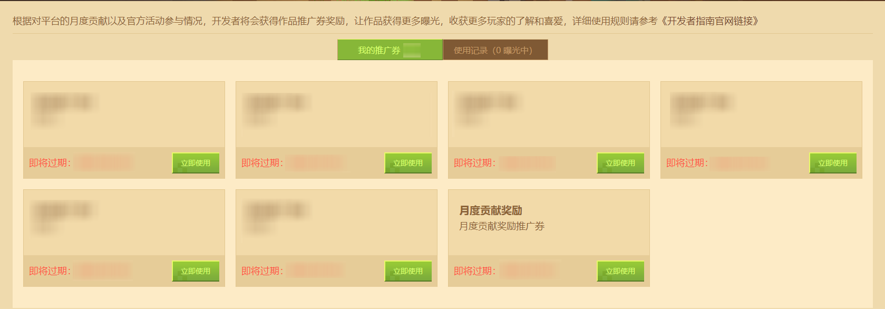
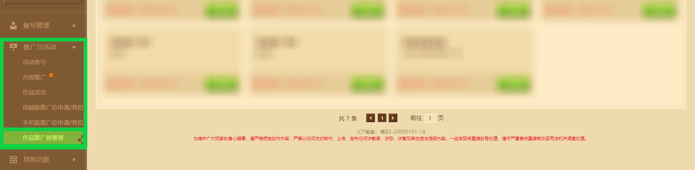
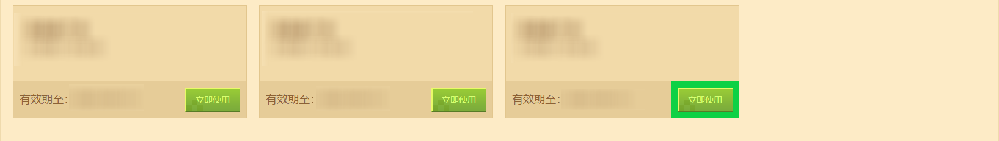
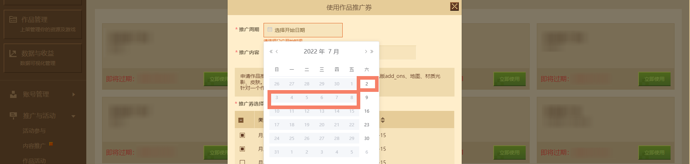
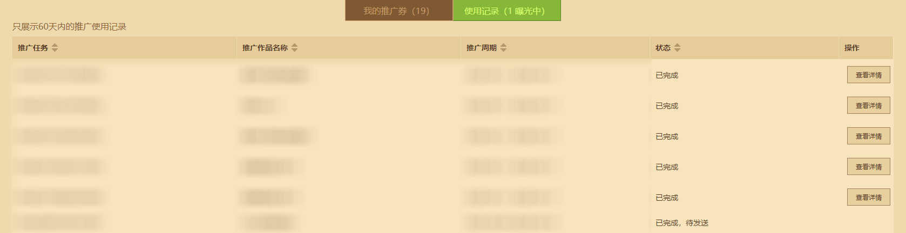
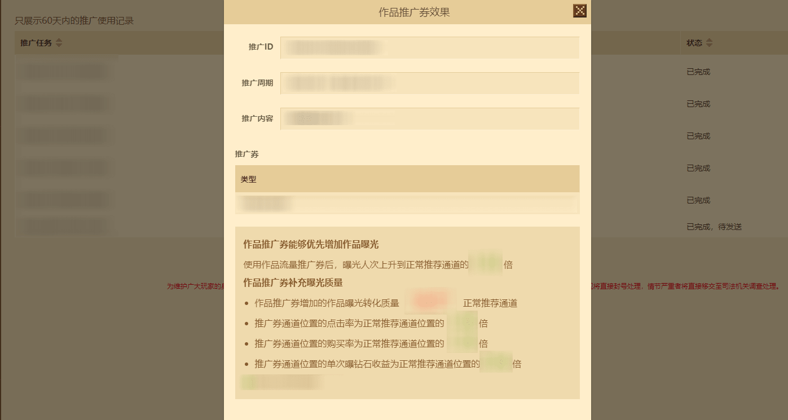

# 开发者作品推广券使用指南

为了争取让 **开发者们** 的优秀作品获得更多玩家的青睐，《我的世界》开发者平台上线 **【作品推广券管理】** 功能，在开发者平台找到 **【推广与活动】** 模块进入即可找到该模块。在这里，开发者可以 **搭配开发者作品推广券** ，随时随地想推就推。

## 说明

**开发者作品推广券** 是一种全新的 **扶持形式** ，官方将针对内容生态有杰出贡献的开发者发放 **开发者作品推广券** 作为奖励，更好地助力 **优秀作品** 在《我的世界》客户端获得 **流量推荐** ，收获玩家更多的喜爱。

目前上线的 **推广位申请与竞拍** 模式，已帮助多位开发者的作品进行专属曝光，助力提升作品下载和玩家游玩量。而 **开发者作品推广券** 则是更加动态/定向的 **广告** ，可以实现热门档期的 **精准投放** ，争取获得最佳的曝光效果。

目前已获取的 **开发者作品推广券** 时间向后推3个月为每张的到期日期。请尽快在到期日期前使用。

## 如何使用开发者作品推广券

进入《我的世界》开发者平台，点击左下角 **【推广与活动】** 模块，选择 **【作品推广券管理】** 功能。

选择任意一张有效期内的推广券，点击 **【立即使用】** 。 **注意：临近有效期的推广券到期日期时间将被醒目标红。** 

使用弹窗需依次填入 **【推广周期】** 、 **【推广内容】** 、 **【推广券选择】** 三个必填项。未填选符合预期的结果将无法提交表单数据。以下是三个填入区域的介绍：

**推广周期：** 涵盖可选周的周六至次下周的周五一周时间。因此推广周期日历栏只能选择每个可选周的周六。

**推广内容：** 作品定价需要 **高于300钻石** ，类型范围在 **手机版平台内的Add-on、地图、材质光影、皮肤组件** 。

**推广券数量：** 针对一个作品每个周期最多使用两张 **开发者作品推广券** 。推荐使用有效期临近到期时间更近的推广券。

确认好信息后，点击提交按钮即可提交推广排期。 **注意：申请后所使用的开发者作品推广券将马上扣除，暂不支持撤回或修改。** 

至此，一个完整的开发者推广券使用流程就完成了。

## 查看开发者作品推广券曝光效果

在 **【作品推广券管理】** 功能的 **【使用记录】** 标签下，对应使用中的 **开发者作品推广券** 可能 **等待中** 、 **曝光中** 、 **已完成，待发送** 和 **已完成** 四种状态。

| 推广任务状态   | 状态说明                                                     |
| -------------- | ------------------------------------------------------------ |
| 等待中         | 推广任务等待进入推广周期。                                   |
| 曝光中         | 推广任务正在进行曝光，请等待一周左右时间。                   |
| 已完成，待发送 | 推广任务已结束，曝光结果将在次周三开放查看。                 |
| 已完成         | 推广任务已结束，可点击 **【查看详情】** 查看 **开发者推广券** 使用效果。 **记录只展示60天内的推广使用记录，如需记录请及时查收。** |

**【查看详情】** 按钮出现时，可以点击按钮查看 **开发者推广券** 使用效果。

