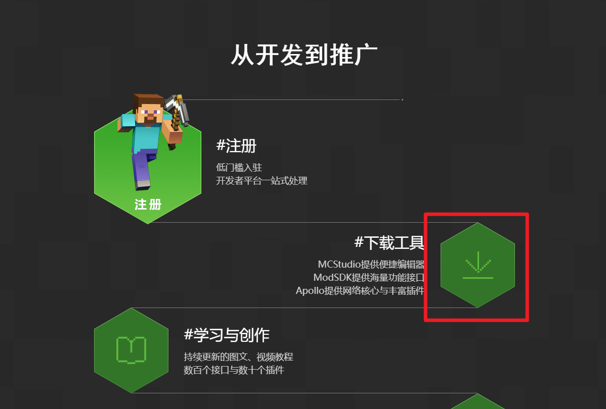
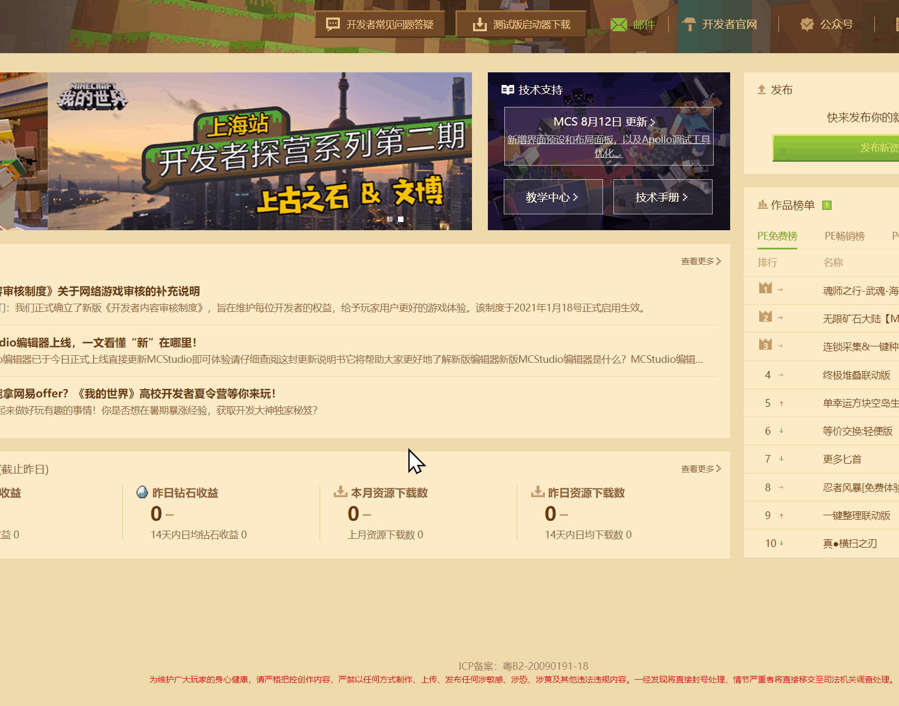

# 我的世界开发工作台常见问题

### 开发工作台是什么？

开发工作台是一个我的世界模组制作工具的集合，包含编辑器，作品管理，作品上传，基岩版电脑开发版，模组SDK，并且内嵌了开发者平台，开发者论坛。

### 我可以在哪里下载开发工作台？

在百度搜索我的世界开发者官网，点击跳转到开发者官网，下拉并找到下载工具。或者直接点击[这里](https://mc.163.com/dev/process.html#xz)下载。

### 使用开发工作台必须拥有开发者账号么？

是的，你必须拥有开发者账号才能正常使用开发工作台。

如果你现在还没有账号，[可以点击此链接](https://mcdev.webapp.163.com/#/login)进行注册。

### 开发工作台可以用于什么版本的我的世界模组/网络游戏开发？

你可以使用开发工作台直接创建和制作我的世界基岩版中国版的模组。如果你有制作好的Java版模组，也可以使用开发工作台进行上传。

除了模组外，你也可以使用开发工作台开发我的世界基岩版手机版的网络游戏。

### 我该如何进行各类模组或者网络游戏的开发？

关于开发工作台的使用，可以参考开发者[文档](../12-入门教程/20-MC%20Studio使用说明.md)。

如果你开发的是玩法模组，并且使用模组SDK，可以参考<a href="../../mcdocs/0-概述/0-概述.html" rel="noopenner"> 技术文档 </a>

此外，我们还有一些关于Add On，玩法地图，美术制作的<a href="../../mconline/100-历史归档教程/15-玩法组件教程【新版】/0-使用我的世界开发工作台制作第一个玩法/0-摘要.html" rel="noopenner"> 示例课程 </a>。

如果你想开发网络游戏，可以参考[网络游戏开服工具文档](../27-网络游戏/课程1：成为Apollo服主及相关准备/第1节：Apollo介绍.md)。

### 我如何知道开发工作台的最新更新内容？

开发工作台平均每两周到一个月更新一次，请移步[这里](https://mc.163.com/dev/mcmanual/mc-dev/mcguide/10-%E6%96%B0%E5%86%85%E5%AE%B9/1-%E5%BC%80%E5%8F%91%E5%B7%A5%E4%BD%9C%E5%8F%B0/)查看。欢迎大家尝试新功能。

### 如果我对开发工作台有意见和建议，如果反馈给官方？

你可以通过[开发者平台](https://mcdev.webapp.163.com/#/square)顶部的开发者常见问题答疑的反馈其他问题进行反馈。

或者直接点击[这个链接](https://mcdev.webapp.163.com/#/feedbackModal)。

