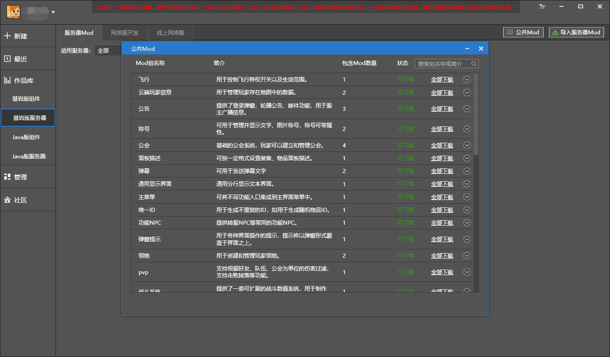
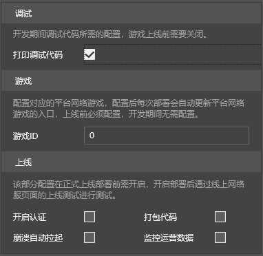
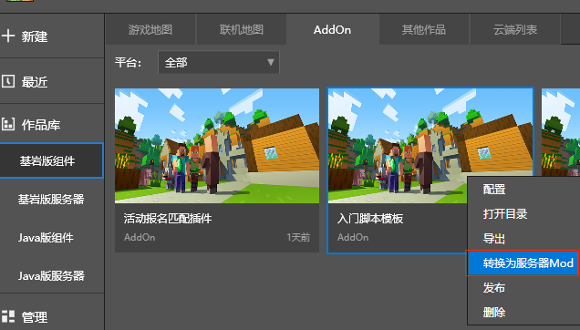
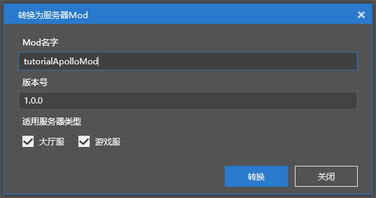
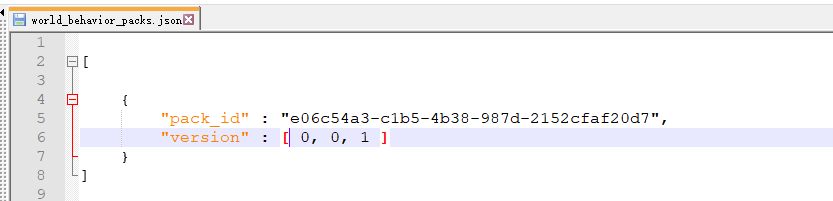
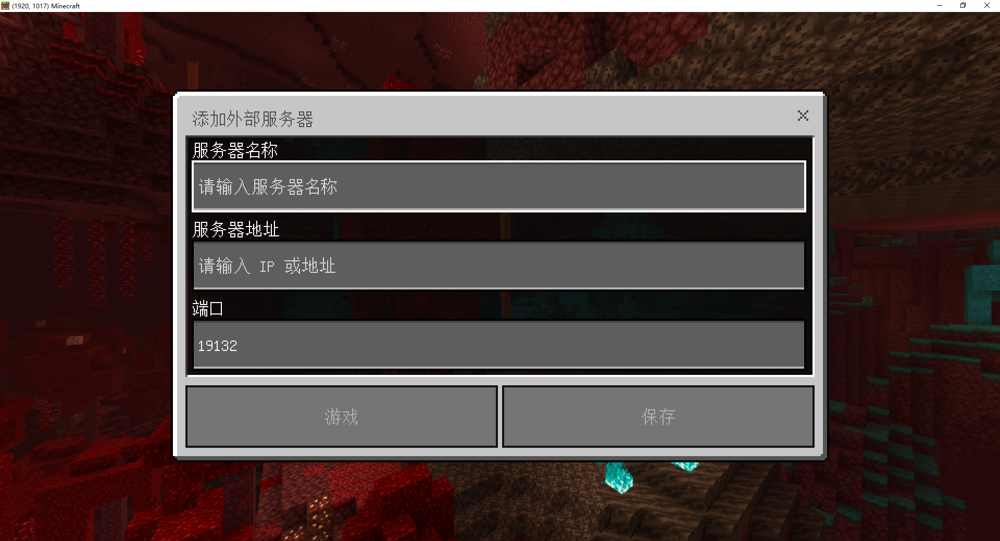
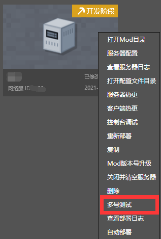
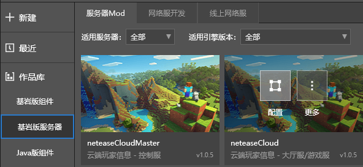
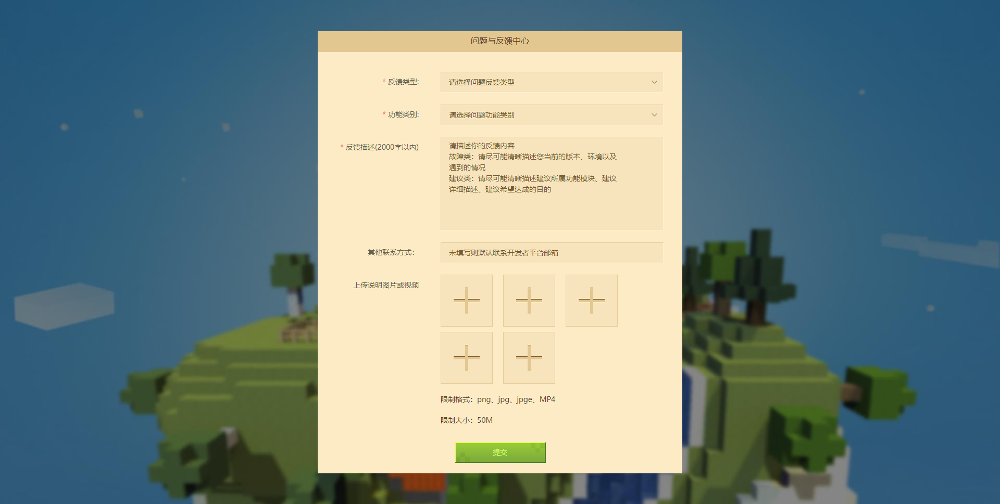

# 网络游戏开服工具常见问题答疑


## 简介篇

### **什么是网络游戏开服工具？**

网络游戏开服工具是由我的世界中国版开花组维护的PE版网络游戏服务器集群工具。它被内置于我的世界开发工作台中，集成了负载均衡、集群管理、运营指令、多号协作的功能，同时支持**完整的原版内容**与**附加包自定义功能**。为了让服务器开发者能够更好地由浅入深地学习网络游戏开服工具，我们还为服主提供了[一站式图文教学](../27-网络游戏/课程1：成为Apollo服主及相关准备/第1节：Apollo介绍.md)和官方插件库。[点击这里](http://mc.163.com/mcstudio/)下载我的世界开发工作台开启你的手游版服主之旅吧!

### **如何入驻手游版网络游戏？**

[点击链接了解更多入驻资讯](../35-上架与入驻/课程12.1-基岩版网络游戏入驻指南.md)

### **我在之前没有了解过网络游戏开服工具，想知道它的开发难度有多大？**

开花组为想要了解网络游戏开服工具的开发者们提供了内容开源的官方插件库。基于官方插件，开发者可以针对自己需求进行二次开发快速积累经验。

目前插件使用的框架是模组SDK，开花组根据服务器架构还另外新增了控制服、大厅与游戏服、功能服接口与事件。由于插件可能需要读写玩家数据，为了应付来自服务器玩家的大量数据请求与访问，在网络游戏开服工具下的模组SDK还额外包装了操作数据库的接口。根据这些信息，我们将所需掌握的技术要点和预想下的开发者自身条件配对，列出以下表格，以供开发者针对自身条件进行难度评估：

| 技术/开发者能力程度     | 正在使用模组SDK制作组件的开发者 | JAVA版插件开发者 | 使用自定义附加包功能的开发者 |
| ----------------------- | ------------------------------- | ---------------- | ---------------------------- |
| 附加包结构              | ✔️                               | ➖                | ✔️                            |
| 少量命令行知识          | ➖                               | ➖                | ➖                            |
| 基于Python语言的模组SDK | ✔️                               | ➖                | ➖                            |
| 数据库Sql语法           | ➖                               | ✔️                | ➖                            |

**注：✔️代表开发者拥有相关的开发经历，这些经验对于制作手游版网络游戏同样十分重要。➖代表开发者需要提前掌握该能力。**

### **我想要尝试学习开发手游版网络游戏但没有经验，我能从官方这里得到什么帮助吗？**

为了进一步降低开发者学习手游版网络游戏的物理成本和学习成本，我们为获得入驻资格的开发者提供免费的开发测试机。您也可以将日常遇到的技术问题、优化建议通过 **【开发者平台】-【开发者常见问题答疑】-【反馈其他问题】** 进行反馈，官方会通过开发者平台站内邮件维护问题，帮助您的服务器和我们的网络游戏开服工具变得更好！


## 插件篇

### **我是一名刚开始使用网络游戏开服工具的服主，想知道从哪里能够获得它的插件呢？**



打开我的世界开发工作台切换至基岩版服务器，点击右上方的公共MOD按钮，会弹出由官方**整合常用需求并长期维护**的网络游戏开服工具插件。服主不用担心版本升级导致插件失效的问题，同时官网也会持续拓展插件库的**数量**与**功能**，让服主能便捷开发网络服。

### 我想对官方插件进行二次修改以满足自己的最大化需求，请问这是允许的吗？

官方插件基本覆盖了开服的方方面面。若您对若干插件有着自己的想法，**开花组并不会限制大家的创造力**。只需将公共MOD下载至本地，您就可以获得插件MOD的全部源码和美术素材来进行**二次开发和调整**。

### 我还想要获得更多的插件，请问官方的公共插件池未来会如何扩容呢？

开花组会在不同的时间节点去调研时下服务器开发者最需要的缺口插件榜单。在这里我们也**诚挚邀请有志愿的插件开发者与我们共建手游版网络游戏的插件生态**。官方将为协助制作网络游戏开服工具插件的开发者提供**资金支持**、**免费的测试开发机**以及**专业团队的开发辅导**，让服主拥有一个更加灵活、便捷的开服条件！

### 我想借助Python的生态在开发中使用第三方类库，请问应该怎么做呢？

从安全性上考虑，开发者是无法直接上传或导入第三方类库。已经在使用网络游戏开服工具进行开发的服主或插件开发者，可以通过 **【开发者平台】** - **【开发者常见问题答疑】** - **【反馈其他问题】** 提交类库清单，官方将会进行实用性、安全性等评估，最后通过开发者平台邮件回复是否采纳。

## 部署篇

### 网络游戏开服工具的部署是什么？

部署是指开发者通过我的世界开发工作台将保存在本地的服务器开发内容部署到远程主机，并根据业务需求的不同阶段对服务器进行不同程度的更新推送。

### 有多少种部署的方式呢？

当前服务器支持三种部署方式：

- 智能部署：根据配置条件，采用滚动新玩家进入新服，旧服持续到旧玩家离开后优雅停机的方式。但若对全局配置项如控制服、功能服、数据库等其他配置做了改动，则会直接触发重新部署。
- 重新部署：将强制踢出全部在线玩家，清空网络服文件、日志，再重新上传本地MOD内容至远程主机上。
- 热更：指在不对服务器停服的情况下更新服务器部分代码。它的执行有以下前提：
  - 修改的Mod内容**只包含运行在服务端部分**的代码，即**developer_mods**里的代码修改。
  - **只修改了函数内实现。**新增函数或在**\__init__**内调用新的函数不会在热更下生效，需要进行重新部署。

### 除此之外，我还需要注意什么其他部署细节呢？

在制作服务器期间，一共会包含**开发**、**审核**、**上线**三个阶段，三个阶段还会有额外的部署细则需要分别勾选。



|              | 开启认证 | 打印调试代码 | 打包代码    | 崩溃自动拉起 | 运营数据 |
| ------------ | -------- | ------------ | ----------- | ------------ | -------- |
| **开发阶段** |          | ✔            | ✔（非必须） |              |          |
| **审核阶段** |          | ✔            | ✔           |              |          |
| **上线阶段** | ✔        |              | ✔           | ✔            | ✔        |

- **开启认证**：只有上线阶段需要开启。
- **打印调试代码**：只有开发阶段和审核阶段需要开启。
- **打包代码**：只有审核和上线阶段必须勾选，开发阶段可以可选，但勾上后，将无法使用 **热更新** 功能。
- **崩溃自动拉起**：只有上线阶段需要开启。
- **运营数据**：只有上线阶段需要开启。


## 开发篇

### 在开发阶段，我应该如何选择部署方式达到代码修改的结果呢？

在单机开发环境中，我们推荐您可以选择使用热更或重新部署的方式来进行代码更新的作业。如果插件MOD只修改了函数内的逻辑，使用热更功能将会很方便地让您在短时间里测试到修改后的内容。若代码改动较大，则需要使用重新部署，这个过程耗时会比热更长。

### 我有现成的资源中心MOD，想转化成服务器MOD，应该要怎么做呢？

网络服务器的MOD同样分为客户端部分和服务端部分。但与在网络游戏不同的是，本地联机的房主玩家既扮演服务端主机，同时也是客户端。而网络游戏下，远程的服务器主机运行着服务端的代码，客户端的代码则会被用附加包的方式传送至玩家手机上进行加载。因此需要将两端脚本文件放到不同的文件夹进行保存。**我们推荐使用MCSTUDIO将Mod转化成网络游戏Mod**。这里以官方的入门脚本模板为例子：



- 对附加包目录下的入门脚本模板点击更，将Mod转换为服务端Mod



- 输入Mod名字为tutorialApolloMod，点击转换，我们就得到一个网络游戏Mod了


- 打开网络游戏Mod，可以看看转换后Mod的目录，这是MCStudio替我们执行了上面“Mod转化成网络游戏Mod”过程，但是转换后Mod的客户端和服务端逻辑还没有分离，需要按照“服务器与客户端”进行调整。

一个健全的ApolloMod目录标准如下：

```
tutorialApolloMod
	behavior_packs
		tutorialBehavior
	developer_mods
		tutorialDev
			tutorialScripts
	resource_packs
		tutorialResource
	worlds
		level
			world_behavior_packs.json
			world_resource_packs.json
```

| **文件/文件夹**           | **解释**                                                     |
| ------------------------- | ------------------------------------------------------------ |
| tutorialApolloMod         | 游戏服Mod根目录                                              |
| behavior_packs            | 存放客户端行为包，可以包含多个行为包                         |
| tutorialBehavior          | 行为包                                                       |
| developer_mods            | 存放服务端Mod，这些Mod只会运行在服务器，不会传送给客户端     |
| tutorialDev               | 服务端Mod                                                    |
| tutorialScripts           | python脚本的根目录，该目录的脚本会被加到python运行环境下，可以从该路径开始import脚本文件，例如from tutorilaScripts import modMain |
| resource_packs            | 存放客户端资源，可以包含多个资源包                           |
| tutorialResource          | 资源包                                                       |
| worlds                    | 存放地图，还包含world_behavior_packs.json和world_resource_packs.json |
| world_resource_packs.json | 配置客户端需要下载的资源包                                   |
| world_behavior_packs.json | 配置客户端需要下载的行为包                                   |

在过去开发玩法MOD时，一般会在入口文件内同时注册客户端和服务端的自定义系统。而在插件Mod中，应强调在develop_mods下的脚本注册服务端系统，并调用服务端接口。客户端系统的注册和接口调用则应被放到行为包文件夹内。包装着对应系统的文件夹和文件也应该按照这样的分类去拆分，一方面这样可以**方便代码管理**，另一方面可以**避免客户端脚本被破解而导致包含的服务端代码泄露**。

最后记得对world_behavior_packs.json和world_resource_packs.json配置来自资源包和行为包的manifest信息，将header层级下的uuid、version字段对应值配对pack_id和version即可。



**[更多详细内容请戳官方教程链接](../27-网络游戏/课程1：成为Apollo服主及相关准备/第1节：Apollo介绍.md)**

### 我该如何在开发服务器内进行单人/多人测试呢？

若想要进入服务器进行单人测试，点击网络服项目的开发阶段，再点击开发测试即可。而多人测试分为多台PC终端以及一台PC终端多号测试的情况。若是多台终端连接服务器，[可以使用子账号协作功能](../27-网络游戏/课程7：开发技巧/第2节：多账号协同部署.md)。若只有单机开发但想要多人测试，可以在主账号中获得服务器IP和端口，通过MCSTUDIO右上角的工具箱—ModPC客户端多开客户端裸连服务器。



同样也可以在服务器项目上右键点击多号测试按钮呼出多个客户端进行联机，验证玩法完整性。




## 使用篇

### 我想要在服务器控制台上执行指令，请问该怎么做呢？



根据官方插件规范，服主可以选择相应插件的配置入口进入插件文件夹，双击readme.txt文本获得运营指令，**登录开发机器**给master发送curl请求，即可获取结果。以云端玩家信息插件为例：

- 云端信息插件支持使用运营指令查询玩家云端信息

```
post url: http:masterip:masterport/cloud/query-user-cloud-items
post body:{
    "uid" :1357471387 #玩家uid
    "apply_tag" :tag0 #数据适用的tag，当云端插件用于不同服务器类型是生效。tag相同的云端插件数据共通
}
```

- 其中http:masterip:masterport可以在MCSTUDIO的网络服开发区域下找到自己当前网络服的master ip和端口。cloud是插件标识符，避免存在多个MOD注册同一指令造成冲突的情况。

- 假设masterip是使用本机127.0.0.1，端口为8001，则指令使用规则为：

  ```shell
  curl -X POST http://127.0.0.1:8001/cloud/query-user-cloud-items  ‘{"uid" :1357471387, "apply_tag" : "tag0"}’
  ```


- 若传输的http消息正确，则会返回以下数据信息：

```json
{
    "entity": {
        ...
    },
    "code": 0,
    "message": ""
}
```

如果对指令输入仍有疑问，可查阅下列教程：**[公告插件使用](../27-网络游戏/课程3：简易网络服模板部署与常见操作/第7节：官方插件.md)**


## 还有一些其他问题？

请登录[开发者平台](https://mcdev.webapp.163.com/#/login)，在[开发者问题答疑表单链接](https://mcdev.webapp.163.com/#/feedbackModal)里提交您的问题吧！

