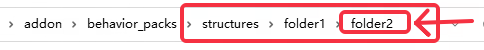
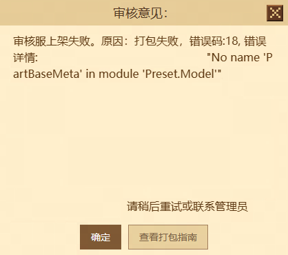
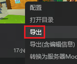
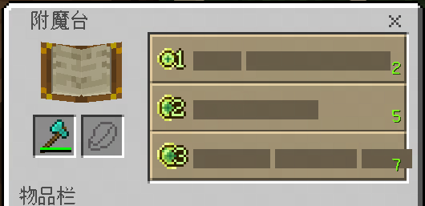
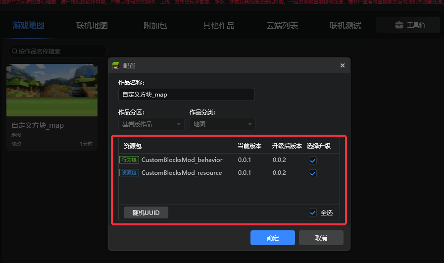

# 我的世界中国版打包错误信息汇整

有关手动打包作品资源的方法，请点击查看 [我的世界中国版资源上传规则](../35-上架与入驻/课程11-我的世界中国版资源上传规则.html)。

有关我的世界开发工作台一键打包作品资源的方法，请点击查看 <a href="../../mconline/10-addon教程/第18章：打包导出你的作品/课程01.包体的结构和导入.html" rel="noopenner">[我的世界开发工作台包体导入] </a>和 <a href="../../mconline/10-addon教程/第18章：打包导出你的作品/课程02.包体的导出.html" rel="noopenner">[我的世界开发工作台包体导出]</a>

## 机审打包错误代码汇总

### 打包错误代码1【UnDefine】

表示未定义的返回值，打包脚本内部报错。

### 打包错误代码2【NoMod】

表示不包含 python 的 Mod，该返回值暂时未使用。

### 打包错误代码3【PackTypeError】

表示调用了未给定的 PackType 打包类型。

### 打包错误代码4【PackTypeError】

表示调用了未给定的 PackType 端口类型。

### 打包错误代码5【McpPackPathError】

表示调用的 McpPack.out 文件路径有问题，不存在或错误。

### 打包错误代码6【DirError】

表示目录错误，组件未按目录组织的要求，导致打包系统不可解析。已知信息中，会触发以上错误的原因有：

> 地图组件：
> - 未携带level.dat_old，levelname.txt等。可以尝试使用我的世界开发工作台（MC Studio）导入地图，它会自动帮地图重新生成这两个文件。
> - addon组件中structures文件夹下相对路径超过2层，会进行拦截，如下图所示：

### 打包错误代码7【UnZipError】

表示解压 zip 文件错误，属于 zip 文件本身有问题不可解压。

### 打包错误代码8【PackMcpError】

表示对 python 脚本进行打包的过程中出现问题，很大可能是脚本语法存在问题。

### 打包错误代码9【GetAllError】

表示在程序中获取解压后的文件目录出问题，打包脚本内部报错。

### 打包错误代码10【NoManifestError】

已知信息中，会触发以上错误的原因有：

> - 表示在打包的过程中发现 behavior_packs 中没有 manifest.json文件。
> - 表示在资源包中存在entities文件夹，目前机审需要使用entities文件夹来判断行为包，文件夹重名将导致导致机审错误。
> - 表示对地图组件多嵌套了一层以上的文件夹。

### 打包错误代码11【ComputerSystemError】

表示打包脚本内部报错，使用了 Windows 和 Linux 之外的系统进行打包。

### 打包错误代码12【NoLevelError】

表示在打包 NetGame 和 Lobby 的时候发现没有 Level 地图数据。

### 打包错误代码13【HasLevelError】

表示在打包商品 Mod 的时候发现存在 Level 地图数据，属于包含了不应该有的文件内容。

### 打包错误代码14【CopyDevelopError】

表示将 python 脚本拷贝到 developer_mods 的过程中出现问题，打包脚本内部报错。

### 打包错误代码15【 ZipToDirError】

表示将处理后的包压缩成新的 zip 包的时候出问题，打包脚本内部报错。

### 打包错误代码16【FileOrPathNameError】

表示打包系统在解压上传的 zip 文件时发现文件名称存在无法解析的字符，可能是中文或无法解析的符号。

### 打包错误代码17【 MoveToDirError】

表示将打包后的 zip 文件移动到指定目录出问题，打包脚本内部报错。

### 打包错误代码18【CodeReviewError】

已知信息中，会触发以上错误代码可能存在下列情形：

> - 表示对整个包进行代码检查时发现有使用未开放 API 或语法错误或禁止使用的方法。
>
>   解决办法：去除代码中的违规接口和模块。
>
> - 表示在我的世界开发工作台导出作品时，使用了【导出（含编辑信息）】的方式导出，导致出现如下报错，详细见示意图：
>
>   
>
>   解决办法：通过我的世界开发工作台的【导出】选项进行导出。
>
>   

### 打包错误代码19【 IncreDownloadError】

表示增量打包manifest文件时出问题，打包脚本内部错误。

### 打包错误代码20【FindBehaviorAndResourceError】

表示在搜索资源包或行为包时发生错误。如果无行为包，请检查manifest.json同级下是否有文件夹命名为resource_pack，如果有请改名。

### 打包错误代码21【EncryptError】

表示平台对组件进行加密处理时出现问题。请勿将中国版已上架发布的组件源文件进行二次投稿。现在平台对上传的组件都做了加密处理，请勿将已加密过的组件资源进行投稿上传。

### 打包错误代码22【 CreateContentsFileError】

表示创建content.json文件时出问题，打包脚本内部错误。

### 打包错误代码23【WriteLevelDatError】

操作组件中level.dat或level.dat_old文件时出现异常，请检查对应文件内容是否有异常。

### 打包错误代码24【ResourcePackUnvalid】

文件夹结构错误，请确保资源包文件夹中有textures或shader文件夹，在行为包文件夹中有entities文件夹，且根目录中没有其他无关文件。

### 打包错误代码25【TexturesListLoadError】

表示读取json文件失败，可能是对应的json文件存在问题。已知信息中，会触发以上错误的原因有：

> - 表示json文件的编码有误，应为utf-8。
> - 表示json文件的格式有误，可使用json格式化工具进行检查。

### 打包错误代码26【TexturesSizeError】

表示贴图文件大小导致的报错，可以检查是否存在过大的贴图文件。

### 打包错误代码27【NameOverSizeError】

表示 zip 文件内存在文件名过长的文件，请检查对应的文件名是否过长。

### 打包错误代码29【PlayerEntityJsonReviewError】

表示resource_packs/entity/ 路径下自定义的player.entity.json中的render_controllers定义不符合规范，请确认至少同时保留以下4个render_controller:

```json
{
    // player.entity.json
    "render_controllers":[
        {
            "controller.render.player.first_person":"variable.is_first_person"
        },
        {
            "controller.render.player.third_person":"!variable.is_first_person && !variable.map_face_icon"
        },
        {
            "controller.render.player.first_person_bloom":"variable.is_first_person"
        },
        {
            "controller.render.player.third_person_bloom":"!variable.is_first_person && !variable.map_face_icon"
        }
    ]
}
```

### 打包错误代码30【ReadLevelDataError】

表示读取level.dat文件失败，请检查资源包中该文件是否损坏、缺少字段或不存在。

### 打包错误代码31【MapItemVersionError】

表示地图组件的游戏版本大于当前《我的世界》中国版支持的最高游戏版本。

### 打包错误代码33【AudioReviewError】

表示组件内携带的音效格式非.ogg格式，或.ogg格式的音效码率大于128。开发者平台站内邮件会告知相应音效的所在路径，请将音效格式转为.ogg格式并设置码率不大于128。

### 打包错误代码34【GlyphReviewError】

表示自定义的位图字体（Bitmap Font）未满足中国版2.2（基岩版1.18）以上的要求，位图字体需要满足以下条件：

- 贴图大小为256*256。
- 每个字体的长宽均为16个像素。
- 透明像素的RGBA通道需要全部为0，否则将导致字体显示异常，如图所示。



### 打包错误代码35【CodeExceptionError】

表示已检测到的文件中，变量命名、文件名、函数名存在超过5个连续相同字符。为了脚本安全性考虑，请对存在超过5个连续相同的字符进行修改。

### 打包错误代码36【McpFileError】

表示上传的原始包体中存在已编译的模组SDK编译文件（.MCP文件），开发者平台针对过去携带MCP文件的原始包体不会再进行 **重复打包** 或 **重复处理** ，请在原始包体内删除此类文件后重新投稿上传。

### 打包错误代码37【ManifestJsonError】

表示附加包内的资源包与行为包`manifest.json`（清单文件）没有添加`min_engine_version`（最低版本信息）或`min_engine_version`的版本低于1.18.0，可参考以下json格式进行修改：

- 资源包

  ```json
  {
      "format_version": 1,
      "header": {
          "uuid": "xxxxxxxx-xxxx-xxxx-xxxx-xxxxxxxxxxxx", // UUID需唯一，此处仅作演示
          "version": [1, 0, 0],
          "min_engine_version": [1, 18, 0]
      },
      "modules": [
          {
              "type": "resources",
              "uuid": "xxxxxxxx-xxxx-xxxx-xxxx-xxxxxxxxxxxx", // UUID需唯一，此处仅作演示
              "version": [1, 0, 0]
          }
      ]
  }
  ```

- 行为包

  ```json
  {
      "format_version": 1,
      "header": {
          "uuid": "xxxxxxxx-xxxx-xxxx-xxxx-xxxxxxxxxxxx", // UUID需唯一，此处仅作演示
          "version": [1, 0, 0],
          "min_engine_version": [1, 18, 0]
      },
      "modules": [
          {
              "type": "data",
              "uuid": "xxxxxxxx-xxxx-xxxx-xxxx-xxxxxxxxxxxx", // UUID需唯一，此处仅作演示
              "version": [1, 0, 0]
          }
      ]
  }
  ```

### 打包错误代码38【MakeBehaviourPackJsonError】

表示机审在读取附加包内的`manifest.json`（清单文件）时出现异常，已知信息中，会触发以上错误的原因有：

- 表示`json`文件的编码有误，应为`utf-8`。
- 表示`json`文件内存在不相关的内容，如使用`\* *\`进行注释。

### 打包错误代码40【InvalidJsonDataError】

表示机审在读取所有的`json`文件时出现异常，已知信息中，会触发以上错误的原因有：

- 表示`json`文件的编码有误，应为`utf-8`。
- 表示在`json`文件中，如果使用如`xx:数字`的键值命名，由于微软底层代码更改，这种格式现被解释为查询图集的指定图片，容易导致图片显示异常。如果数字序号超出`Int32`范围，还会引发`out of range`错误并导致游戏崩溃。

## 其他打包错误信息汇总

### 打包错误之皮肤图片必须包含Alpha通道

表示皮肤图片缺少Alpha通道。请把皮肤源图片文件导入Photoshop等图片处理软件里，检查颜色通道，并导出成png图片。或使用MCSkin3D或Skinseed将皮肤源文件导入后再次导出，最后再进行上传。

### 打包错误之上架接口调用失败

请检查打包文件夹内的命名是否有中文或特殊符号，以及开发者平台作者简介和作品介绍是否有部分无法解析的特殊符号（**如Emoji**）。若存在以上情况，需重新调整后再提审。若问题依然存在，在 **【开发者平台】** 的 **【开发者常见问题答疑】** 下，点击 **【反馈其他问题】** 提交问题，反馈结果将通过开发者邮件发送至开发者平台邮箱。

### 打包错误之UUID冲突，请重新生成

表示上传作品中，行为包或资源包的清单文件（manifest.json）里的UUID与平台现有作品的UUID重复。请查看[组件打包发布](../30-测试/3-组件打包发布.html#组件配置)文档中的组件配置功能说明，使用 **《我的世界》开发工作台** 导入作品，可一键替换组件或地图内组件的UUID与版本号。

