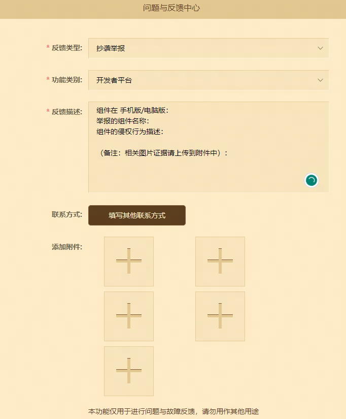

# 开发者常见问题汇总

本章根据开发者日常反馈，汇总了包含审核相关、开发者工具相关、收益结算、开发者账号信息等一系列常见问题。

## 一、审核相关：

### 1、组件投稿、上架与下架

**Q：如何投稿组件到电脑版/手机版组件中心呢？**

**A:** 首先，在开发者平台页面左侧点击【作品管理】，然后根据您的需求在左上方选择【手机版】或【电脑版】。接着点击发布新资源，并按照页面要求编辑完整的资料信息后点击保存。等待组件进入【未审核状态】，这时您可以点击【提交审核】按钮，将组件提交到开发者平台系统进行审核。平台将指派专门的审核人员对组件内容进行审核。一旦组件符合上架质量并通过审核，您将通过手机短信收到通知。最后，需要再次回到该页面，点击【组件上架】即可上架过审组件资源。

**Q：希望同时上架一款组件资源到手机版和电脑版平台，应该如何操作？**

**A:** 目前电脑版组件中心包含《我的世界》基岩版，因此开发者平台是支持同步手机版组件至电脑版组件中心，可在下载后使用基岩版打开。除此之外，还必须确保自己的组件格式为基岩版的格式，同时确保使用时功能适配电脑版操作。

**Q：如何下架作品？**

**A:** 进入作品管理页面后，选择编辑想要下架的已上线组件资源，点击更新按钮，进入页面后下滑至上架设置模块，点击编辑按钮，随后打勾确认需要下架的选项，并填写您下架该组件的理由，最后保存后再次提交审核，请耐心等待审核结果。当审核通过时，组件方进入下架状态。

（弱下架指经过运营操作之后，该内容无法被用户搜索、查看与购买，但已经购买的玩家用户仍能够正常使用）

### 2、 催审

**Q：组件审核需要多久时间？**

**A:** 一般情况下，普通组件的审核周期为3个工作日左右，网络游戏则需要大约10个工作日。如果您对审核进程或速度有疑问，请通过开发者平台进行提单反馈：[开发者平台问题与反馈中心](https://mcdev.webapp.163.com/#/feedbackModal?target=browser)

**Q：审核结果长时间未通过怎么办？**

**A:** 审核是需要一定周期的，请各位开发者耐心等待。如若组件作品从提交审核后若长达10日未通过审核，网络游戏则需要大约10个工作日。如果您对审核进程或速度有疑问，请前往【开发者平台】—【问题与反馈中心】，选择审核问题类型，提单进行反馈 [开发者平台问题与反馈中心](https://mcdev.webapp.163.com/#/feedbackModal?target=browser) 反馈格式如下：

### 3、 审核意见有歧义或者有相关审核规范疑问

**Q：我的组件未通过审核，应该怎么办？**

**A:** 如果您的组件未通过审核，您可以采取以下措施：

①查看错误代码和具体原因，以进行组件修改。您可以访问 [我的世界中国版打包错误信息汇整](https://mc.163.com/dev/mcmanual/mc-dev/mcguide/50-%E5%B8%B8%E8%A7%81%E9%97%AE%E9%A2%98%E7%AD%94%E7%96%91/60-%E6%88%91%E7%9A%84%E4%B8%96%E7%95%8C%E4%B8%AD%E5%9B%BD%E7%89%88%E6%89%93%E5%8C%85%E9%94%99%E8%AF%AF%E4%BF%A1%E6%81%AF%E6%B1%87%E6%95%B4.html?catalog=1) 查看错误代码和具体原因。

②如果遇到上传CDN失败的问题，请等待一段时间后重新提审。

③如果是常规组件审核不通过，根据审核意见进行修改后再次提交审核，或者在下次提审时提交补充申述说明。

如果以上方式不适用于您的情况，您可以在开发者平台常见问题答疑中使用反馈问题功能提问。

**Q：我不了解审核制度，该怎么办？**

**A:** 有关于内容审核标准和审核意见的疑问和歧义。为了提高审核的透明度和效率，我们建议您阅读：

【组件上架的规范及过审攻略】详细了解如何成功上架您的组件，请访问 [组件上架的规范及过审攻略](https://mc.163.com/dev/mcmanual/mc-dev/mcguide/35-%E4%B8%8A%E6%9E%B6%E4%B8%8E%E5%85%A5%E9%A9%BB/%E8%AF%BE%E7%A8%8B03-%E7%BB%84%E4%BB%B6%E4%B8%8A%E6%9E%B6%E7%9A%84%E8%A7%84%E8%8C%83%E5%8F%8A%E8%BF%87%E5%AE%A1%E6%94%BB%E7%95%A5.html?catalog=1)

【开发者内容审核制度介绍】了解审核制度的详细信息，请访问 [开发者内容审核制度介绍](https://mc.163.com/dev/mcmanual/mc-dev/mcguide/36-%E5%AE%A1%E6%A0%B8%E4%B8%8E%E4%B8%8B%E6%9E%B6/%E8%AF%BE%E7%A8%8B02-%E5%BC%80%E5%8F%91%E8%80%85%E5%86%85%E5%AE%B9%E5%AE%A1%E6%A0%B8%E5%88%B6%E5%BA%A6%E4%BB%8B%E7%BB%8D.html)

我们鼓励所有开发者在创建和提交内容之前仔细阅读这些指南，以确保您的作品顺利通过审核。

**Q：组件不过审，我对审核结果有异议，该怎么办？**

**A:** 对于组件审核不通过，建议您先根据平台的审核标准进行必要修改并重新提交审核。如果您对审核结果有异议，可以进入【开发者平台】—【问题与反馈中心】，选择审核问题类型，提单进行反馈 [开发者平台问题与反馈中心](https://mcdev.webapp.163.com/#/feedbackModal?target=browser) 。提交后，工作人员将会跟进处理您的问题。

**Q：上架/更新组件后，为什么再次修改提审时会出现“请三天后再次上传”的提示？**

**A:** 当您上架或更新组件后，您的组件资源会被平台保留三天的提审冷却期。在这个冷却期内，禁止再次重新提审相同的资源。这个冷却期的目的是为了防止抄袭、盗版他人作品或随意改变价格或其他信息等情况的发生。

如果您的上架作品出现紧急bug需要修复并重新提审，但受到了三天的冷却限制，您可以在开发者平台的常见问题答疑中使用反馈问题功能提出您的问题。

### 4、组件版权相关问题

**Q：如何举报抄袭、盗版、侵权的组件？**

**A:** 《我的世界》中国版获得微软正版授权，对开发者版权保护也极为重视，严厉打击盗版及侵权行为。对于触犯版权保护的行为，一旦证实，将被冻结相关收益、押金，严重者将永久封禁开发者账号。

如需举报，请提供被盗图作品的相应证据（链接地址、截图等）到【开发者内容管理平台】—【问题与反馈中心】，选择审核问题类型，按照以下格式进行反馈[开发者平台问题与反馈中心](https://mcdev.webapp.163.com/#/feedbackModal?target=browser)  ：

举报规则详见：[点击此链接](http://mc.netease.com/thread-203706-1-1.html)

工作人员将定期查阅并回复大家，请大家尽量详细描述问题，提供有价值的信息和问题案例，有助于工作人员理解并快速查验问题。

**Q：团队成员离开了我的团队，他的作品可以转移到他的开发者账号吗？**

**A:** 当前开发者平台不支持转移作品至另一个平台账号上。因为成员在未来换了新的团队，换绑组件会直接影响到[开发者等级](https://mc.163.com/dev/mcmanual/mc-dev/mcguide/32-%E5%BC%80%E5%8F%91%E8%80%85%E8%B4%A6%E5%8F%B7%E4%B8%8E%E5%9B%A2%E9%98%9F/%E8%AF%BE%E7%A8%8B14-%E5%BC%80%E5%8F%91%E8%80%85%E7%AD%89%E7%BA%A7.html?catalog=1)。付费资源绑定之后的结算问题同样很难处理。

**Q：在中国版投稿的组件如原创材质包等，是否可以根据材质包里的贴图以商业形式出售周边呢？**

**A:** 这是不可以的。利⽤游戏素材进行周边开发是⼀个非常严肃的商业行为，如果缺乏授权是不被允许的。

**Q：给其他没有开发者账号的人代投作品，请问这是允许的吗？**

**A:** 为确保玩家能自由、顺畅、安全地探索与创造，我们在此建议各位开发者尽量避免寻求他人代发资源的行为，以防出现权益纠纷。如现有或计划将组件资源由他⼈代发的开发者，建议与代发⼈签署相关纸质协议并做好备案，约定好版权归属及收益分配等。为了保证结算体系的安全公平，平台结算只认准对应资源的上传账号，请各位开发者务必记得保护好自身权益。

## 二、开发者工具及相关

**Q：官方的开发工具与接口有哪些？**

**A:**  我的世界中国版已推出免费的开发者工具及接口，其中包括我的世界开发工作台、模组SDK、网络游戏开服工具：

**我的世界开发工作台:** 是集开发者启动器、地图编辑器、关卡编辑器、逻辑编辑器、特效编辑器、云端测试平台等功能于一体的开发工具，能够为《我的世界》开发者开发和发布作品提供极大的便利。有关我的世界开发工作台的编辑器基础教学请点击[我的世界开发工作台使用说明](https://mc.163.com/dev/mcmanual/mc-dev/mcguide/12-%E5%85%A5%E9%97%A8%E6%95%99%E7%A8%8B/20-MC%20Studio%E4%BD%BF%E7%94%A8%E8%AF%B4%E6%98%8E.html?catalog=1) 查看。

**模组SDK:** 模组SDK是《我的世界》中国版提供的一套控制游戏内各种元素的Python接口，利用这套接口，能够制作出各种创新好玩的组件。若想要在游戏内实现较为复杂的逻辑，有关 [模组SDK开发文档](https://mc.163.com/dev/mcmanual/mc-dev/mcguide/10-%E6%96%B0%E5%86%85%E5%AE%B9/2-%E6%A8%A1%E7%BB%84SDK/90-1.24%E7%89%88%E6%9C%AC.html?catalog=1)与 [接口文档](https://mc.163.com/dev/mcmanual/mc-dev/mcdocs/1-ModAPI/%E6%8E%A5%E5%8F%A3/%E9%80%9A%E7%94%A8/%E7%B4%A2%E5%BC%95.html?catalog=1)可以提供非常大的帮助。

**网络游戏开服工具:** 这是由中国版开发组维护的手游版网络游戏服务器集群工具，集成了负载均衡、集群管理、运营指令、多号协作的功能，同时支持完整的原版内容与附加包自定义功能。若您是一位寻求支持完整的原版内容、插件拓展与附加包功能的服主，不妨点击 [网络游戏开服工具常见问题答疑](https://mc.163.com/dev/mcmanual/mc-dev/mcguide/50-%E5%B8%B8%E8%A7%81%E9%97%AE%E9%A2%98%E7%AD%94%E7%96%91/20-%E7%BD%91%E7%BB%9C%E6%B8%B8%E6%88%8F%E5%BC%80%E6%9C%8D%E5%B7%A5%E5%85%B7%E5%B8%B8%E8%A7%81%E9%97%AE%E9%A2%98%E7%AD%94%E7%96%91.html?catalog=1)与 [网络游戏开服工具课程](https://mc.163.com/dev/mcmanual/mc-dev/mcguide/27-%E7%BD%91%E7%BB%9C%E6%B8%B8%E6%88%8F/%E8%AF%BE%E7%A8%8B1%EF%BC%9A%E6%88%90%E4%B8%BAApollo%E6%9C%8D%E4%B8%BB%E5%8F%8A%E7%9B%B8%E5%85%B3%E5%87%86%E5%A4%87/%E7%AC%AC1%E8%8A%82%EF%BC%9AApollo%E4%BB%8B%E7%BB%8D.html?catalog=1)看看吧。

**Q：在投稿手机版组件作品时，需要掌握什么制作技术呢？**

**A:** 手机版组件涵盖皮肤组件、纹理（材质）组件、功能玩法组件、地图组件、光影组件等类型。对于不同类型的组件，需要掌握不同的技术能力才能制作出深受玩家喜爱的作品。

为了支持开发者制作出深受玩家喜爱的作品，《我的世界》官方开发者网站提供了一系列资源和工具。这些包括：

开发指南：提供了组件开发的基本指引和最佳实践。 访问[开发指南](https://mc.163.com/dev/guide.html)

API文档：详细介绍了可用的API接口及其用法。查看[API文档](https://mc.163.com/dev/apidocs.html)

在线教程：提供实用的视频教程，帮助您快速掌握关键技术。观看[教学课程](https://mc.163.com/dev/course.html)

我们持续在更新和补充更多的内容以支持开发者社区。更多内容还在持续补充和迭代中。若您有更多意见，可以点击[开发者平台问题与反馈中心](https://mcdev.webapp.163.com/#/feedbackModal?target=browser) 反馈。

### 三、收益结算相关

### 1、 收益查询相关

**Q：组件收益查询提示【暂无法查询收益，请稍后重试】，此时应该怎么办？**

**A:** 可以前往【开发者内容管理平台】—【问题与反馈中心】—【反馈其他问题】，按照下列格式将资料提交 ：

**Q：为什么在广告收益里，同一个组件在一个月里有分出不同的当月收益？**

**A:** 因为每个广告组件一共会被投放到五个渠道，因此不同的渠道的收益会显示对应的收益明细。

**Q：广告单次播放的播放价值或单个组件广告的当月收益是扣除了所有应缴费用（例如税费、平台分成）了吗？**

**A:** 税负统计与扣除只有在收益结算环节才会显示，在广告计划、收益查看内看到的广告收益是暂时没有扣除税费的分成前流水收益。可结算广告分成的月度收益里，**【收益结算】—【查看详情】**  展示的 "本月广告计划结算收益"**为未扣税的分成后广告流水收益，最终将会和钻石收益合并计算应缴税费。应缴税费可在 "提交税费" 栏目中查看。**

### 2、收益结算相关问题

**Q：开发者每月结算信息以什么时期的为准？**

**A:** 开发者每月结算信息（包含结算方式、供应商及支付信息）以收益产生月份的最后一天信息为准。

**Q：注册了个体工商户营业执照但没有对公商户，结算的收益可以直接打款到经营者的个人账户里吗？**

**A:** 这是可以的，个体工商户可以没有对公商户。但开发者需要开具情况说明并加盖公章，接着将发票和说明函一并邮寄至财务处，打款流程才会正常进行。说明函可参考以下格式：

-标题：情况说明

-正文：本公司XXX因为是个体工商户，暂无对公账户，需打款至个人账户，账户信息如下

-收款人：真实姓名

-收款账户：个人银行卡卡号

-收款开户行：详细到支行信息

**Q：结算方式变动后（如认证为企业开发者、个人结算方式修改），过去的结算金额会按照新的结算方式打款吗？**

**A:** 每个月可结算收益只会按照当月的开发者结算方式决定。例如：月度收益结算开放后且开发者结算方式为个人代扣代缴，即使在之后变更为公司制开发者，过去的结算收益依旧以个人收入进行税负计算并打款至个人账户内。同理，若开发者结算方式从个人自备税票转为个人代扣代缴，过去以自备税票为结算方式的收益依旧需要邮寄发票。

**Q：平台是否可以代替开发者进行缴税呢？**

**A:** 网易公司作为支付方有义务为个人开发者代为申报缴纳个人所得税。向开发者支付授权费时，将根据国家法律法规规定，为开发者预扣预缴个人所得税，并按扣除个人所得税后的金额向开发者实际支付。若开发者办理个人所得税汇算清缴时涉及补税的，需补税款由开发者自行承担。开发者如需自备税票，税票寄送地址及其他情形请详见**《开发者协议》或《开发者发票开取相关问题》—《使用”自备税票“结算方式的开发者应当如何填写开票信息呢？》**

**Q：什么是“更新结算信息”与“修改结算信息”，它们的区别是什么？**

**A: 修改结算信息**属于自助更正结算信息的流程，开发者可以自主提交之后结算打款的银行卡与结算方式等。详细步骤可在【问题与反馈中心】—【开发者信息相关问题】—【更换开发者结算信息】中找到。
**更新结算信息**属于结算打款失败开放的临时更正结算信息入口，开发者需尽快点击开发者平台右上方头像，在个人信息窗口点击【更换结算信息】按钮，上传正确的结算资料等待审核。打款失败的款目会在审核通过后的下一周到账。如无及时更改将会影响后续的正常结算的流程，敬请了解。

**Q：平台的结算周期及规则？**

**A:** 平台的**结算周期**为上一个月的收益，平台系统会在次月月中开放结算。开发者需要在次月的10-15日之间，在收益结算页内点击【开始结算】按钮提交结算申请，若超过该结算时间，将会顺延至下个月的打款周期。打款时间将在系统显示结算中后的30个工作日左右，如遇法定节假日，打款时间可能会顺延，敬请谅解。

**结算规则**为端游或手游单个平台当月累计收益满1000元即可在下个月结算提现。若累计收益未满1000元则不能进行结算，也可以累计多个月的收益满1000元后进行统一结算。

**Q：在规定期限内结算收益，但在打款时未拿到款项，请问这是怎么回事呢？**

**A:** 在通常情况下，您的收益款项会在结算后的30个工作日左右收到。如果超出了正常结算周期仍然没有收到款项，您可以采取以下步骤：

请仔细检查您的个人资料信息，确保没有错误。主要关注以下几个方面：

1、银行卡账号是否正确？

2、 银行卡账号是否与您注册时提供的身份证信息一致？

3、 银行卡支行信息是否正确？

如果发现银行卡信息错误导致款项无法收到，或者您过去可以正常收款，但在之后出现了超出结算周期仍未收到款项的情况，您可以在【开发者平台】- 【开发者常见问题答疑】 -【反馈其他问题】处与我们联系。请确保提供正确的联系方式，通常情况下，官方人员会通过留下的联系方式与您取得联系。

**Q：收到需要更新结算信息的平台通知，该怎么处理呢？**

**A:** 请尽快前往开发者平台，点击右上方头像，在个人信息窗口点击"更换结算信息"按钮，上传正确的结算资料等待审核即可。

### 3、开发者发票开取相关问题

**Q：自备税票时开票金额应该以哪个数字为准？**

**A:** 以在开发者平台上的 **【数据与分析】—【收益查看】—【收益结算】** 里找到的本次结算金额的**累计可结算收益**为准。

**Q：使用自备税票的结算方式结算收入时，应开取什么类型的发票？**

**A:** 依据开发者类型决定，**企业开发者**应开取**增值税专用票**，**个人开发者**应开取**增值税普通票**。

**Q：企业开发者开取发票时，发票税率如何选择？**

**A:** 根据纳税人身份不同而不同。若是增值税一般纳税人发票税率为6%。若您小规模纳税人发票税率为3%（或1%）。详情可咨询当地税务局。

**Q：公司是小规模纳税人，没办法开增值税专用发票的，税务局代开的可以吗？**

**A:** 小规模纳税人也是可以自开增值税专用发票的，如果无法开具，可以去税务局请工作人员代开。

**Q：使用”自备税票“结算方式的开发者应当如何填写开票信息呢？**

**A:** 自备税票的个人开发者请按以下说明开具**增值税普通发票**，而企业开发者请开具**增值税专用发票**。开票信息如下：

-公司名称：上海网之易璀璨网络科技有限公司

-纳税人识别号：91310000MA1FR5564G

-公司地址：上海市徐汇区龙水南路99号B1层-01室

-电话：021-61947163

-开户银行：招商银行股份有限公司上海田林支行

-银行账号： 121922114910604

**注：开具增值税普通发票时无需填写地址、电话、开户行及银行账号，但增值税专用发票必须包含这些信息。**

**Q：使用”自备税票“结算方式的开发者应当开取何种发票算？**

**A:** 自备税票的开发者可以参考以下开票内容开具发票：

-开票内容："无形资产"授权费

-对应税收编码：4060000000000000000

-货物和劳务名称："其他权益性无形资产"

-商品和服务分类简称："无形资产"

如果这类内容开不了，推荐开发者选择**软件开发服务**或**软件技术服务**类型的发票。

**Q：使用”自备税票“结算方式的开发者应当邮寄哪张税票？**

**A:** 依据您自身的开发者类型决定，**企业开发者**应备好发票章并盖印**抵扣联**和**发票联** ，**个人开发者**只需备好**发票联** 。

**Q：使用”自备税票“结算方式的开发者需要将税票邮寄至哪里？**

**A:** 在当月15号18:00前，**企业开发者**准备**抵扣联**和**发票联** 、**个人开发者**准备**发票联自费邮寄**至上海市徐汇区龙水南路99号网易大厦11楼—MC财务部—电话 021-61947163-77267，**超过时间寄达**将会顺延至下个月打款。

### 4、 开发者押金缴纳问题

**Q：开发者平台缴纳押金的规则是什么呢？**

**A:** 当前平台押金缴纳上限为600元。押金收取规则是根据钻石定价决定的，定价100钻石的组件，就会被收取50元的押金。

**Q：账号注销后押金如何退还？**

**A:** 账号注销后，押金将在下一个结算周期退还，这个时间点与收益一起结算。通常情况下，押金的退还时间与收益的结算时间基本一致。

### 5、其他结算相关问题

**Q：代缴代扣和自备税票的开发者如何做能成功结算？**

**A:** 对于代扣代缴的个人开发者，需要在每月15日18:00前点击结算按钮，确保在结算时间内进行操作；对于自备税票的开发者，需要在每月15日前点击结算按钮，并在15日18:00前将自备的税票邮寄到财务部门。

**Q：作品数据在某一时刻查询显示为零是怎么回？**

**A:** 数据分析功能目前仍处于公测阶段，由于线上的数据量大，需要一定运算及同步时间，当日数据可能无法在次日0点立即完成处理，因此会出现数据标0情况。开发者们可在稍晚时间进行查看，我们也将不断优化和提升数据分析系统的使用体验，感谢大家的理解和支持。若您有更多意见，可以点击 [开发者平台问题与反馈中心](https://mcdev.webapp.163.com/#/feedbackModal?target=browser)  选择其他问题进行反馈。

**Q：数据分析系统上查询单个组件的月收益时，无法将它和收益查看内的数据对的上，请问这是怎么回事呢？**

**A:** 目前**数据分析系统**的组件收益清单上暂未包含**玩家转赠组件**的付费数据。我们会持续**倾听开发者的反馈**，优化**数据分析系统的使用体验**。若您有更多意见，可以点击 [开发者平台问题与反馈中心](https://mcdev.webapp.163.com/#/feedbackModal?target=browser) 选择其他问题进行反馈。

## 四、开发者信息相关

### 1、 开发者账号

**Q：如何注册开发者账号？**

**A:** [点击此链接](https://mcdev.webapp.163.com/#/login) 注册开发者（必须拥有开发者账号才能正常使用开发工作台）

**Q：如何注销开发者？**

**A:** 进入【开发者平台】后，点击右上角的个人昵称呼出个人信息窗口，点击申请注销账号按钮，并等待审核通过即可。注销申请提出后不可撤回，**且同个身份证、银行卡信息和手机号只允许注册一个开发者账号。当开发者主账号被注册或注销时，所使用过的个人信息将不再支持作为第二次注册开发者账号时的凭证资料，请慎重操作。**

【已实名账号】注销开发者账号操作流程：进入开发者平台后，点击右上角的个人昵称呼出个人信息窗口，点击【申请注销账号】按钮，并等待审核通过即可。

【未实名账号】如果您的账号是未实名的，则需要您前往《我的世界》开发者频道，私聊管理员【我的世界中国版】并提供账号相关信息（例如账号、昵称等），我们才能帮您彻底注销您的账号。

**Q：开发者账号下的成员账号应该如何实名认证？**

**A:** 请提前在协作成员管理模块对成员账号开启实名认证入口。之后引导成员前往《我的世界》开发者平台在线认证网址进行实名认证， [点击此链接](https://mcdev.webapp.163.com/#/subAccountAuth) 。

**Q：该怎么选择结算类型呢？**

**A:** 结算类型共有2种：

**代扣代缴**指网易公司统一帮助代扣代缴个人开发者按照上海地区的标准进行开发者平台代扣代缴税费。

**自备税票**指**个人/企业开发者**需按照**开发者协议** 的规定或根据**收益结算相关问题** 的指示，并根据自己的开发者类型与当地税务局税率开具发票，然后寄往指定的邮寄地址。

**Q：想要更换开发者结算信息（如换绑银行卡、改结算方式等），请问要怎么修改呢？**

**A:** 结算身份为**个人**的开发者可以点击开发者平台右上角的头像，点击**修改结算信息** 提交新的银行信息或结算方式。提交内容前，请确保申请的信息与账号实名信息相符。更改结算信息后，还需等待审核通过方能生效。变更成功后90天内将不可再次发起银行卡及结算类型信息修改申请。无论通过与否，平台都会通过开发者平台邮件和短信告知审核结果。敬请了解。
**企业身份**的开发者非特殊情况不支持更改，若有特殊情况请前往《我的世界》开发者频道，私信管理员【我的世界中国版】处理。

**Q：想要更换自己账号的身份证信息，请问要怎么修改呢？**

**A:** 身份证信息没有特殊情况一般不支持更换。若有特殊情况，请前往《我的世界》开发者频道，私信管理员【我的世界中国版】处理。

**Q：个人性质开发者转为企业身份应该怎么做？**

**A:** 进入开发者平台后，点击右上角的个人昵称呼出**个人信息窗口**后，再次点击申请**企业开发者认证**，即可根据表单需要的内容自助提交信息。

**Q：在转为企业开发者后，有哪些流程会与个人开发者不一样呢？**

**A:** 在认证为企业开发者后，每月结算的费用会通过开发者账号上的对公账户进行打款，费用在流转中涉及的税费主要由**企业税负**，详细税率标准请咨询当地税务局。除此之外，在**资源内容上传**、**资源内容审核**和**收入结算时间**等环节与个人开发者无异。

**Q：如何在资源中心的开发者主页内留下自己的作者信息？**

**A:** 在开发者资源组件页面点击作者头像后，可以在头像下方看到一行开发者简介，作者信息即是开发者简介。通过在开发者平台上的个人信息窗口自定义作者信息，玩家可以在这里了解更多关于账号个人或者工作室的消息。

**Q：什么样的内容无法出现在作者信息上？**

**A:** 任何第三方宣传信息、违规内容和特殊字符（如Emoji) 都无法出现在作者信息上，使用此类文字将会影响正常的组件提审流程和作者信息的更改。

### 2、 协作账号相关

**Q：为什么我登陆不上测试版启动器，还显示要获得账号授权？**

**A:** 需要有组件在“审核”或“自测"状态，才可以登陆上测试版启动器。确保您的组件符合上述条件，然后尝试重新登录测试版启动器。

**Q：开发者账号下的成员账号应该如何实名认证？**

**A:** 请提前在协作成员管理模块对成员账号开启实名认证入口。之后引导成员前往《我的世界》开发者平台在线认证网址进行实名认证， [点击此链接](https://mcdev.webapp.163.com/#/subAccountAuth) 。

**Q：如何使用协作成员管理模块实现多账号协作？**

**A:** 点击账号管理下的 【协作成员管理】 按钮，跳转至成员管理页面，在此可以自定义开发者的成员信息，绑定自己的游戏账号。

点击 【添加成员】 按钮，在输入框内输入成员昵称，然后点击按钮，这个账号就会被添加到开发者成员中。 注意：开发者成员账号不能是其他账号的协作子账号，如有重复情况平台将会进行统一清理，敬请了解。

开发者账号需对成员账号发起实名认证流程，才能保证后续成员账号能正常使用协作功能。

**Q：我的成员账号是渠道服，如何进行成员账号实名认证？**

**A:** 渠道服账号的权限相对于安卓测试包和开发工作台中的子账号权限有所不同，因此渠道服账号暂时不需要进行成员账号实名认证，也不会影响其功能使用。已经提交成员账号认证的开发者也无需处理。

### 3、开发者等级相关

**Q：什么是开发者等级呢？**

**A:** 开发者等级系统是一套全新的开发者成长记录体系。有关开发者等级的体系说明，可点击查看 [开发者等级说明文档](https://mc.163.com/dev/mcmanual/mc-dev/mcguide/32-%E5%BC%80%E5%8F%91%E8%80%85%E8%B4%A6%E5%8F%B7%E4%B8%8E%E5%9B%A2%E9%98%9F/%E8%AF%BE%E7%A8%8B14-%E5%BC%80%E5%8F%91%E8%80%85%E7%AD%89%E7%BA%A7.html?catalog=1) 。

**Q：开发者基础等级经验值以达到下一个等级的升级条件，但还没有达到升阶条件，那我还会持续获取经验吗？**

**A:** 开发者在同等阶满级的情况下，经验值会持续累加。待等阶提升后，溢出的额外经验值将会被一并加回开发者基础等级经验当中。

**Q：什么是开发者等级回退机制？**

**A:** 当开发者**连续3个月没有新内容上架时**，会出现**等级回退机制**。机制会使经验持续降低。当经验到0时，则会触发等级下降，但下降后的等级最终不会低于**当前等阶**。当开发者账号的基础等级进入**回退状态**时，每日回退的经验约等于等级总经验的**1%**。在回退前**1个月**、**开始经验回退**、**开始等级回退**时，平台会默认发送相关邮件至开发者的**平台邮箱**中。

**Q：各个开发者基础等级的升级条件在哪里看呢？**

**A:** 可以在 [开发者等级说明文档](https://mc.163.com/dev/mcmanual/mc-dev/mcguide/32-%E5%BC%80%E5%8F%91%E8%80%85%E8%B4%A6%E5%8F%B7%E4%B8%8E%E5%9B%A2%E9%98%9F/%E8%AF%BE%E7%A8%8B14-%E5%BC%80%E5%8F%91%E8%80%85%E7%AD%89%E7%BA%A7.html?catalog=1)中找到开发者基础等级经验表。

**Q：开发者等级有什么用？**

**A:** 官方会在开放相关活动、资源推荐申请时，对报名的开发者进行资质筛选，开发者等级的三个体系会作为**重要的参考依据**。后续开发者平台接入的其他功能也会与之产生关联。请做到不失信、不违纪。

## 五、组件打包测试相关

**Q：如何打包上传自己的基岩版/JAVA版组件作品呢？**

**A:** 使用我的世界开发工作台一键上传功能请 [参考教程](https://mc.163.com/dev/mcmanual/mc-dev/mconline/10-addon%E6%95%99%E7%A8%8B/%E7%AC%AC18%E7%AB%A0%EF%BC%9A%E6%89%93%E5%8C%85%E5%AF%BC%E5%87%BA%E4%BD%A0%E7%9A%84%E4%BD%9C%E5%93%81/%E8%AF%BE%E7%A8%8B03.%E5%9C%A8%E6%89%8B%E6%9C%BA%E5%92%8C%E7%94%B5%E8%84%91%E4%B8%8A%E6%B5%8B%E8%AF%95%E4%BD%A0%E7%9A%84%E4%BD%9C%E5%93%81.html?catalog=1)。手动打包组件资源并上传开发者平台网页请参考 [我的世界中国版资源上传规则](https://mc.163.com/dev/mcmanual/mc-dev/mcguide/35-%E4%B8%8A%E6%9E%B6%E4%B8%8E%E5%85%A5%E9%A9%BB/%E8%AF%BE%E7%A8%8B11-%E6%88%91%E7%9A%84%E4%B8%96%E7%95%8C%E4%B8%AD%E5%9B%BD%E7%89%88%E8%B5%84%E6%BA%90%E4%B8%8A%E4%BC%A0%E8%A7%84%E5%88%99.html?catalog=1)。

**Q：创建好的基岩版组件送去自测，结果出现了打包失败【失败原因xx】的问题，该如何解决呢？**

**A:** 在开发指南 里找到 [我的世界中国版打包错误信息汇整](https://mc.163.com/dev/mcmanual/mc-dev/mcguide/50-%E5%B8%B8%E8%A7%81%E9%97%AE%E9%A2%98%E7%AD%94%E7%96%91/60-%E6%88%91%E7%9A%84%E4%B8%96%E7%95%8C%E4%B8%AD%E5%9B%BD%E7%89%88%E6%89%93%E5%8C%85%E9%94%99%E8%AF%AF%E4%BF%A1%E6%81%AF%E6%B1%87%E6%95%B4.html?catalog=1#%E6%88%91%E7%9A%84%E4%B8%96%E7%95%8C%E4%B8%AD%E5%9B%BD%E7%89%88%E6%89%93%E5%8C%85%E9%94%99%E8%AF%AF%E4%BF%A1%E6%81%AF%E6%B1%87%E6%95%B4)，根据提示进行内容修改。

**Q：创建好的基岩版组件送去自测，结果出现了提交失败【错误代码XX】的问题，该如何解决呢？**

**A:** 在开发指南里找到 [我的世界中国版打包错误信息汇整](https://mc.163.com/dev/mcmanual/mc-dev/mcguide/50-%E5%B8%B8%E8%A7%81%E9%97%AE%E9%A2%98%E7%AD%94%E7%96%91/60-%E6%88%91%E7%9A%84%E4%B8%96%E7%95%8C%E4%B8%AD%E5%9B%BD%E7%89%88%E6%89%93%E5%8C%85%E9%94%99%E8%AF%AF%E4%BF%A1%E6%81%AF%E6%B1%87%E6%95%B4.html?catalog=1#%E6%88%91%E7%9A%84%E4%B8%96%E7%95%8C%E4%B8%AD%E5%9B%BD%E7%89%88%E6%89%93%E5%8C%85%E9%94%99%E8%AF%AF%E4%BF%A1%E6%81%AF%E6%B1%87%E6%95%B4)，根据提示进行内容修改。

**Q：基岩版组件在电脑上可以运行，在手机上运行不了，请问该如何解决呢？**

**A:** 由于手机与电脑存在系统上设计的差异。我们强烈建议您在提审组件前，使用**我的世界手机自测端**对组件进行自测。目前已知的常见兼容性问题如以下：

\> - 有关光影在不同手机平台上的兼容性问题与解决方案，请[参考此链接](https://g.126.fm/023pShe)。

\> - 苹果和安卓平台是大小写敏感的，而Windows系统是大小写不敏感的。因此我们建议您将所有资源文件名和后缀名统一以小写命名。若有部分特殊要求下需要使用大小写混用，如编写模组SDK的Python脚本文件名，请务必注意区分大小写。

**Q：我的世界开发工作台里的云端仓库下载回自己的基岩版作品并修改，请问这样可行吗？**

**A:** 是不可以的。目前成功上传至开发者平台并进入审核或自测流程的组件会**默认进行加密**。从我的世界工作台云端仓库功能下载到本地电脑上进行测试的组件无法再次上传至平台。**请妥善保管好本地的原始组件工程**。

**Q：如何在本地自测上架组件中心的基岩版作品呢？**

**A:** 可以[点击此链接](https://g.126.fm/02FbWGg)了解如何在本地、与其他成员自测基岩版作品。若在使用自测客户端时遇到棘手情况，可以通过[开发者平台问题与反馈中心](https://mcdev.webapp.163.com/#/feedbackModal?target=browser) 提交问题。我们将会有专门人员在定位到问题原因后与您联系。

**Q：如何在中国版平台自测自己的JAVA版作品？**

**A:** 请下载我的世界开发工作台并导入自己的JAVA版作品进行自测。当前端游版平台的JAVA版版本与Forge版本关联性如下，请额外关注Mod组件与平台使用的Forge版本的兼容性：

| 《我的世界》Java版本 | Forge版本                  |
| -------------------- | -------------------------- |
| 1.7.10               | Forge 10.13.4.1558-1.17.10 |
| 1.8.9                | Forge 1.8.9-11.15.1.1722   |
| 1.11.2               | Forge 1.11.2-13.20.1.2388  |
| 1.12.2               | Forge 1.12.2-14.23.5.2768  |
| 1.16.4               | Forge-35.1.4               |
| 1.18.1               | Forge-39.1.0               |
| 1.20.1               | Forge-47.3.0               |

**Q：在资源中心预览的皮肤效果与游戏内显示的效果有区别是怎么回事呢？**

**A:** 目前《我的世界》皮肤组件不支持带有半透明图层的皮肤，资源中心的皮肤渲染机制也不同于游戏渲染。因此使用半透明颜色将会导致颜色区块显示为纯色块，可通过擦除半透明颜色后解决。

## 六、开发者推广相关

**Q：如何有效地推广作品？**

**A:** 为了使更多的开发者能有展示自己作品的空间，《我的世界》在手机版和电脑版上提供多种推广位资源，释放海量流量资源，提高开发者作品曝光率。现在可进入《我的世界》开发者平台，点击自助申请与竞拍电脑版/手机版推广位。有关推广位申请与竞拍的使用指南，可以 [点击此链接](https://mc.163.com/dev/mcmanual/mc-dev/mcguide/40-%E6%B4%BB%E5%8A%A8%E3%80%81%E6%8E%A8%E5%B9%BF%E4%B8%8E%E6%94%B6%E7%9B%8A/%E8%AF%BE%E7%A8%8B16-%E6%8E%A8%E5%B9%BF%E4%BD%8D%E7%94%B3%E8%AF%B7%E4%B8%8E%E7%AB%9E%E6%8B%8D%E8%AF%95%E8%BF%90%E8%A1%8C%E6%8C%87%E5%8D%97.html)了解。

**Q：如何申请手机版或电脑版的推广位资源？**

**A:** 目前推广位申请与竞拍功能在开发者平台开放试运行中。您可以通过【推广与活动】模块找到【电脑版推广位申请/竞拍】、【手机版推广位申请/竞拍】功能入口。“申请”模式支持为组件/网络游戏申请推广位资源，平台人员将根据组件的评分与质量进行申请审核。**竞拍模式**支持通过支付一定押金与竞拍金额，为组件/网络游戏获取推广位置。该模式仅对电脑版游戏中心、精彩世界和首屏弹窗开放。

**注：竞拍前，开发者账号信用分需在6分，能力贡献度等级在 【奋斗老铁】以上，竞拍作品点赞量需超过100个**。

## 七、开发者社群相关

**Q：我的世界有哪些供开发者获取官方消息和交流的官方社区呢？**

**A:** 目前我的世界中国版有官方开发者QQ频道、我的世界开发者公众号、我的世界开发者B站号和开发者论坛社区。其中：

**开发者QQ频道**：

〇 可在开发者平台右上角点击**开发者QQ小站** 申请加入。加入时请输入开发者昵称和开发者账号进行验证，等待频道管理员审核通过后即可进入频道。审核周期7个工作日，如遇到节假日可能会顺延，请耐心等待。

**我的世界开发者公众号**：

〇 可以在微信公众号或开发者平台主页左下角打开微信扫一扫关注**我的世界Minecraft开发者** 公众号，获得海量教程与开发者最新活动与扶持资讯。

**我的世界开发者B站号：**

〇 可在开发者平台右上角点击**开发者B站号** 进入。在这里你可以收获开发教程、官方资讯，也可以展示自己的优秀作品、交流创作故事！只要你热爱创作，就快点关注我们，一起创造更加精彩的世界吧！

**开发者论坛社区**：

〇 [点击此链接](https://mc.netease.com/forum-111-1.html)根据板块反馈相对应问题即可。工作人员将定期查阅并回复大家，请大家尽量详细描述问题，提供有价值的信息和问题案例，有助于工作人员理解并快速查验问题。

**Q：官方会举办线下见面会吗？每年会有几次，都会在哪里呢？**

**A:** 我的世界中国版每年会不定期选择线上或线下的形式举办**开发者大会**，线下大会选址地每年各不同。活动内容主要为公布**我的世界中国版大事件**，同时促进开发者们的沟通交流。活动举办时采用邀请制邀请开发者参加。
