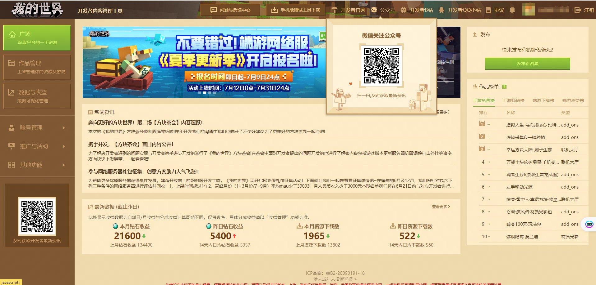

# 其他问题反馈途径

### 阶段目标：了解并知晓反馈问题的途径

#### TAG： 问题反馈

#### 阶段结构：

#### 第一阶段：了解并知晓反馈问题的途径、方式

#### 开发者QQ小站：

[点击此链接](https://qun.qq.com/qqweb/qunpro/share?_wv=3&_wwv=128&inviteCode=1VX5Hn&from=181074&biz=ka&shareSource=5#/pc)加入我的世界开发者QQ小站频道。

频道主要用于开发者之间的交流及官⽅活动发布，频道申请时需要备注开发者昵称及开发者邮箱。

#### 我的世界开发者B站号

关注我的世界开发者B站号获取获取开发者相关资讯和技术指导。

#### 我的世界开发者公众号

关注我的世界开发者公众号进行反馈并获取开发者相关资讯和技术指导。

#### 问题与反馈中心：

[https://mcdev.webapp.163.com/#/feedbackModal?target=browser](https://mcdev.webapp.163.com/#/feedbackModal?target=browser)，可用于反馈建议、提报Bug、举报违规组件、咨询审核问题等。

⼯作⼈员将持续查阅并回复⼤家，请⼤家尽量详细描述问题，提供有价值的信息和问题案例，有助于⼯作⼈员理解并快速查验问题。