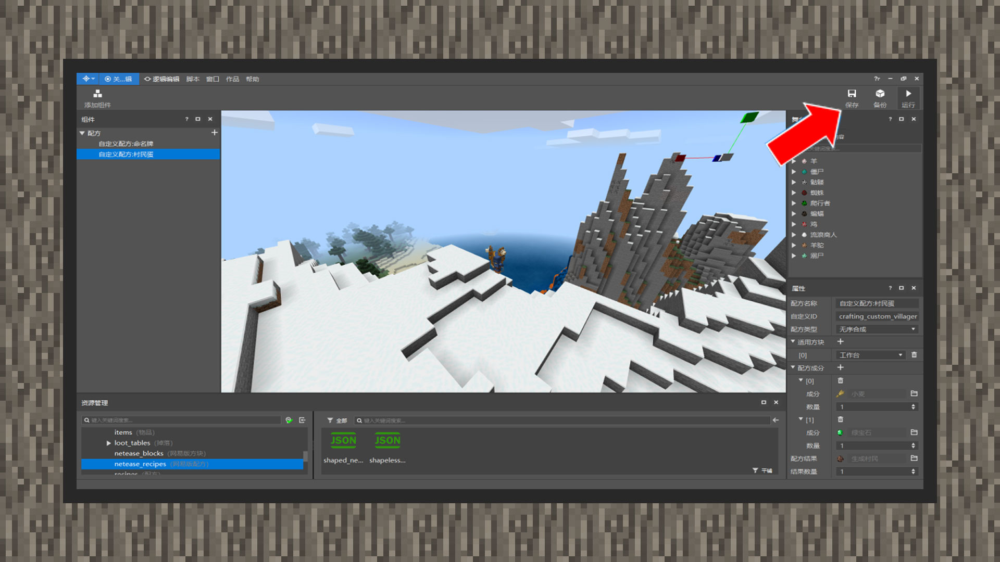
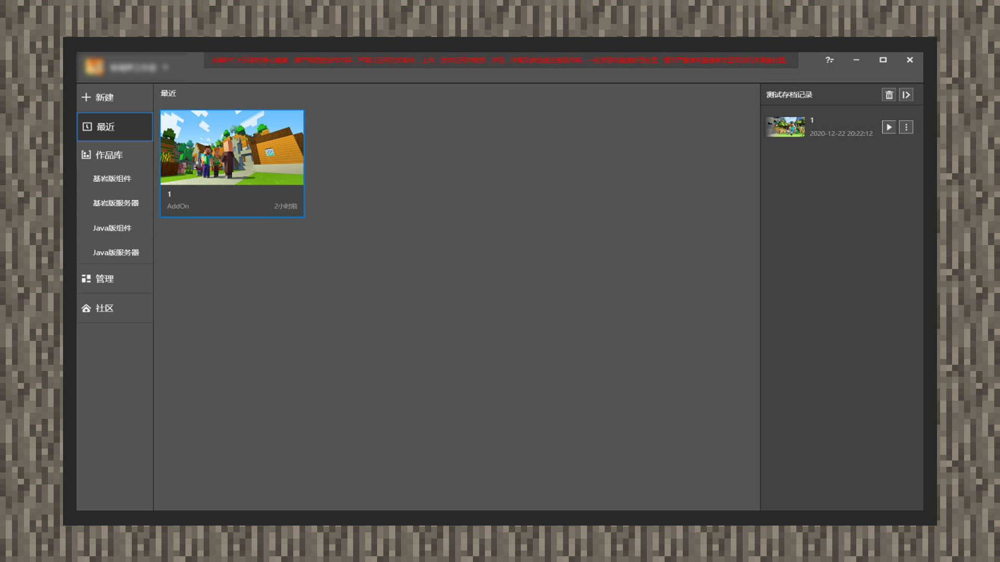
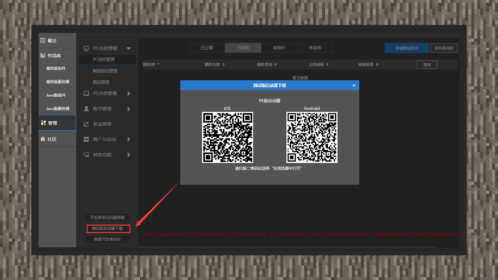

# 自测玩法，并在手机上运行它

#### 作者：境界

#### 自测玩法

点击运行，编辑器会弹出客户端窗口，开发者就可以测试本地玩法了。

在玩法测试前，请记得随时保存当前的制作进度，避免遇到进度丢失的问题。

#### 在手机上运行Add-on

点击最近选项，你会看到刚刚制作的组件。鼠标移动到组件上点击更多，再点击发布，选择新建项目。接着根据发布资源的流程依次填写好相关内容，点击保存，再点击自测或提交审核。

然后在MCSTUDIO-管理-测试版启动器下载手机版测试包，开发者就可以在手机测试版上体验到自己做的第一个玩法了。