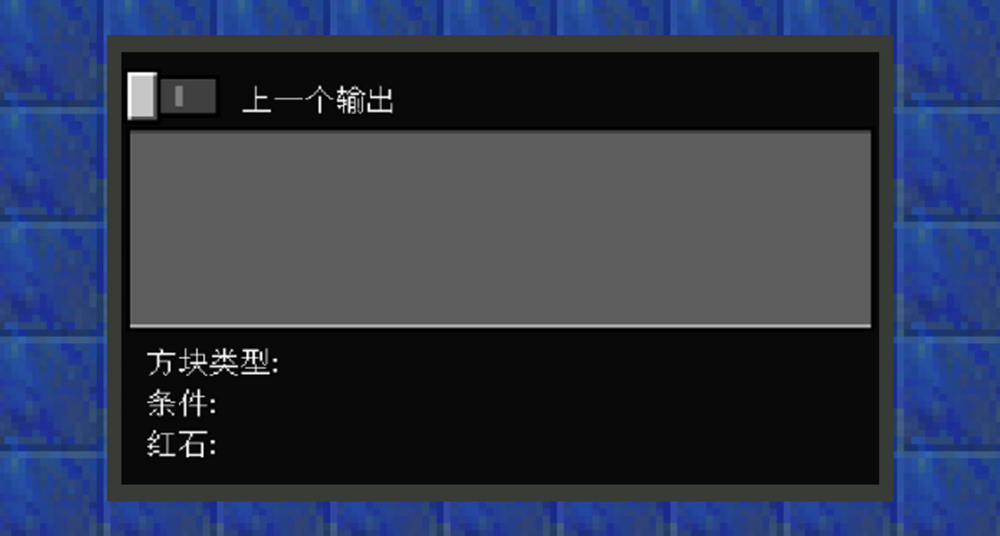
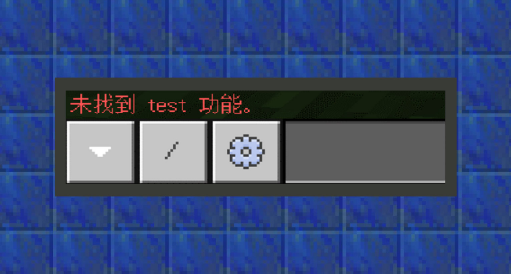

# 如何使用指令

#### 作者：境界

#### 使用聊天框输入指令

在电脑客户端中，按下快捷键“T”或者“/”可以打开聊天窗口。按下“/”时会在输入栏内自动添加上命令前缀格式“/”，所以“/”是个很实用的快捷键。

而在手游版中，需要点击屏幕上方的聊天按钮唤出聊天窗口。

打开聊天窗口时，电脑客户端还支持用TAB补全命令。这意味着不需打出完整的命令格式，多用tab补全命令可以节省许多制作时间。

而手游版目前还不支持命令补全。

#### 通过命令方块执行指令

命令方块（Command Block）是一种用以执行命令的特殊方块。它不可以通过创造背包选取获得，只能在游戏内输入/give @s command_block获得。注意：需要开启设置-游戏中的启用命令方块选项。

命令可以输入到命令输入框内。需要多重指令时，按enter键换行。按下+号可以放大输入框看到超出框外的指令。

点击“脉冲/连锁/循环”选项可更改命令方块类型。默认为“脉冲”，命令方块改变类型时也会改变颜色。

脉冲型命令方块是橙色的。这种方块是“标准”的命令方块，激活一次执行一次命令。

连锁型命令方块是绿色的。这种方块只在指向它的方块执行命令时才会执行命令。

循环型命令方块是紫色的。这种方块被激活时每一游戏刻都执行一次命令。

打开“上一个输出”按钮，可以获得运行在该命令方块下的部分带有返回信息的指令的返回信息。例如：使用testblock指令检查某个坐标上的方块是否是某个种类，返回检测结果。

点击“无条件/有条件的”选项来改变命令方块的条件制约行为：

条件制约”：只有当前一个指向自己的命令方块执行指令成功时，后一个命令方块才会继续执行指令。

不受制约：该命令方块将忽视条件制约行为。

激活命令方块有两种方式，分别是在方块界面中的红石选项里选择保持开启或者红石开启。

保持开启：会让命令方块一直保持在工作状态。

红石开启：则必须像红石机械一样激活才能执行指令。

以下是可以激活命令方块的红石物件：

放在命令方块侧面的红石火把、红石块、阳光探测器、按钮等。

互相邻接的充能方块。

输出信号且指向向命令方块的红石比较器或红石中继器。

激活的且在命令方块四周的红石粉。

指定循环型命令方块是否在激活后立即执行其指令，如果已禁用，则从激活时起延迟后第一次执行。

对于脉冲型命令方块和连锁型命令方块，指定在被激活或触发后，执行指令之前延迟的游戏时间。对于循环型命令方块，指定其重新执行指令所延迟的游戏时间。对于脉冲型命令方块和循环型命令方块，延迟设置为“0”和“1”的效果相同，游戏将把“0”视为“1”。但是，对于连锁型命令方块，“0”和“1”是不同的。当设置延迟的命令方块被破坏后，未执行的指令将不会被执行。

#### 通过function执行指令

function是一种文件类型，它可由Add-on识别，作为一组指令集在游戏内被指令/function <文件名称>执行。文件的后缀名为.mcfunction。以下图为例，这里会执行行为包下，function文件夹里的test.mcfunction文件。

未在正确路径下找到该文件时，则返回异常。

