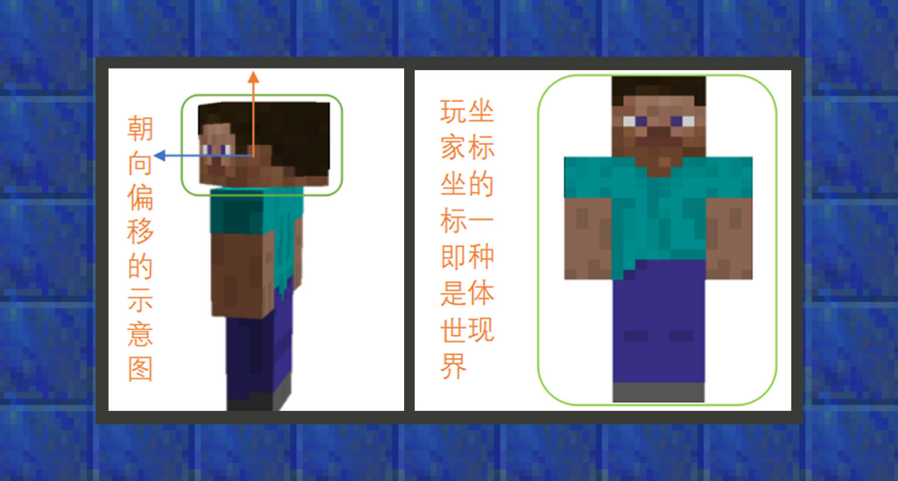
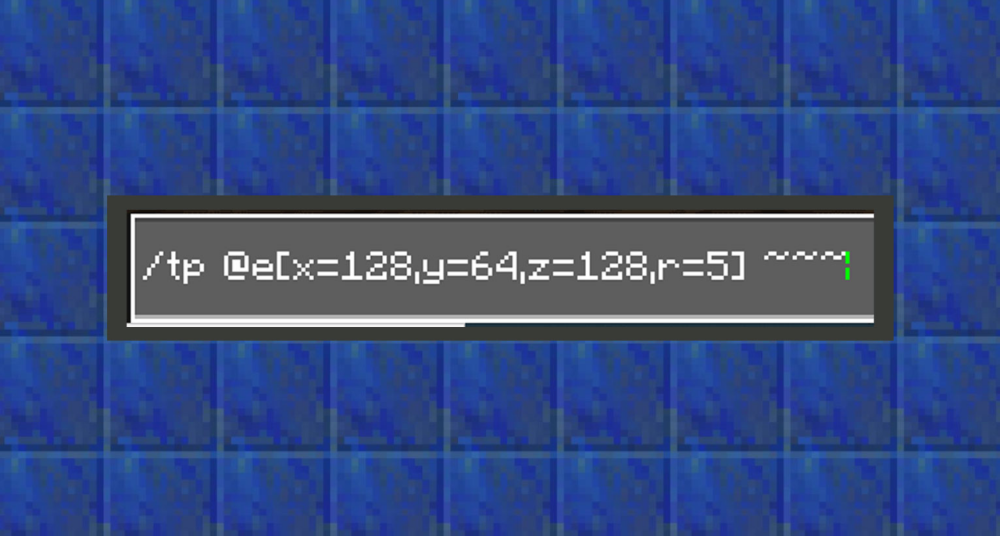
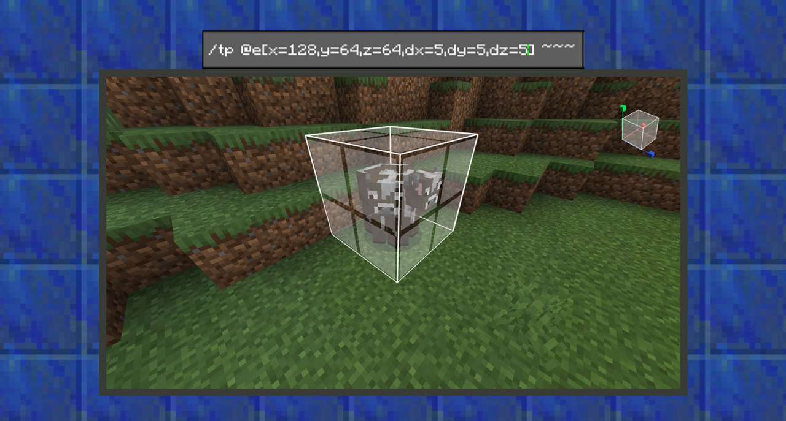

# 理解指令参数

#### 作者：境界


#### 什么是坐标参数


上图示例提示下一类指令参数填写坐标参数。


绝对坐标：世界坐标被视作绝对坐标。例如，冒险家使用指令“/tp 128 64 128”时，会将人物传送到世界坐标为“x:128 y:64 z:128”的位置上。


相对坐标：相对坐标视为绝对坐标的偏移量。通常，冒险家可以用波浪符号~来指代坐标为当前所站的世界坐标。因此，可以在~符号旁添加计算式来达到坐标偏移的结果。例如，冒险家使用指令“/tp ~+1 ~-1 ~”时，会将他传送到距离当前世界坐标X轴正一格，Y轴负一格的位置上。


局部坐标：局部坐标为视线方向的偏移量。通常，冒险家可以用插入符号“^”来指代坐标为当前头部的方向坐标。



与相对坐标不同的是，局部坐标以头部方向为基准点。例如，若冒险家希望让传送对象向面朝方向传送，就会用到插入局部坐标。还是以“tp”指令为例，冒险家使用指令“/tp ^ ^ ^+5”时，会把冒险家从当前位置向面朝方向的位置传送5格。


#### 什么是目标选择器


上图示例提示下一类指令参数填写目标选择器。


在通常情况下，指令由使用者输入，再由使用者执行。如执行“/tp”指令可以传送执行者到一个坐标。

但在地图玩法中，往往执行指令的个体不单单是拥有具体名称的玩家，也有可能是地图中的其他生物。如何获取到这些生物，就需要学会如何使用目标选择器。


目标选择器可以根据使用者所选的变量，再用条件参数筛选出最后满足条件的一个或多个执行指令的个体。

目标选择器变量用于指定待选目标的大致分类。共有5种变量：

```
@p：选择最近的玩家

@r：选择随机的玩家

@a：选择所有玩家

@e：选择包括所有玩家在内的全部实体

@s：选择您自己
```


如果仅仅只输入选择器变量，是不足以满足开发者的各种定制需求。因此我的世界指令系统还为使用者提供了条件参数的功能，来筛选出目标个体。这里称之为目标选择器参数。在当前中国版中，共有12种类型：

```
x, y, z：坐标

r、rm：距离

dx, dy, dz：体积尺寸

scores：计分项分数

tag：记分板标签

c：数量

l、lm：经验等级

m：游戏模式

name：实体名称

rx、rxm：垂直旋转角度

ry、rym：水平旋转角度

type：实体类型
```


通过特定格式@变量[<参数>=<值>,<参数>=<值>,<参数>=<值>,.....]来限制选取的群体，其中参数和值不区分大小写。


#### 坐标参数

坐标参数用以定义一个起始点，它常用的用法是和距离参数一起使用。例如，指令使用者希望以某个坐标点开始，让周围半径5格内的实体传送到自己身边。目标选择器可以这么做：



“x,y,z”三个参数决定世界的一个坐标，“r”代表距离范围内。“rm”则相反，代表距离范围外。两者结合使用，则可以获取从一个范围开始到另一个范围结束的实体目标。

因此，起始点的作用常用于配合距离参数来框选一个区域内的实体目标。


#### 体积尺寸



体积尺寸参数用于定义一个一定长方体区域。它常与坐标参数一起使用，以坐标参数传入的世界坐标为基准点，向“X”方向(dx)延伸特定格数，向“Y”方向(dy)延伸特定格数，并向“Z”方向(dz)延伸特定格数。最后形成的长方体区域内，与之坐标重叠的实体便是筛选出的实体目标。例子中，指令使用者尝试以某个坐标点开始，让它延伸出5x5x5的立方体区域并将与之重叠的实体传送到自己身边。


#### 计分项分数参数

计分项分数参数允许开发者通过分数选择目标，生物的分数来自“scoreboard”指令，根据指定目标的分数过滤有多种写法，但基本格式是以@变量[scores={计分项=计分值}]为准：

```
@e[scores={myscore=10}]——选择所有记分项myscore分数为10的目标。

@e[scores={myscore=10..12}] — 选择所有记分项myscore分数为包含10到12之间的目标。

@e[scores={myscore=5..}] — 选择所有记分项myscore分数为5及以上的目标。

@e[scores={myscore=..15}] — 选择所有记分项myscore分数为15及以下的目标。

@e[scores={foo=10,bar=1..5}] — 选择所有记分项foo分数为10，且记分项bar分数为包含1到5之间的目标。
```


#### 记分板

记分板标签参数允许开发者通过标签选择目标，生物的分数来自tag指令，基本格式是以@变量[tag=标签名称]为准：

```
@e[tag=标签名称]——选择所有带有“标签名称”的实体。

@e[tag=!标签名称]——选择所有没带有“标签名称”的实体。

@e[tag=]——选择所有没有标签的实体。

@e[tag=!]——选择所有带有标签的实体。
```

允许目标选择器参数同时筛选多个标签的情况，被筛选出的目标个体必须满足所有标签参数的条件：

```
@e[tag=abc,tag=def]——选择所有同时带有“abc”和“def”标签的实体

@e[tag=abc,tag=!def]——选择所有同时带有"abc"，但不带有"def"标签的实体
```


#### 数量参数

数量参数用于所选的目标数量不超过给定数值，在基岩版中，默认下使用目标选择器变量“@p”和“@r”会限制获取的目标数量为“1”，那么冒险家就可以用数量参数来增加获取的数量。而在“@e”和“@a”中，数量参数传入正值会获取离冒险家最近的、满足筛选要求的目标实体，传入负值则相反，会获取满足筛选条件且离使用者最远的目标实体。

```
@p[c=3]——获取离使用者最近的3名玩家

@a[c=-4]——选择离使用者最远的4名玩家

@r[c=2]——随机选择正在世界中的2名玩家
```


#### 等级参数

等级参数用于筛选满足给定等级范围的目标实体。在基岩版中，有两个相关参数：
lm——等级超过给定值

l——等级小于给定值


例如：

```
@e[lm=1]——获取等级大于1的实体，由于只有玩家有等级概念，因此相当于获取等级大于1的玩家

@p[l=16]——获取离使用者最近，等级在16以内的玩家

@a[lm=8,l=16]——获取等级在8~16范围内的玩家
```


#### 游戏模式参数

游戏模式参数用于筛选满足给定游戏模式的目标实体，在基岩版中，使用“m”来标识：

“m”的值可以用0、s代表生存，1、c代表创造，2、a代表冒险模式。


例如：

```
@e[m=0]——获取生存模式的玩家实体

@a[m=c]——获取创造模式的玩家实体

@a[m=!2]——获取不为冒险模式的玩家实体
```


#### 名称参数

名称参数用于筛选满足给定名字的目标实体，在基岩版中，使用name来标识：

```
@a[name=Steve]——获得世界中名为Steve的玩家实体

@a[name=!Steve]——获得世界中名称不为Steve的玩家群体
```


#### 角度参数

通过垂直旋转角度参数，开发者可以筛选出给到角度范围内的目标实体，在基岩版中，使用两种参数来表示：

rxm——角度超过给定值

rx——角度小于给定值


例如：

```
@e[rxm=30,rx=60]——获取所有视线角度在30~60垂直角度内的实体目标

@e[rx=0]——获取所有视线角度与水平线持平的实体目标

@e[rxm=45]——获取所有视线角度大于45度的实体目标
```


通过水平旋转角度参数，开发者可以筛选出给定角度范围内的目标实体，在基岩版中，使用两种参数来表示：

rym——角度超过给定值

ry——角度小于给定值


例如：

```
@e[rym=30,ry=60]——获取所有视线角度在30~60水平角度内的实体目标

@e[ry=0]——获取所有视线角度在0水平角度内的实体目标

@e[rym=45]——获取所有水平角度大于45度的实体目标
```


#### 类型参数

类型参数可以帮助开发者筛选满足给定生物类型的目标实体，在基岩版中，使用type来表示：

例如：

```
@e[type=cow]——获取世界中所有的牛实体

@e[type=!cow]——获取世界中不为牛类型的实体

@e[type=cow,type=chicken]——获取世界中牛类型和鸡类型的目标实体
```


#### 什么是原始JSON文本


在基岩版中，/tellraw指令使用原始json文本来显示文本信息结果。


```
<raw json message: json>内的格式为{"rawtext":[{"text":""}]}，其中<"text":> 后的双引号内，可以填写包含任意字符的文本信息。
```

