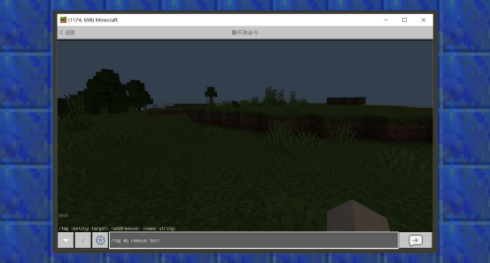
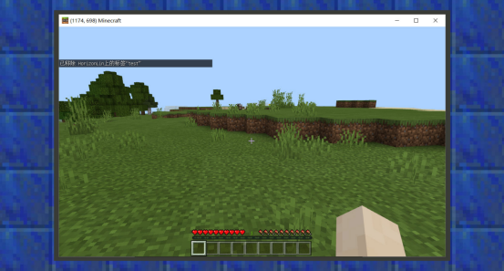
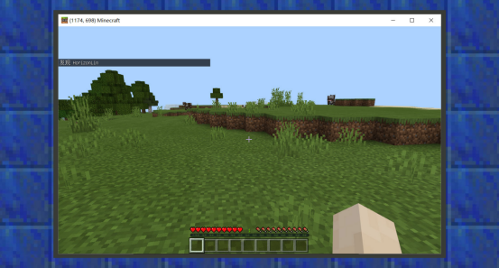
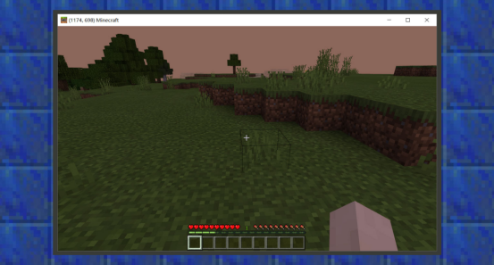
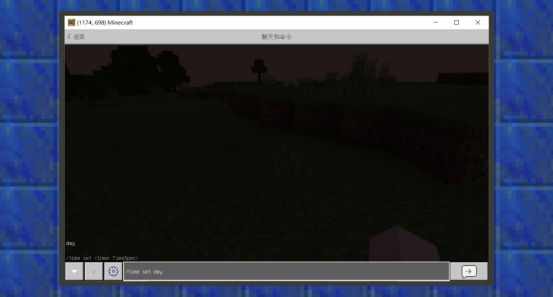
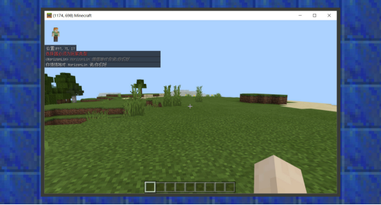
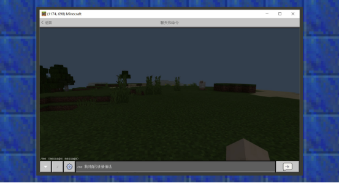
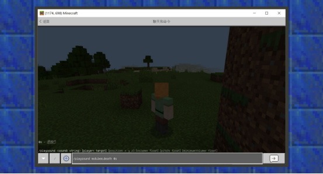

# 常用指令及用法

#### 作者：境界


#### 生物指令

生物指令主要汇整了与实体相关的指令用法。


#### summon指令的用法

```
/summon指令，用于在世界中生成一个实体。在基岩版中，它有两种语法格式。

1./summon <entityType: EntityType> [spawnPos: x y z] [spawnEvent: string] [nameTag: string]

2./summon <entityType: EntityType> <nameTag: string> [spawnPos: x y z]
```

其中entityType内填写生物的名称域，名称域是生物在世界中的唯一身份标签。例如牛的名称域是minecraft:cow，鸡的名称域是minecraft:chicken。如果是原版生物，minecraft:可以省略，而自定义生物则需要打出完整名称。

在Minecraft指令系统中，被“[ ]”包裹的参数为可省略参数，如在第一种写法里，若使用者给定生物类型后，没有填写后面三个参数，指令会正常执行并返回结果。spawnPos是坐标参数，它会默认选择在使用者的坐标上生成，而spawnEvent是生物事件，默认会执行minecraft:entity_spawned事件，如果nameTag是生物的命名，则会默认不命名。

在第二种写法中，默认要求使用者填写生物名称域和生物命名，同理，若不给定生成坐标，则默认生成在使用者所在的世界位置。


#### kill指令的用法

```
/kill指令，用于清理世界中的实体，包括玩家、生物、抛射物、掉落物等。在基岩版中，它有一种语法格式：

/kill [target: Target]

/kill的第一个参数是可省略参数，这意味着当使用者不给定目标选择器，则默认清理使用者自己。而给定目标选择器，则会清理筛选后的目标实体。
```


#### give指令的用法

```
/give指令，用于给予玩家道具。在基岩版中，它有一种语法格式：

/give <player: target> <itemName: Item> [amount: int] [data: int] [components: json]

/give只能给予玩家这一类实体，因此目标选择器变量的范围缩小在@p、@r、@a里。<itemName>中，需要给定一个物品名称域，物品名称域和生物命称域属性相同，是作为某种物品在世界中的唯一身份标识。如苹果是minecraft:apple。如果给予的道具是原版物品，则minecraft:可省略，若给予的是自定义物品，则需要打出完整名称。
```

[amount: int]是可省略参数，不填写的情况下，会默认给予一个道具，int可以简单理解为整数。在我的世界中，道具堆叠的数量一定是整数，例如，不存在具有1/2或者0.5个苹果。

[data:int]是可省略参数，不填写的情况下，默认给定0。data即物品的附加值，在原版道具中，许多物品带有附加值，以区分相同物品的不同特征。例如在游戏内，玩家可以收集到16种颜色的羊毛。因此附加值决定了羊毛的颜色。一般情况下，一种道具只有一类，因此附加值默认为0。

[components: json]是可省略参数，不填写的情况下，默认为无。它必须是一个json对象，作用是指定物品带有特殊的功能。它目前仅支持minecraft:can_place_on[决定方块物品可以放置在什么方块之上], minecraft:can_destroy[决定物品能够破坏什么样的方块], minecraft:item_lock[1.16.100加入，可以锁定物品无法丢弃、移动等],minecraft:keep_on_death[即使玩家死后重生，该物品也会得到保留]。


#### xp指令的用法

```
/xp指令，用于增加或减少玩家经验值。它有两种语法格式：

1. xp <amount: int> [player: target]

2. xp <amount: int>L [player: target]
```

由于只有玩家这一实体才有经验值的概念，因此该指令只作用于玩家。

在第一种格式中，<amount:int>是必填参数，使用者输入正值增加经验值，输入负值减少经验值。经验值必须是整数且在0 ~ 2147483647之间，这是一个很庞大的范围，一般情况下，输入可接受的数值即可。[player: Target]是可省略参数，在不填写的情况下，指令生效在使用者本身。

在第二种格式中，与第一种格式的区别仅仅在填写完第一个参数时后面尾随一个大写的L。这是直接授予增加的经验等级而不再是经验值。在我的世界中，在一个等级内，经验值达到等级要求上限后会提升等级，这是等级和经验值的关系。同样，使用者输入正值增加经验等级，输入负值减少经验等级。等级必须是整数且在-2147483647 ~ 2147483647之间。


#### Tp指令的用法

```
/tp指令，也可写成/teleport指令，是用于传送实体的指令。在基岩版中，它有9种语法格式：

1. /tp <destination: x y z> [checkForBlocks: Boolean]

2. /tp <destination: target> [checkForBlocks: Boolean]

3. /tp <victim: target> <destination: target> [checkForBlocks: Boolean]

4. /tp <destination: x y z> [yRot: value] [xRot: value] [checkForBlocks: Boolean]

5. /tp <destination: x y z> facing <lookAtPosition: x y z> [checkForBlocks: Boolean]

6. /tp <destination: x y z> facing <lookAtEntity: target> [checkForBlocks: Boolean]

7. /tp <victim: target> <destination: x y z> [yRot: value] [xRot: value] [checkForBlocks: Boolean]

8. /tp <victim: target> <destination: x y z> facing <lookAtPosition: x y z> [checkForBlocks: Boolean]

9. /tp <victim: target> <destination: x y z> facing <lookAtEntity: target> [checkForBlocks: Boolean]
```

<destination: x y z>  代表需要给定一个坐标参数。<victim: target> 和 <destination: target>  需要给定一个目标选择器。

[checkForBlocks: Boolean]是可省略参数，它接受true和false两个值。当它为true时，只会在传送坐标区域内没有与实体产生重叠的方块的情况下传送实体，否则执行失败，这是为了保证如传送玩家时，不希望他被传送进方块而受到窒息伤害的方法。若填写false，即无视这一情况，默认传送实体到指定目标。

[yRot: value]是可省略参数，它接受一个数值，这个整数要在-180.0~180.0之间，可以带有小数，也可以是整数。它的作用是在传送实体到目标地点时，同时旋转实体的水平角度。

[xRot: value]是可省略参数，它接受一个数值，这个整数要在-180.0~180.0之间，可以带有小数，也可以是整数。它的作用是在传送实体到目标地点时，同时旋转实体的垂直角度。

<lookAtPosition: x y z>是一个需要给定值的参数，它接受一个坐标参数。它的作用是在传送实体到目标地点时，使目标面向某个坐标。

<lookAtEntity: target> 是一个需要给定值的参数，它接受一个目标选择器变量。它的作用是在传送实体到目标地点时，使目标看向某个实体。


#### tag指令的用法

```
/tag指令是用于给予实体标签的指令，在基岩版中，它有3种语法格式。

1. /tag <entity: Target> add <name:string>

2. /tag <entity: Target> list

3. /tag <entity: Target> remove <name:string>
```

第一个格式中，主要介绍如何使用tag指令给实体目标添加标签。其中，<entity: Target>给定一个目标选择器参数。< name>给定一个名字，这两个都是必填参数。

第二个格式中，主要介绍如何使用tag指令查询实体目标的标签。其中，<entity: Target>给定一个目标选择器参数，它是一个必填参数。

第三个格式中，主要介绍如何使用tag指令给实体目标移除标签。其中，<entity: Target>给定一个目标选择器参数。< name>给定一个名字，这两个都是必填参数。







#### testfor指令的用法

```
/testfor指令，是用于检测并统计符合指定条件的实体（玩家、生物、物品等）。它有一种语法格式：

1. /testfor <victim: target>
```

其中<victim: Target>接受一个目标选择器参数，它是一个必填参数。

示例：

```
1.检测圆心为(128,64,128)、半径为5米的掉落物

/testfor @e[type=item,x=128,y=64,z=128,r=5]

2.检测Steve是否在线

/testfor Steve
```





#### scoreboard指令的用法

```
/scoreboard指令，是用于管理计分板系统的指令。在基岩版中，它有十二种语法格式：

1. /scoreboard objectives add <objective:string> dummy [displayName:string]

2. /scoreboard objectives list

3. /scoreboard objectives remove <objective:string>

4. /scoreboard objectives setdisplay <list:sidebar> [objective: string] [ascending:descending]

5. /scoreboard objectives belowname [objective:string]

6. /scoreboard players list [player: Target]

7. /scoreboard players reset <player:Target> [objective:string]

8. /scoreboard set|add|remove players <player:Target> <objective:string> <count:int>

9. /scoreboard players random <player:Target> <objective:string> <min:int> <max:int>

10. /scoreboard operation <targetName:Target> <targetObjective:string> <operator:operator> <.selector:Target> <objective:string>
```


计分板系统是通过操作复杂的指令来追踪玩家分数的一种机制，根据玩家当前所带有的某种分数作为条件，可以用目标选择器来筛选出这一类玩家并执行相应指令。
第一个格式中，主要介绍如何使用scoreboard指令给实体目标添加分数类型。其中，<objective:string> 给定一个分数名称。< displayName>给定一个显示名称，前者是必填参数，后者是选填参数。

第二个格式中，主要介绍如何使用scoreboard指令显示分数类型。

第三种格式中，主要介绍如何使用scoreboard指令移除分数类型。

第四种格式中，主要介绍如何使用scoreboard指令显示计分板，其中<list:sidebar> 是必填参数，显示在list【列表】时，计分板内容会出现在暂停界面右侧的玩家列表里，显示在sidebar【侧边栏】时，内容会以界面地方式呈现在玩家屏幕右侧。[objective: string] 是选填参数，当不填写这一项时，会清空已经显示的列表或侧边栏的内容，但不会影响本来的分数值。当填写这一项时，会在列表或侧边栏上显示这一数值类型的值。[ascending:descending]是选填参数，由于值必定是整数类型，因此可以进行上升或者下降排序。

第五种格式中，主要介绍如何使用scoreboard指令将分数显示在玩家名称下。其中[objective:string]是选填参数，当不填时，会清空之前显示在玩家名称下的分数；当填写时，会显示指定分数在玩家名称下。

第六种格式中，主要介绍如何使用scoreboard指令将玩家的分数值打印在聊天栏中。其中[player: Target]是选填参数，当不填写时，会打印全部正挂载在玩家身上的分数类型，若填写时，可以填写@a、@s以及指定玩家名称，以显示特定群体的玩家分数。

第七种格式中，主要介绍如何使用scoreboard指令将玩家的分数进行重置。其中<player:Target> 是必填参数，需要让指令知道要将哪类玩家的分数进行重置，[objective:string]是选填参数，代指分数类型。重置意味着将分数值进行清空，即不再带有某个分数类型的值。

第八种格式中，主要介绍如何使用scoreboard指令将玩家的分数进行设置、加、移除。其中<player:Target> 是必填参数，<objective:string>是分数类型，<count:int>是值。set代指设置，即将玩家的分数设置成某个整数，而不进行任何数学计算，add代指添加，当玩家没有分数时，效果等同于“设置”，当玩家有分数时，效果等同于相加。remove是移除，当玩家没有分数时，分数会变成0 - 给定值，因此等同于设置值的负方向的值。当玩家有分数时，效果等同于相减。

第九种格式中，主要介绍如何使用scoreboard指令将玩家的分数进行随机区间的取值。其中<player:Target> 是玩家选择器，属于必填参数，<objective:string>是分数类型，属于必填参数，<min:int> <max:int>分别代指最小值和最大值。

第十种格式中，主要介绍如何使用scoreboard指令将一位玩家的分数进行计算，并最终将目标玩家分数设置为计算结果。<targetName:Target> 是目标玩家选择器，最终改变分数的即是这个参数指定的那一类玩家。<targetObjective:string> 是目标玩家的分数类型。<operator:operator> 是运算符，一共包含%=[求模]、*=[相乘]、+=【相加】、-=【相减】、/=【相除】、<【若目标分数小于他人分数，则将目标分数设置为与他人分数相等】、=【将目标分数设置为与他人分数相等】、>【若目标分数大于他人分数，则将目标分数设置为与他人分数相等】、><【将目标分数与他人分数相互替换】。<selector:Target>可以代指其他玩家选择器，同样，这个他人可以指向自己，即自己的分数与自己做计算。<objective:string>是分数类型。


#### execute指令的用法

```
/execute允许使用者用该指令让特定类型的实体去执行另一条指令，由于在通常情况下，除了玩家外，其他生物是不会执行指令，所以这条指令十分有用。在基岩版中，它一共有两种语法格式：

1. /execute <origin: target> <position: x y z> <command: command>

2. /execute <origin: target> <position: x y z> detect <detectPos: x y z> <block: Block> <data: int> <command: command>
```

第一个格式中，主要介绍如何使用execute指令让某一实体执行某一指令。其中<origin: target> 是目标选择器，筛选出来的实体将会是执行指令的对象，<position: x y z> 是坐标参数，<command: command>是要执行的指令。

第二个格式中，主要介绍如何使用execute指令让某一实体执行某一指令时，还要通过一道方块检测。<detectPos: x y z> 即要检测的方块坐标，<block: Block>即方块名称，<data: int> 即方块附加值。


#### enchant指令的用法

```
/enchant允许使用者用该指令让手上的可附魔物品附魔。需要注意的是，不同可附魔的物品可以附魔的能力不一定相同，若返回了一些红色提示信息，很可能是开发者将错误的附魔属性附魔到了手上的物品。例如，将三叉戟的特殊附魔属性附魔在了剑上。在基岩版中，它一共有两种语法格式：
1./enchant <player: target> <enchantmentId: int> [level: int]

2./enchant <player: target> <enchantmentName: Enchant> [level: int]
```

第一个格式与第二个格式不同的地方仅仅在enchantmentId和enchantmentName上，基岩版中一共有36种附魔，每种附魔对应一个附魔数字ID，也同时拥有一个附魔名字。其他参数上，<player: target> 是目标选择器，是必填参数，[level: int]是附魔等级，是选填参数，当不填写时，只要拿着正确的物品，默认附魔等级为1的附魔属性。同时，受原版附魔等级限制，不同附魔超过一定等级是不可以用指令附魔的。


#### effect指令的用法

```
/effect允许使用者用该指令给予特定类型的实体一种药水效果。在基岩版中，它一共有两种语法格式：
1./effect <player: target> clear

2./effect <player: target> <effect:Effect> [seconds:int] [amplifier:int] [hideParticles:Boolean]
```

第一个格式中，<player: target> 是必填参数，但请不要被它的指令提示迷惑，它可以作用于所有生物上。clear即代表会移除该类目标身上的所有状态效果。

第二个格式中，<effect:Effect> 是状态效果，是必填参数，[seconds:int] 是选填参数，即状态效果的持续时间，[amplifier:int] 是状态效果的强度，也是选填参数，[hideParticles:Boolean]是布尔参数，即是否隐藏状态效果粒子，true为隐藏，false为不隐藏，默认为false。


#### clear指令的用法

```
/clear允许使用者用该指令清除一个玩家背包内的物品。在基岩版中，它一共有一种语法格式：

1./clear [player: target] [itemName: Item] [data: int] [maxCount: int]
```

第一个格式中，[player: target] 是选填参数，代指玩家类型选择器，因此只能填写@a、@s、玩家名称等，若不填写时，默认对象为执行玩家本人，同时，若不填写后面的其他参数，则会清空该名玩家背包的所有物品，包括装备栏、快捷栏、背包栏。[itemName: Item] 是物品名称，[data: int] 是物品附加值， [maxCount: int]是物品最大数量，当物品最大数量不指定时，指令匹配到的同类物品无论堆叠了多少数量都会一并清除。


### 世界指令

世界指令主要汇整了与游戏世界相关的指令用法。


#### time指令的用法

```
/time允许使用者用该指令去改变游戏世界的时间，在我的世界中，24000代表一天会经过的游戏时间。在基岩版中，它一共有一种语法格式：

1./time add <amount: int>

2./time query <daytime|gametime|day>

3./time set <amount: int>

4./time set <time: TimeSpec>
```

第一个格式中，<amount:int>代指时间长度，即添加多少时间到当前时间中。

第二个格式中，<daytime|gametime|day>代表当天的游戏时间，gametime代表总的游戏时间，day代表这个世界过了几天。query即查询这些时间后得出的数据会显示在聊天框里。

第三种格式中，<amount: int>代指某一时间，即设置现在的时间为多少。

第四种格式中，<time: TimeSpec>代指某段时间，类型有day【白天】、night【黑夜】、noon【中午】、midnight【深夜】、sunrise【日出】、sunset【日落】。即设置当前时间为这6段时间中的一种。






#### tickingarea指令的用法

```
/tickingarea允许使用者用该指令去添加常加载区域，常加载区域意味着你所添加的区域将会持续加载，无论玩家离着多远，那块区域的方块状态、生物活动等都会照常运行。如植物生长、熔炉燃烧、生物繁殖等。在基岩版中，指令一次只能添加十个常加载区域在这个世界存档中。它一共有6种语法格式：

1. /tickingarea add <from: x y z> <to: x y z> [name: string]

2. /tickingarea add circle <center: x y z> <radius: int> [name: string]

3. /tickingarea remove <name: string>

4. /tickingarea remove <position: x y z>

5. /tickingarea remove_all

6. /tickingarea list [all-dimensions: AllDimensions]
```

第一个格式中，<from: x y z> 为坐标参数，即从某个坐标开始，到<to: x y z>某个坐标结束的范围里为一个常加载区域，[name: string]为选填参数，即为该常加载区域设置一个名字。

第二个格式中，<center: x y z>为坐标参数，即从某个坐标开始，到<radius: int> 某个半径范围外结束的一个圆形区域作为常加载区域，[name: string]为选填参数，即为该常加载区域设置一个名字。

第三种格式中，<name: string>为必填参数，即常加载区域的名称。使用这个格式来移除该名称的常加载区域。

第四个格式中，<position: x y z>为坐标参数，为必填参数，使用这个格式来移除以该坐标为起始点的常加载区域。

第五个格式中，使用这个格式一次性删除所有常加载区域。

第六个格式中，[all-dimensions: AllDimensions]为选填参数，即所有维度中的常加载区域，不填时只显示当前维度的常加载区域。


#### setworldspawn指令的用法

```
/setworldspawn允许使用者用该指令去设置主世界的出生点。在基岩版中，它一共有一种语法格式：

1. /setworldspawn [spawnPoint: x y z]
```

在这个唯一格式中，[spawnPoint: x y z]为出生点坐标参数，当不填时，默认设置当前使用者的坐标为出生点坐标。


#### spawnpoint指令的用法

```
/spawnpoint允许使用者用该指令去设置某个玩家的出生点坐标。在基岩版中，它一共有一种语法格式：

1. /spawnpoint [player: target] [spawnPos: x y z]
```

在这个唯一格式中，[player: target] 为玩家目标选择器参数，因此它只支持@a、@s、玩家名字等，当不填时，默认指定目标为执行玩家本人。[spawnPos: x y z]为出生点坐标参数，当不填时，默认设置当前使用者的坐标为出生点坐标。


#### spreadplayers指令的用法

```
/spreadplayers允许使用者用该指令去分散某个区域内的实体。在基岩版中，它一共有一种语法格式：

1./spreadplayers <x: value> <z: value> <spreadDistance: float> <maxRange: float> <victim: target>
```

在这个唯一格式中，< x>  < z>为坐标参数的x轴、z轴，<spreadDistance: float> 为在每个被分散的目标之间的距离是多少。<maxRange: float> 为从中点开始，被分散的目标最终会在多大范围内，<victim: target>为实体目标选择器，因此不要被指令名称迷惑，它同时支持@a、@e、@s、玩家名称等目标。


#### locate指令的用法

```
/locate允许使用者用该指令将离自己最近的原版特征建筑显示在聊天框内。在基岩版中，它一共有一种格式：

1. /locate <feature: Feature>
```

在这个唯一格式中，<feature: Feature>为必填参数，指令提示会引导玩家去选填自己要找的特征。但需要注意的是，有些特征仅出现在特定群系的时候，使用者在其他群系是无法定位到这些特征的。如玩家在主世界寻找下界的特征等情况。


#### gamemode指令的用法

```
/gamemode允许使用者用该指令去设置某位玩家的游戏模式。在基岩版中，它一共有两种语法格式：

1./gamemode [gamemode: GameMode] [player:target]

2./gamemode [gamemode:int] [player:target]
```

第一个格式中，[gamemode: GameMode]为模式类型的字符串，可以设置为生存模式、创造模式、冒险模式。[player:target]为玩家目标选择器参数，由于只有玩家才有游戏模式的概念，因此这里只能填写@a、@s、玩家名称等。

第二个格式中，[gamemode:int] 为模式类型对应的数值ID，0为生存模式，1为创造模式，2为冒险模式。


#### gamerule指令的用法

```
/gamerule允许使用者用该指令去设置世界的游戏规则。在基岩版中，它一共有两种语法格式：

1. /gamerule [rule: BoolGameRule] [value:Boolean]

2. /gamerule [rule: IntGameRule] [value:int]
```

第一个格式与第二个格式的区别在于，我的世界的有些游戏规则是只有是和否的选择，有些游戏规则则可以设置值规则。如是否生成怪物必定只有是和否的选项，出生范围则必定是可以设置值的规则。更多规则的概念，请参考[游戏规则](https://zh.minecraft.wiki/w/%E6%B8%B8%E6%88%8F%E8%A7%84%E5%88%99)


#### difficulty指令的用法

```
/difficulty允许使用者用该指令去设置世界的游戏难度。在基岩版中，它一共有两种语法格式：

1. /difficulty <difficulty: Difficulty>

2. /difficulty <difficulty: int>
```

第一个格式与第二个格式的区别在于，我的世界一共有4种游戏难度，分别为和平、简单、普通、困难，因此它们除了带有完整名字和缩写名字的参数外，还允许以0~3的数值作为设置游戏难度的参数。


#### alwaysday指令的用法

```
/alwaysday允许使用者用该指令去设置世界是否总是白天。在基岩版中，它一共有一种语法格式：

1. /alwaysday <lock:Boolean>
```

在这个唯一的格式中，它接收一个布尔值，即真(true)或者假(false)。设置为真时，则世界永远都是白天。设置为假时，世界会正常昼夜循环。


#### weather指令的用法

```
/weather允许使用者用该指令去设置世界的天气。在基岩版中，它一共有两种语法格式：

1. /weather clear|rain|thunder <duration:int>

2. /weather query
```

第一个格式中，clear代表清除当前的天气效果，若当前没有天气效果如下雨或者打雷，则不会有任何变化。rain代指将天气设置为雨天。thuner代指将天气设置为雷雨天。duration:int代指天气持续的时间，它接受一个整数值。

第二个格式中，query代表查询当前天气。


### 聊天指令

聊天指令主要汇整了与聊天相关的指令用法。


#### tellraw指令的用法

```
/tellraw指令允许使用者发出一段json格式的信息给玩家。在基岩版中，它一共有一种语法格式：

1. /tellraw <target: target> <raw json message: json>

第一个格式中，<target: target> 为目标选择器，但一般情况下这里都会填写以玩家为类型的目标选择器，因为只有玩家才能看得到聊天信息。<raw json message: json>是一段被用来发给玩家的，以原始json消息为格式的信息。
```

以消息“你好”为例，通常情况下使用其他聊天指令发给他人，或者使用聊天窗口聊天时，前面都会带有玩家名称。若使用者想要自行定制一个广播格式，则tellraw是非常好用的指令帮手。
/tellraw @a {"rawtext":[{"text":"[广播站]你好"}]}将会给所有玩家发送一个以广播站为前缀，内容为你好的消息。


#### title指令的用法

```
/title指令允许使用者发出一段纯文本或者json格式的信息给玩家。在基岩版中，它一共有三种语法格式：

1. /title <player: target> <clear|reset>

2. /title <player: target> <title|subtitle|actionbar> <titleText: message|raw json titleText: json>

3. /title <player: target> times <fadeIn: int> <stay: int> <fadeOut: int>
```

第一个格式中，<player:target>为玩家目标选择器，为必填参数，clear为清空玩家当前正在播放的标题文本。reset为重置标题的时间配置。

第二个格式中，<player:target>为玩家目标选择器，为必填参数，<title|subtitle|actionbar> 为屏幕大标题、屏幕副标题、快捷栏上方标题三种类型，为必填参数，titleText接收纯文本或者json消息，为必填参数。

第三个格式中，<fadeIn: int> 为渐进时间，<stay: int>为停留时间，<fadeOut: int>为淡出时间。该格式可以用来设置标题的时间配置。


#### tell | msg | w指令的用法

```
/tell | /msg | /w指令允许使用者对某个玩家进行悄悄话。在基岩版中，这三种命令的格式几乎相同：

1. /tell | /msg | /w <target: Target> <mssage: message>
```

在该格式中，<target: Target> 必须为玩家目标选择器，为必填参数，<mssage: message>为一段纯文本。当指令使用成功时，一般以"你悄悄地对某人说：某段内容"为基准。





#### me指令的用法

```
/me指令允许使用者对自己发送一条消息。在基岩版中，这个命令的格式只有一种：　

1. /me <mssage: message>
```

在该格式中，<mssage: message>为一段纯文本，属于必填参数。当指令使用成功时，一般以"* 名字 某段内容"为格式显示在自己的聊天窗内。




### 方块指令

方块指令主要汇整了与方块相关的指令用法。


#### setblock指令的用法

```
/setblock指令允许使用者设置某一个坐标点上的方块。在基岩版中，这个命令的格式只有一种：

1. /setblock <position: x y z> <tileName: Block> [tileData: int] [destroy|keep|replace]
```

在该格式下，<position: x y z> 为一个坐标参数，<tileName: Block> 为方块名称， [tileData: int] 为方块附加值，[destroy|keep|replace]为方块替换模式，destroy为破坏上一个方块并设置指令的方块，会产生方块破坏粒子和声音。keep为值会替换非空气方块的方块。replace为直接用方块去替换上一个方块，而不产生破坏粒子和声音。默认情况下，若不填写方块替换模式，则为replace。


#### clone指令的用法

```
/clone指令允许使用者将某个区域的方块复制到另一个区域。在基岩版中，这个命令的格式有两种：

1. /clone <begin: x y z> <end: x y z> <destination: x y z> [maskMode: MaskMode] [cloneMode: CloneMode]

2. /clone <begin: x y z> <end: x y z> <destination: x y z> filtered <cloneMode: CloneMode> <tileName: Block> <tileData: int>
```

在第一个格式中，<begin: x y z> 为起始坐标参数，<end: x y z>为终止坐标参数， <destination: x y z> 为要粘贴的位置坐标参数。[maskMode: MaskMode] 为遮罩模式，一共有masked和replace两种遮罩模式，前者为仅复制选择区域的非空气方块，在粘贴时将保持原本会被替换为空气方块的区域不变。replace为复制选择区域的所有方块，它们主要作用在于是否过滤复制的方块，若未指定则默认为replace。[cloneMode: CloneMode]为复制模式，一共有force、normal、move三种模式，force为强制复制，即将一个区域拷贝一份粘贴到另一个区域。move可以理解为剪切，即将一个区域移动到另一个区域，源区域被带走的方块将会变成空气方块。normal则是不执行另外两种模式。

在第二个格式中，遮罩模式被改为过滤模式，并添加了方块参数和方块附加值参数，即意味着clone指令只会复制某一种符合了方块附加值和方块名称的方块，并根据复制模式的模式来粘贴到目的地区域。


#### fill指令的用法

```
/fill指令允许使用者将某个区域用某种方块来填满。在基岩版中，这个命令的格式有两种：

1. /fill <from: x y z> <to: x y z> <tileName: Block> [tileData: int] [oldBlockHandling: FillMode]

2. /fill <from: x y z> <to: x y z> <tileName: Block> <tileData: int> replace [replaceTileName: Block] [replaceDataValue: int]
```

在第一个格式中， <from: x y z> 为要填充的区域的起始坐标，<to: x y z> 为终止坐标，<tileName: Block> 为方块名称，[tileData: int] 为方块附加值，[oldBlockHandling: FillMode]为旧方块的填充模式，它一共有destroy、hollow、keep、outline、replace五种模式。destroy会破坏区域内的所有方块并在满足条件的情况下掉落部分方块的掉落物。hollow仅用指定方块填充区域最外层的方块，内部会被置换为空气方块。若填充区域没有内部（如体积小于3x3x3），作用则与replace相等。keep会仅用指定方块去替换区域内的空气方块，outline与hollow类似，但它不会置换内部位空气方块。replace则会替换区域内的所有方块，但不会掉落任何掉落物或产生方块破坏的音效、粒子效果等。

在第二个格式中，默认模式为replace模式，但多了两个参数[replaceTileName: Block] [replaceDataValue: int]，即将某个区域内的符合被替换的方块名称和方块附加值的方块变为填充所需的方块。


#### testforblock指令的用法

```
/testforblock指令允许使用者测试某个坐标上的方块是否与给定的指令方块参数匹配，并将结果信息打印在聊天栏。这个命令的格式有一种：

1. /testforblock <position: x y z> <tileName: Block> [dataValue: int]
```

在这个格式中，<position: x y z> 为方块所在的坐标参数，为必填参数， <tileName: Block> 为方块名称，为必填参数，[dataValue: int]为方块附加值参数，为选填参数，若不填，当某种方块有多种附加值时则都会匹配得到。


### 音效指令

音效指令主要汇整了与音效相关的指令用法。


#### playsound指令的用法

```
/playsound指令允许使用者对某类玩家在某个坐标上播放音效。这个命令的格式有一种：

1. /playsound <sound: string> [player: target] [position: x y z] [volume: float] [pitch: float] [minimumVolume: float]
```

在这个格式中，<sound: string> 为必填参数，可以通过sound_definitions.json下的找到需要的音效资源键，它支持播放自定义音效。[player: target] 为选填参数，为玩家目标选择器，因此只能填写@a、@s、玩家名称等。 [position: x y z] 为选填参数，为音效播放的坐标，由于绝大多数的原版音效为3D音效，因此受距离关系，距离收到音效的玩家越远，该玩家听到的音量越小。[volume: float] 为声音音量，[pitch: float] 为声音音调，[minimumVolume: float]为最小音量。




#### stopsound指令的用法

```
/stopsound指令允许使用者对某类玩家停止播放某个音效。这个命令的格式有一种：

1. /stopsound <player: target> [sound: string]
```

在这个格式中，<player: target> 为必填参数，为玩家目标选择器，因此只能填写@a、@s、玩家名称等。 [sound: string]为音效资源键，若该参数不填，则默认停止所有正在播放的音效，包括背景音效等。


### 特效指令

特效指令主要汇整了与特效相关的指令用法。


#### particle指令的用法

```
/particle指令允许使用者在世界的某个坐标上播放一种粒子效果，该指令支持播放自定义粒子效果，粒子播放时对全部玩家可见。这个命令的格式有一种：

1. /particle <effect: string> <position: x y z>
```

在这个格式中，<effect: string> 为粒子名称域，为必填参数。需要认识更多的原版粒子，可以通过原版资源包目录下的particles文件夹中找到，由于部分粒子可能需要给定粒子参数，而当前粒子指令不支持传入粒子参数，所以有部分粒子存在播放不正确、无法正常播放的情况。<position: x y z>为坐标参数，用来指定粒子生成在什么位置上，离该位置较远的玩家可能无法看到粒子效果。


