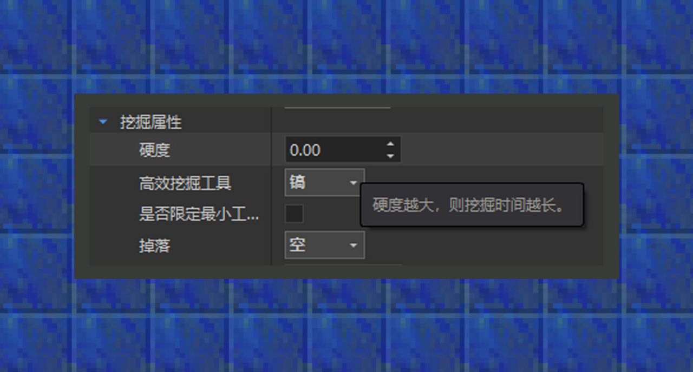

# 使用组件

#### 作者：境界

① 通过点击“添加组件”按钮，或是在组件区域内点击鼠标右键，就会弹出组件选项来添加组件。

② 对单个组件点击右键，可以看到组件的简介内容。

③添加完组件后，右下角的属性面板将会出现被添加组件的属性参数。

### 各类组件介绍

#### 世界类目：

世界类目：包括相机和地形改变相关的组件，详细组件说明如下：

①基础组件：该组件可以设置世界选项、作弊选项等，与在游戏客户端中的设置-选项里的内容无差。许多地图玩法中，可能会需要一个总是白天的地图，或者不刷怪的地图，这时就可以在这里进行设置了。

②相机组件：该组件可以设置玩家的视角，游戏中带有三种视角，第一人称视角、第三人称后视角、第三人称前视角，即组件选项中的原版视角。而改为俯视角时，玩家视角会被改成第三人称视角，并且视角角度可以自由定义，例如MOBA游戏中的俯视角，2D平面跑酷的侧视角，都可以实现。默认情况下，切换为自定义视角时，应不允许玩家切换视角。

③资源点：该组件可以设置世界中的某个位置不断生成资源道具，风靡全球的MC小游戏起床战争就用到了资源点的理念。

④地图复原：该组件可以设置在创建游戏时或开始游戏时保存一片区域的方块，在结束游戏时进行场景复原。当场景内会由玩家因素造成场地破坏时，就可以用到这个组件。

⑤安全区：该组件可以将一个随时间向内聚拢的方形区域外的方块设置成其他方块，适合需要引导玩家向内移动的诱因玩法。如，在出生点周围100格外，不断向内涌入岩浆，直到比赛分出胜负时停止。

#### 维度类目：

维度类目：包括生物群系、自定义特征、生物生成规则等维度相关的功能，详细组件说明如下：

①自定义维度：该组件可以创建一个除主世界、下界、末地以外的新维度。由于群系设定下，新的维度的群系与主世界的群系呈对应关系，因此在没有自定义新维度群系的情况下，主世界与新维度的地貌相差无几。

②自定义群系：该组件可以创建一个在新维度中的群系。在网易版自定义群系中，群系必须继承原版群系，无法添加自定义新群系，且只能作用于新维度中。地形高度栏目下，可以设置群系的高度，在一般情况下使用原版的预设种类即可。若对于地形生成算法小有研究的开发者，亦可以尝试使用随机参数来自定义群系高度。地表栏目下，可以设置一个群系从下层到上层的方块种类。生成规则会控制群系在不同温度下的生成概率，在我的世界中，每个地图种子会被划分为海洋和陆地，并决定不同地区的温度，就好像地球上的温带一样，不同温带下的群系会呈现出不同的地形及气候等特征。不仅如此，当群系遇到高度变化时，可以设置要被转化的群系。如平原遇到山地变化时，会生成森林和森林丘陵。海洋遇到岸滨变化时，会生成沙滩和平原。最后，群系标签可以将指定的自定义名称标签加入到自定义群系中，用来作为新生物出现的群系条件，这个会在生成规则组件中做额外说明。

③自定义生物生成规则：该组件可以创建一个新的生物生成规则。顾名思义，新的规则是用来划分生物可以出现的条件。其中，生物必须来自生物组件所创建的自定义生物，若开发者想要使用该组件来设置手动写的自定义生物的生成规则，可以简单生成一个模板生物后，引用该自定义生物，并在附加包文件内将identifier字段指向的生物ID改为手动写的生物ID。

④自定义特征：该组件可以创建一个新的自定义特征，特征可以用来自定义地下矿簇、地表植物树木等，原版世界里稀有的化石堆、苔石堆，都用到了特征功能。当前编辑器只支持将地图编辑器导出的方块结构转化成特征，如需了解更多自定义特征功能，请参考minecraft wiki或游戏客户端目录/data/definitions/features文件夹。

⑤自定义特征规则：该组件可以创建一个新的特征规则，用来划分编辑器所创建的自定义特征的生成规则。生成时机用来决定特征出现的时机，原版世界中，花草树木一般在表层时机出现，矿物在地下时机出现。指定群系标签可以让特征出现在带有对应群系标签的群系内，该标签适用自定义群系内的标签。分布状态有均匀分布和所有区块分布，所有区块分布下，特征会在满足群系条件的情况下，尝试在每个区块都生成一次。均匀分布下，特征会在满足群系条件的情况下，尝试在多个区块间隔下生成。

⑥自定义传送门：该组件可以设置一个通向另一个维度的传送门。当前编辑器只允许设置立式传送门，即类似下界传送门。一般可容纳玩家穿过的传送门高度在4格宽，5格高。传送门方块需要使用自定义方块进行额外定义，才会从下拉选项内弹出选项。

#### 玩家类目：

玩家类目：包括技能、排行榜等和玩家相关的功能，详细组件说明如下：

①基础属性：该组件可以快速设置玩家的基础属性，并将最后结果生效于进入世界的全部玩家身上。

②初始物品：该组件可以在玩家进入游戏时给予指定出生道具。

③初始装备：该组件可以在玩家进入游戏时自动穿戴指定装备。

④有限复活：该组件可以设置玩家能够复活的次数，当超过复活次数时，会被传送到游戏区域外，非常适合用来制作带有有限复活条件的地图玩法。

⑤技能：该组件可以简单地自定义一些基础型的技能，目前可以定义给予状态效果技能，和发射弹射物技能。

⑥个人排行榜：该组件可以追踪一些玩家数据并对其进行排行，显示在游戏地图内。

⑦旧版初始物品：该组件可以通过填写对应的原版物品ID，让玩家进入游戏时得到指定的出生道具，若希望给予自定义物品，请使用初始物品功能。

⑧旧版初始装备：该组件可以通过填写对应的原版物品ID，让玩家进入游戏时得到穿戴指定的原版装备，若希望给予自定义装备，请使用初始装备功能。

#### 生物类目：

生物类目：用于添加自定义生物，详细组件说明如下：

①生物：该组件可以添加自定义生物，创建自定义生物时，会在资源包和行为包上生成几个文件，而生物行为最终会放置在行为包/entites文件夹内。目前生物功能不支持添加自定义的生物模型、动画，以及更复杂的生物行为组合，但使用该功能可以快速生成生物模板，方便熟练的开发者在之后进行文本级的深度自定义。除此之外，当开发者需要放置自定义生物到地图内时，需要先点击左侧组件中的坐标符号将放置功能解锁，方可放置生物至指定位置。

#### 物品类目：

物品类目：用于添加食物、工具、装备、武器等自定义物品，详细组件说明如下：

①普通物品：该组件可以添加自定义的普通道具、生物蛋道具、消耗性道具等。

②武器和工具：该组件可以添加自定义的剑武器和基于四种原版工具的新工具。

③盔甲：该组件可以添加对应玩家四个装备槽的自定义装备。同时，若开发者越来越熟练后，可以使用文本级的编辑将装备换成自定义3D模型版本的装备。

#### 方块类目：

方块类目：用于添加自定义方块，详细组件说明如下：

①自定义方块：该组件可以添加自定义的基础方块、刷怪笼方块和传送门方块。除此之外，当开发者需要放置自定义方块到地图内时，需要先点击左侧组件中的坐标符号将放置功能解锁，方可放置方块至指定位置。

#### 配方类目：

配方类目：用于添加自定义配方，详细组件说明如下：

①自定义配方：该组件可以添加自定义的熔炉配方和工作台配方。支持将配方的合成材料或结果产出设置为由物品组件和方块组件添加的自定义物品或者方块。

#### 队伍类目：

队伍类目：用于添加队伍配置，详细组件说明如下：

①队伍：该组件可以添加队伍并对队伍内的成员进行分数跟踪。

#### 经济类目：

经济类目：可配置掉落、交易、商店等物品流通相关的功能，详细组件说明如下：

①货币：该组件可以为地图玩法上的玩家新增流通的货币单位。

②掉落：该组件可以为自定义生物添加上自定义的掉落物。掉落物内可以包含多个物品的随机组合，支持自定义物品、装备、方块等。

③交易：该组件可以为自定义生物添加上类似村民的交易列表。

④出售商店：该组件可以为地图上正在被加载的实体添加上出售商店的功能。

⑤购买商店：该组件可以为地图上正在被加载的实体添加上购买商店的功能。

#### 剧情类目：

剧情类目：可配置对话和任务，详细组件说明如下：

①对话：该组件可以为地图上的实体添加对话选项，基于多个条件下，出现对话的时机也都可以不同。

②任务：该组件可以为地图上的实体添加可被玩家领取的任务。领取任务时，会对开发者提供多种领取条件的自定义属性，和任务完成时的道具奖励。

#### 流程类目：

流程类目：包括开始游戏、结束游戏等控制游戏流程的组件，详细组件说明如下：

①开始游戏：该组件可以为地图玩法添加开始游戏的条件。满足组件属性内自定义的多个条件后，游戏才会开始。

②结束游戏：该组件可以为地图玩法添加结束游戏的条件。满足组件属性内自定义的多个条件后，游戏才会结束。

#### 玩法元素类目：

玩法元素类目：包括塔防、起床战争等特定玩法所需的组件，详细组件说明如下：

①床：该组件可以为一个队伍内的成员设置一个公共出生点的坐标，当床被破坏时，可以自定义成员被淘汰后所在的位置，主要对应起床战争的内容。

②塔防大本营：该组件可以设置玩家需要保护的大本营，主要对应塔防玩法。

③攻击手：该组件可以设置自定义的塔防单位为玩家保护大本营，主要对应塔防玩法。

④生物点：该组件可以设置自定义的生物点坐标，利用地形的设计加上巡逻路径组件，可以设置一条塔防玩法中敌对生物的移动路径。

⑤巡逻路径：该组件可以为生物点的生物设置一条行径路径，主要对应塔防玩法。