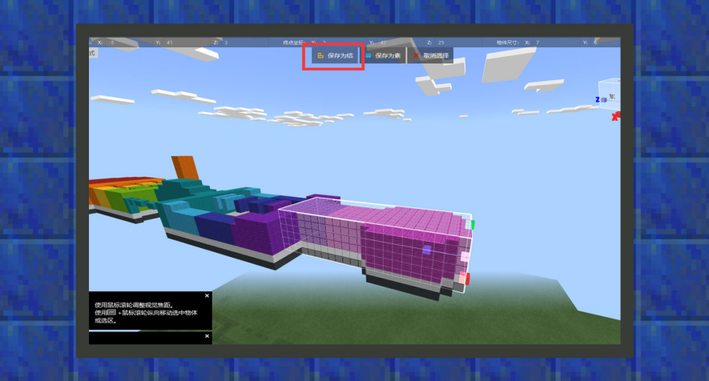

# 地图编辑器

#### 作者：境界

地图编辑器是针对基岩版（C++版）的地图编辑工具，界面分为提供基础功能的菜单栏、集成各种工具及属性的工具栏、进行地图绘制修改的操作区三个部分。

目前地图编辑器提供了笔刷工具、地形工具、橡皮工具、选取工具等等常用的便捷工具，开发者可以通过这些工具在操作区像使用绘图软件一样，对地图存档进行修改与绘制。本章节会简单地为组件开发者提供如何导出特征结构的方法，方便将其应用到自定义特征当中。

进入地图编辑器时，默认工具会选择选取工具，若当前工具不是选取工具，可以点击便捷工具栏改变工具类型，接着选取完区域范围后，点击保存为结构，为其命名一个名称即可。

