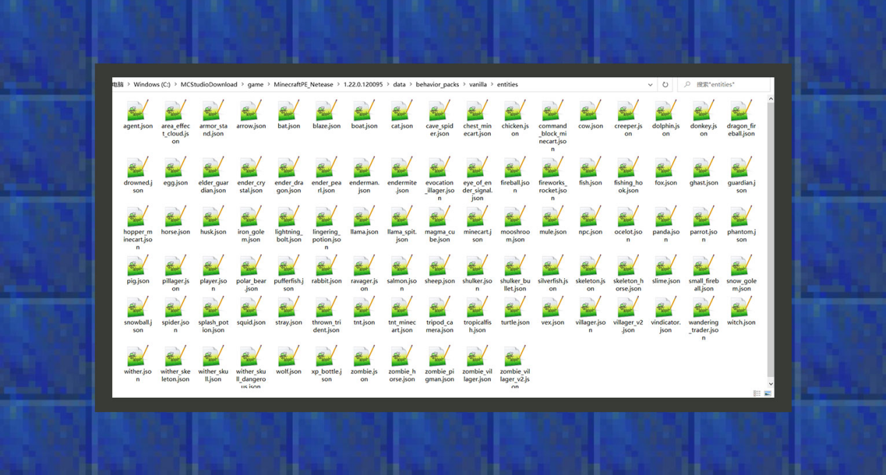
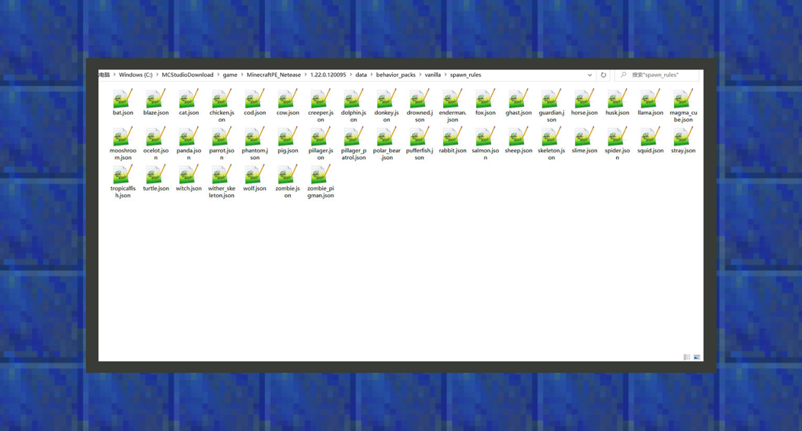
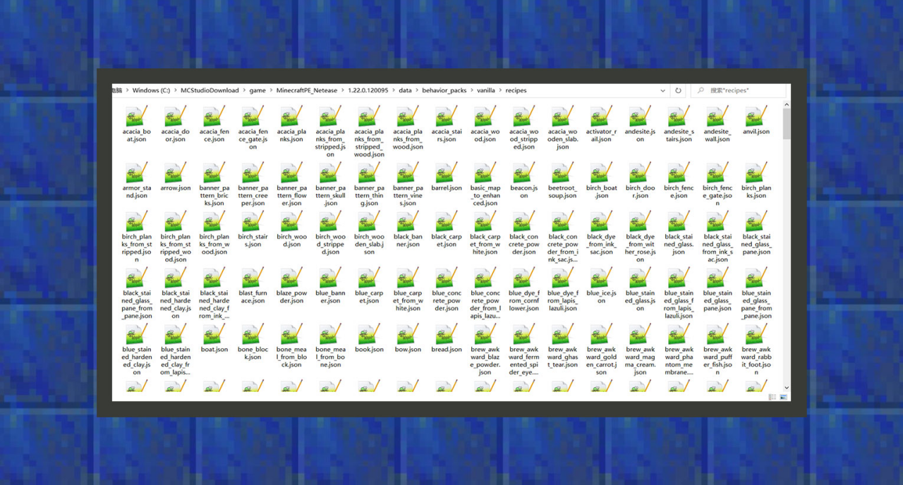
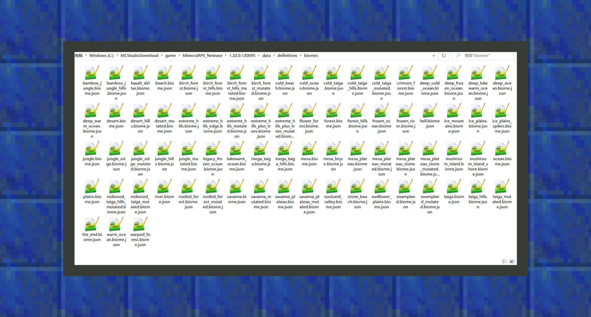

# 开始认识行为包

#### 作者：境界

行为包内运作的内容是运行在服务端上的。

服务端可以理解为一个公共环境，它会向服务端内所有的玩家客户端提供各种服务。例如不同生物会出现在不同的群系，不同种类的生物有不一样的行为，它们又会各自掉落不一样的战利品，这些都是服务端去实施的行为。
在我的世界中，服务端可以简单理解为一个游戏存档，当玩家自己单人游玩，服务端运行在本地，它的延迟最低，对于玩家影响也最小。在联机大厅游戏中，服务端是房主，其他玩家进入房间会受到主机玩家的终端配置和网络延迟影响，因此游戏体验相较于单人游戏时，可能表现得不太稳定。而在网络游戏里，服务端则是一台远程主机，所有玩家连接进入这个世界都不需要去承担服务端带来的运行计算压力。这是三者之间的区别，因此，开发者在设计行为包的时候，应当遵守第一原则，即玩家在本地游玩时，就要有流畅的游戏体验。否则开发者将这样的附加包放进联机游戏和网络游戏当中，都会带来不流畅的游戏体验。

### 行为包的工程文件结构

#### entities[生物行为文件夹]

在原版游戏包里，这里存放着所有原版生物的行为文件，是开发者认知生物行为的最佳场所。同时，我们可以在这里重新修改原版生物的行为，如让鸡可以像末影人一样传送，或者末影人可以像鸡一样每隔一段时间生下一颗鸡蛋。当我们组合新的原创生物时，它们的行为文件也会放在这里。

#### loot_tables[掉落物文件夹]

在原版行为包里，这里存放着所有原版的宝箱战利品，生物战利品，钓鱼战利品等。通过编辑行为，我们可以将生物及自定义方块的战利品表指向存放在这里的任何一种配置文件里，达到自定义掉落物的效果。

#### trading[村民交易表文件夹]

在原版行为包里，这里存放着所有原版游戏中，旧村民和新村民的交易表。旧村民交易表在trading目录下，新村民交易表在trading目录内的economy_trades中。一般来说，我们要修改原版村民的交易表时，优先修改的都是新村民的交易内容。并且，我们也可以将新的交易表文件放在这里，让带有交易行为的其他生物能够读取这些交易表。

#### spawn_rules[生物生成规则文件夹]

在原版行为包里，这里存放着所有原版生物的生存规则，若你想要重新编写原版生物的生成规则，可以直接在这里修改。当你正在修改自定义生物的生成规则时，你的新生物生成规则也应该放在这里。

#### recipes[配方文件夹]

在原版行为包里，这里存放着所有原版的配方。在1.16.10的中国版中，开发者应在模组文件夹内将文件夹名改成netease_recipes，才能在不开实验玩法的条件下使用这项功能。

#### items[物品文件夹]

在原版行为包里，这里存放着大部分原版食物的行为文件。在1.16.10的中国版中，开发者应在模组文件夹内将文件夹名改成netease_items_beh，才能在不开实验玩法的条件下使用自定义物品功能。

#### blocks[方块文件夹]

原版行为包目前没有包含任何一个原生方块的行为，开发者需要通过后续的教程以及开发者技术中心的文档、minecraft wiki作为学习参考的对象。在1.16.10中国版中，开发者应在模组文件夹内将文件夹名改成netease_blocks，才能在不开实验玩法的条件下使用自定义方块功能。

#### features[特征文件夹]

在原版行为包里，这里存放着大多数原版群系中的特征。包括矿石分布特征、植被分布特征等。在1.16.10中国版中，开发者应在模组文件夹内将文件夹名改成netease_features，才能在不开实验玩法的条件下使用自定义特征功能。

#### feature_rules[特征规则文件夹]

在原版行为包里，这里存放着大多数原版群系中的特征规则。特征规则将决定特征出现的条件。在1.16.10中国版中，开发者应在模组文件夹内将文件夹名改成netease_feature_rules，才能在不开实验玩法的条件下使用自定义特征规则功能。

#### Biomes[群系文件夹]

在原版行为包里，这里存放着所有原版群系设定。在1.16.10中国版中，开发者应在模组文件夹内将文件夹名改成netease_biomes，才能在不开实验玩法的条件下使用自定义群系功能。

