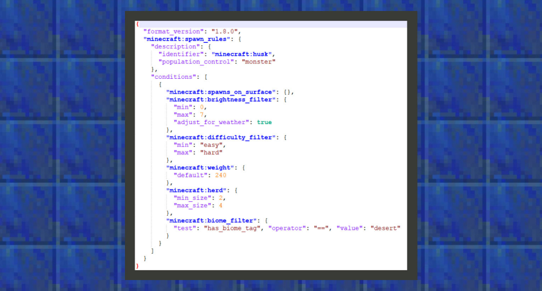

# 基础的实体生成规则

#### 作者：境界


实体生成规则用来控制任一实体在世界中生成的逻辑。

目前常用于生物的生成，生物是实体这一理念的延伸，我们可以说鸡、牛、猪是实体，也是生物，但矿车、船只是实体不是生物。因此船、矿车这种实体不应在自然界中生成，而鸡、牛、猪等生物需要在世界中生成。
本章我们将会教给大家如何简单地改变原版的生物生成规则。


#### 修改尸壳的生成规则

在原版的生成规则中，尸壳这一种攻击性生物只会出现在沙漠中，我们希望它能生成在每个攻击性生物都会出现的地方，而不仅仅是沙漠，请看下面的分析：




```
{
  "format_version": "1.8.0",
  "minecraft:spawn_rules": {
    "description": {
      "identifier": "minecraft:husk",
      "population_control": "monster"
    },
    "conditions": [
      {
        "minecraft:spawns_on_surface": {},
        "minecraft:brightness_filter": {
          "min": 0,
          "max": 7,
          "adjust_for_weather": true
        },
        "minecraft:difficulty_filter": {
          "min": "easy",
          "max": "hard"
        },
        "minecraft:weight": {
          "default": 240
        },
        "minecraft:herd": {
          "min_size": 2,
          "max_size": 4
        },
        "minecraft:biome_filter": {
          "test": "has_biome_tag", "operator": "==", "value": "desert"
        }
      }
    ]
  }
}
```


①当前生物生成规则的format_version停留在1.8.0版本。

②identifier指向生物的名称，population_control是指由游戏引擎控制的生物数量，这里可以写上的字段有animal、underwater_animal、monster、ambient。因此在基岩版中，存在着4个无法直接确定生物数量的维度。打个比方，几乎绝大多数动物都会在亮度7~15的时候出现，而绝大多数攻击性生物都会在0~7的时候出现。因此animal的数量控制了白天时候玩家所看到的生物数量，monster控制了黑夜时分玩家所看到的生物数量。如果同时允许animal的数量和monster的数量在同一个时间内一起出现，可能会出现由于世界中生物实体数量生成过多，所导致的游玩体验降低的风险，请开发者斟酌使用。

③生物生成主要是由群系过滤器控制，biome_filter下接收一个或多个带有群系标签（has_biome_tag）的过滤条件，在尸壳的源文件中可以看到value值的参数是desert，因此将desert改为monster后，就可以让尸壳出现的规律和僵尸一样了。