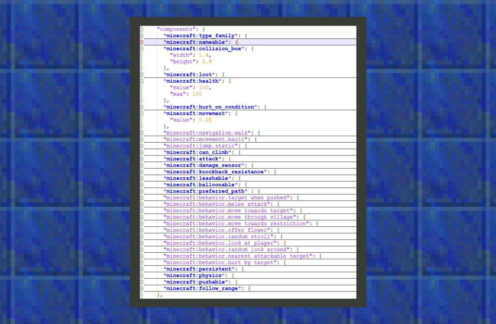

# 简易教学①：修改铁傀儡的基础属性

#### 作者：境界


在《开始认识行为包》章节已知，通过游戏根目录/data/behavior_packs/vanilla/entities中可以找到原版铁傀儡的行为文件。开发者也可以下载原版Add-on附加包模板，通常压缩包内会携带behavior_packs文件夹，与前面提到的游戏根目录下所寻找的行为文件夹相对应。





```
{
  "format_version": "1.13.0",
  "minecraft:entity": {
    "description": {
    },

    "component_groups": {},

    "components": {
      "minecraft:collision_box": {
        "width": 1.4,
        "height": 2.9
      },
      "minecraft:health": {
        "value": 100,
        "max": 100
      },
      "minecraft:movement": {
        "value": 0.25
      }
    },

    "events": {
    }
  }
}
```


①：minecraft:collision_box是控制一个生物碰撞盒子的组件。碰撞盒子决定其他生物距离该类生物多远会产生推挤碰撞，以及可以在多大范围内能伤害到这类生物。其中width决定这个碰撞盒子的宽度，height决定它的高度。

②：minecraft:health是管理一个生物生命值的组件。value的参数代表生物的生命值，max代表生物的最大生命值。

③：minecraft:movement是控制生物的速度组件。其中value的参数代表速度。我的世界基岩版速度换算公式为：movement[速度值] * speed_multiplier[部分行为的速度加成] * friction[方块的摩擦力，默认是0.6] * 20 tick[游戏时间]。