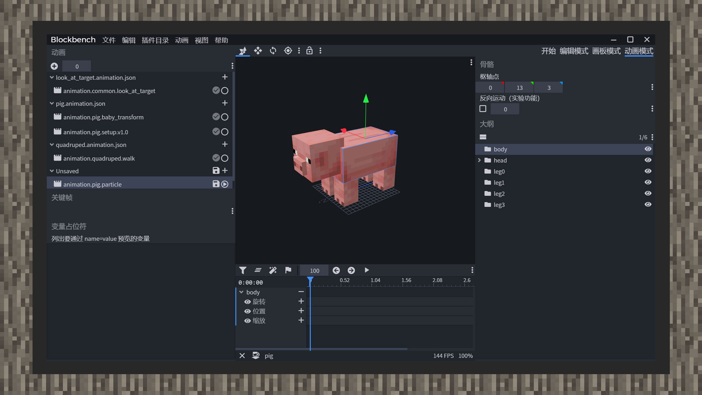
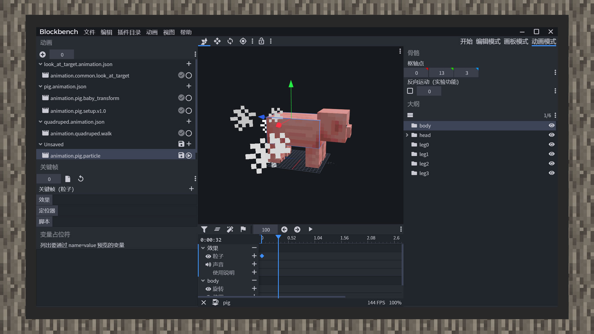

# 绑定动画粒子和动画控制粒子


#### 作者：境界


粒子可以做出非常出彩的效果，让生物的视觉体验提高几个层次。在游戏中，墨鱼喷墨和烈焰人蓄力发射烈焰弹时的火焰都归于粒子效果的范畴。开发者可以在生物定义文件中引用粒子，再通过动画和动画控制器两种方式来播放粒子。粒子还可以绑定在生物的几何体模型上，根据生物的骨骼位置、旋转角度进行相对计算，是更加进阶的粒子使用。在本章中会教开发者如何让粒子跟随生物实体，实现一个简单的效果。


原版的粒子可以在RP/particles文件夹中找到，以中国版当前版本1.21（1.16.10）中，一共有113个预定义好的原版粒子，开发者可以通过研读其中的结构设定，来实现自己的新粒子。




1）打开Blockbench，导入原版猪的模型和贴图。

2）点击动画模式，新建一个动画。


3）点击动画，动画效果，打开动画特效面板。




4）在效果栏列插入帧，同时在左侧关键帧文字上方选择导入文件，选择所需的粒子。同时填入在生物定义文件预先索引好的粒子短名称。

5）拖动鼠标即可预览粒子。

```
{
    "format_version":"1.8.0",
    "animations":{
        "animation.pig.particle":{
            "particle_effects":{
                "0.0":{
                    "effect":"smoke"
                }
            }
        }
    }
}
```


6）保存好动画文件，可以看到，在动画格式中新增了一个particle_effects对象，内容是时间差和它对应的值，值内包含着粒子效果的短名称，将新建的动画在生物定义文件中定义好后，若动画配置正确，游戏内粒子就会正常播放了。

7）在Blockbench当中，一帧内只能添加一种粒子效果。若需要同时播放好几种粒子效果，则需要将粒子效果对象改为粒子效果数组，再手动填入每一个粒子对象。

如：

```
{
    "format_version":"1.8.0",
    "animations":{
        "animation.pig.particle":{
            "particle_effects":{
                "0.0":[
                    {
                        "effect":"smoke"
                    },
                    {
                        "effect":"flame"
                    }
                ]
            }
        }
    }
}
```

```
{
    "format_version":"1.10.0",
    "animation_controllers":{
        "controller.animation.blaze.flame":{
            "initial_state":"default",
            "states":{
                "default":{
                    "transitions":[
                        {
                            "flaming":"query.is_charged"
                        }
                    ]
                },
                "flaming":{
                    "particle_effects":[
                        {
                            "effect":"charged_flames"
                        }
                    ],
                    "transitions":[
                        {
                            "default":"!query.is_charged"
                        }
                    ]
                }
            }
        },
        "controller.animation.blaze.move":{
            "initial_state":"default",
            "states":{
                "default":{
                    "animations":[
                        "move",
                        "look_at_target"
                    ]
                }
            }
        }
    }
}
```


与绑定动画粒子相比，动画控制器粒子可能更为简单。在每个状态下新建一个粒子效果集合，即"particle_effects"，它同样可以同时添加多种粒子效果。

与绑定动画粒子不同的是，当动画控制器切换到带有粒子效果的状态时，粒子会在第一时间播放，想要延迟粒子的播放则只能手动修改粒子的发射时间。而动画粒子可以根据动画达到一定时间才会播放一次粒子效果。