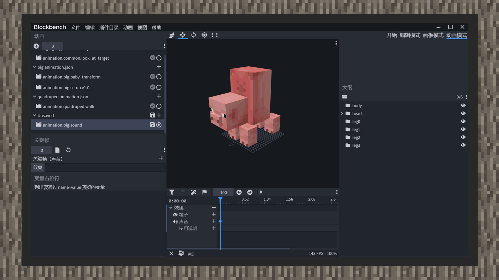

# 绑定动画音效及动画控制器音效


#### 作者：境界


音效是可以提升游戏沉浸感、真实感的一种方法。在游戏里，玩家除了能够听到背景音乐、环境音乐，每种生物也都有自己的专属声音。例如羊吃草，蜜蜂嗡嗡嗡。一种生物如果在每个行为表现上都有自己的音效，会让玩家觉得生物更加生动。因此，本章将会教给开发者如何通过动画和动画控制器来给生物添加上音效。


原版的音效可以在RP/sounds中找到，由于MC原版音效使用的是商业音效引擎FMOD，正常情况下是无法试听音效。但开发者可以在同目录下的sound_definitions.json文件中，找到音效的资源名称和资源路径。通过一定的比较，提取出适合的音效作为练习绑定生物音效的素材。


1）打开Blockbench，导入原版猪的模型和贴图。

2）点击动画模式，新建一个动画。

3）点击动画，动画效果，打开动画特效面板。

4）在效果栏列插入帧，同时在左侧关键帧文字下方效果输入在生物定义文件中定义好的音效名称。




5）进入游戏，测试音效播放情况。

6）保存好动画文件，可以看到，在动画格式中新增了一个sound_effects对象，内容是时间差和它对应的值，值内包含着音效效果的名称，将新建的动画在生物定义文件中定义好后，若动画配置正确，游戏内音效就会正常播放了。

```
{
    "format_version":"1.8.0",
    "animations":{
        "animation.pig.particle":{
            "sound_effects":{
                "0.0":{
                    "effect": “smoke”
                }
            }
        }
    }
}
```


7）在Blockbench当中，一帧内只能添加一种音效效果。若需要同时播放好几种音效效果，则需要将音效效果对象改为音效效果数组，再手动填入每一个音效对象。

如：

```
{
    "format_version":"1.8.0",
    "animations":{
        "animation.pig.particle":{
            "sound_effects":{
                "0.0":[
                    {
                        "effect":"jiliguala"
                    },
                    {
                        "effect":"yiyiyaya"
                    }
                ]
            }
        }
    }
}
```


与绑定动画音效相比，动画控制器音效可能更为简单。在每个状态下新建一个音效效果集合，即"sound_effects"，它同样可以同时添加多种音效效果。

```
{
    "format_version":"1.10.0",
    "animation_controllers":{
        "controller.animation.blaze.flame":{
            "initial_state":"default",
            "states":{
                "default":{
                    "transitions":[
                        {
                            "flaming":"query.is_charged"
                        }
                    ]
                },
                "flaming":{
                    "sound_effects":[
                        {
                            "effect":"balabala"
                        }
                    ],
                    "particle_effects":[
                        {
                            "effect":"charged_flames"
                        }
                    ],
                    "transitions":[
                        {
                            "default":"!query.is_charged"
                        }
                    ]
                }
            }
        }
    }
}
```


与绑定动画音效不同的是，当动画控制器切换到带有音效效果的状态时，音效会在第一时间播放，并且播放结束后就不会重新播放。若音效绑定在动画内并且动画被设置为循环开启，则音效会在指定的时间间隔不断重复播放，直到动画结束为止。