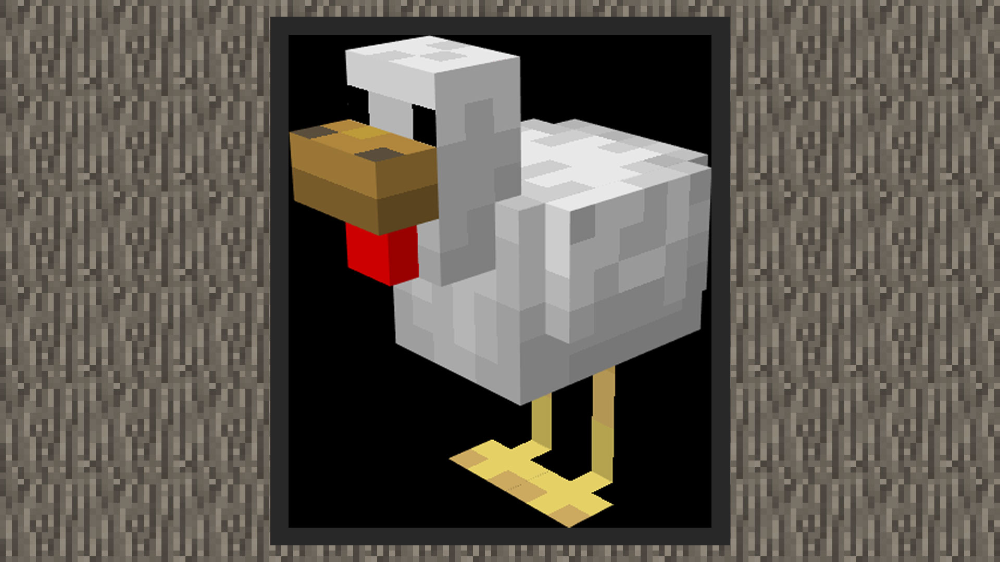
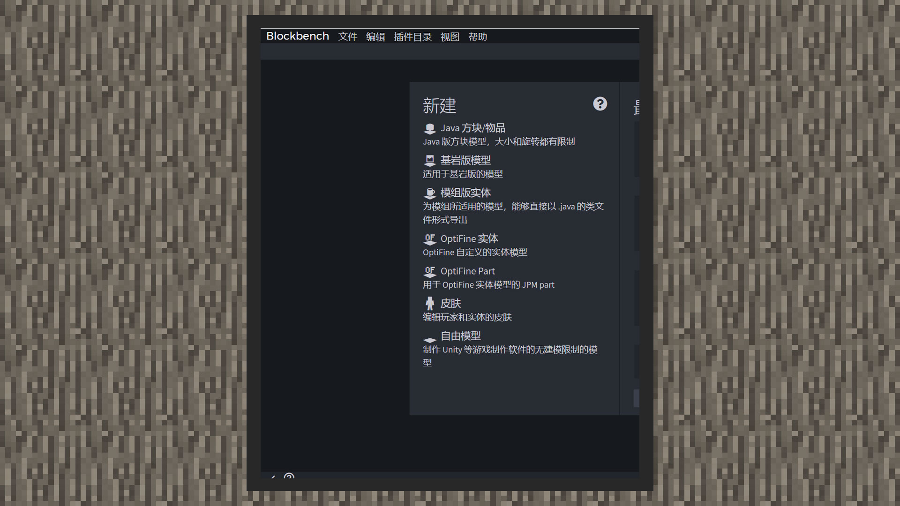

# 利用Blockbench修整鸡的模型

#### 作者：境界

在Blockbench中导入鸡的模型，从中可以看到它一共被分为6个骨骼。

1）body：身体

2）head：头部

3）leg0：右脚

4）leg1：左脚

5）wing0：右翼

6）wing1：左翼

这样的骨骼分组十分符合我们对新生物水鸭的需求。对照现实中的绿头水鸭，只需提取鸭头、鸭嘴、羽毛特征，进行个人风格化的修整，即可制作完一只水鸭模型。

1）打开blockbench，选择基岩版模型。

2）点击文件，选择打开模型，找到鸡的模型文件（通常在客户端文件中的data/resource_packs/vanilla/models/entity/chicken.geo.json中），选择geometry.chicken，再点击导入。

3）点击body骨骼，按下快捷键R用鼠标向X轴正旋转90度，或是在元素面板中的旋转单位里，在X轴输入90，矫正模型。

4）拉高鸡的脖子，由于绿头鸭的一大特征是脖子很长，我们将脖子高度由6拉到9。同时鸭子没有鸡的红脖子，因此去掉红色的方块，随后移动beak骨骼（即喙）到靠近升高后的眼睛位置。

5）鸭子有比鸡更长的尾巴，因此我们在body骨骼里放入两个新的方块来模拟尾巴。将大尾巴移动到x为-3，y为12，z为-2的位置，将方块放大至长度为6，高度为2，宽度为5。将第二个方块作为小尾巴，位置放在x为-2，y为12，z为0的位置。将尺寸拉至4格长，1格高，4格宽。

6）最后我们的水头鸭会长成这样，不用担心，现在看起来贴图纹理很怪异的原因，是因为原来贴图上的像素点无法对应新增的方块面积，而变成了透明区域。再下一章我们会带大家进行贴图的绘制。