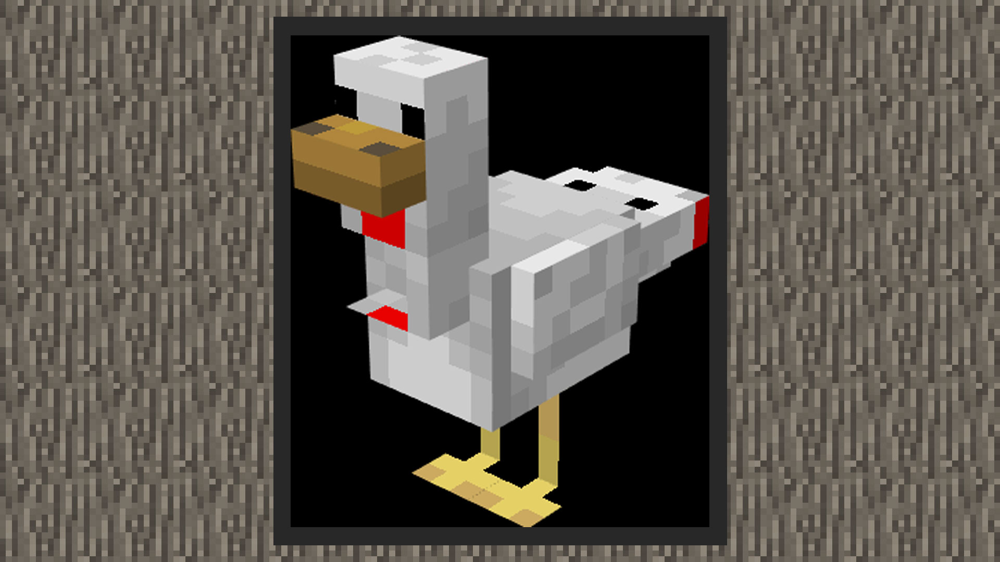
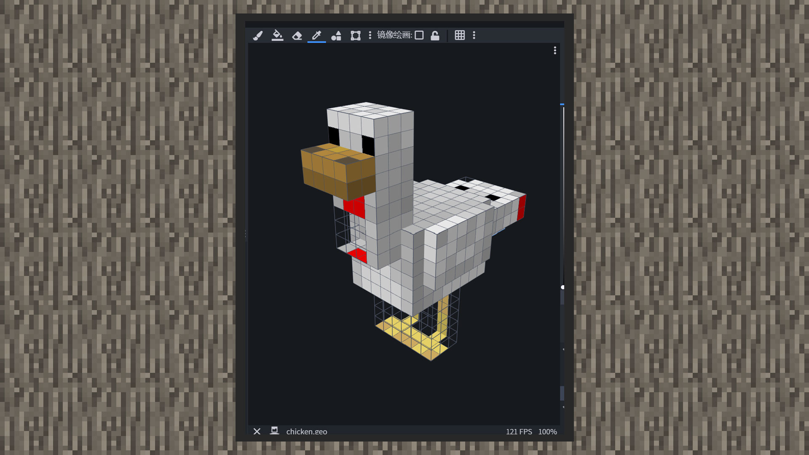
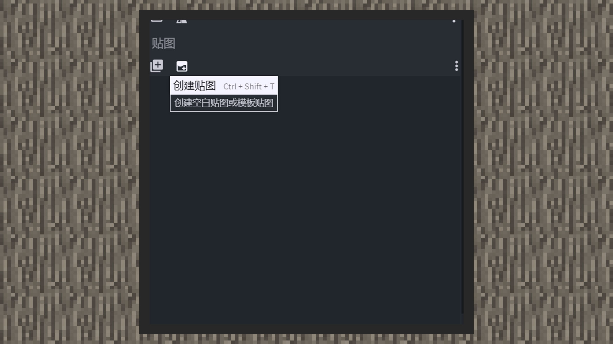
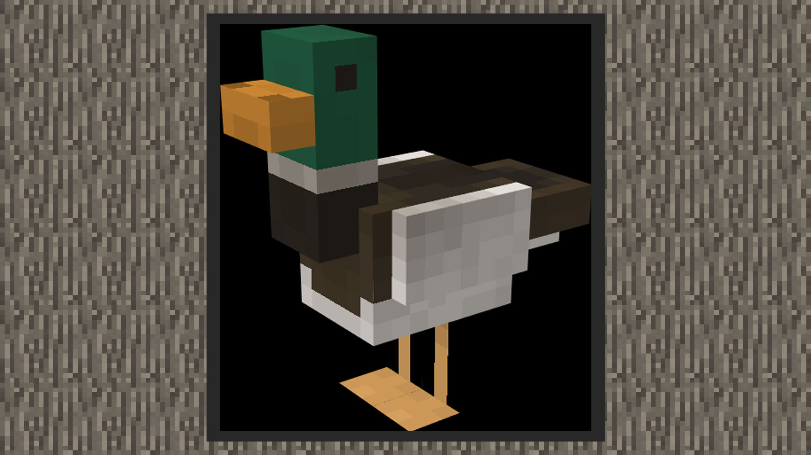
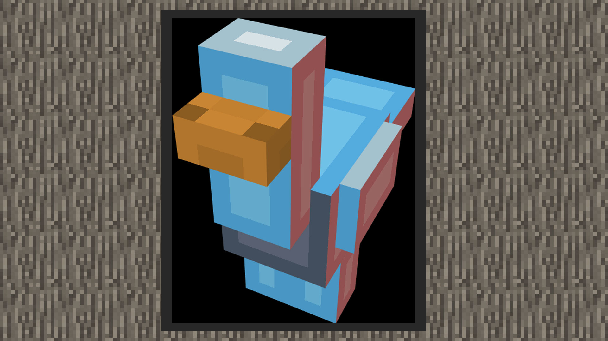

# 利用BlockBench为鸭画上贴图

#### 作者：境界

修改完鸡的模型后，我们在右上角将blockbench列为画板模式，指针变成笔刷，点击方块区域即可上色。

1）首先删掉原来的贴图，点击创建贴图，将贴图名称改为green_duck，勾选模板，接着一直点击确定。

2）首先调整喙的颜色，水鸭的喙更加鲜艳，因此可以选择更鲜艳（饱和度高）的黄色，阴影选择稍微浅的土黄色。

2）绿水鸭最显眼的是它的绿冠头，用笔刷给它画上深绿色。脖子上还有个白色红领巾，再下一层给它刷上白色。

4）接着将胸口，后背和大尾巴刷成棕色，小尾巴和其他身体画成白色。

5）让脚方块的前面，上面、侧面和一小部分的背面变透明，使用画板模式的橡皮擦即可。其他部分画成黄色。

6）加上一些阴影，一只继承了鸡骨骼的水鸭模型就做好了。

7）最后一步，选择文件->导出，选择导出基岩版模型，之后在自定义水鸭时还会用到它。