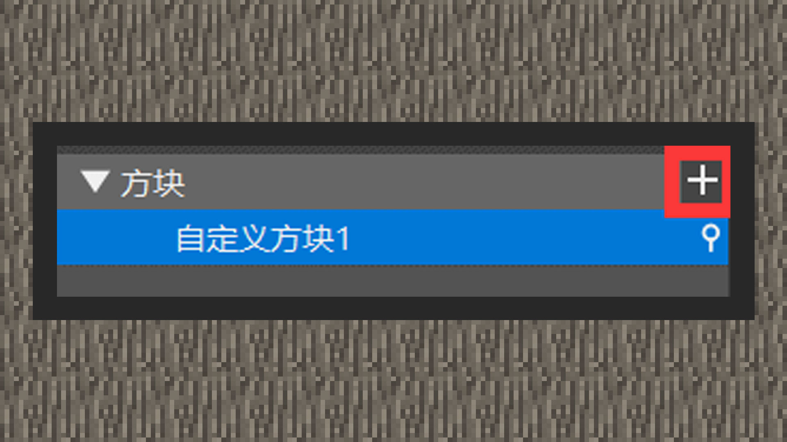
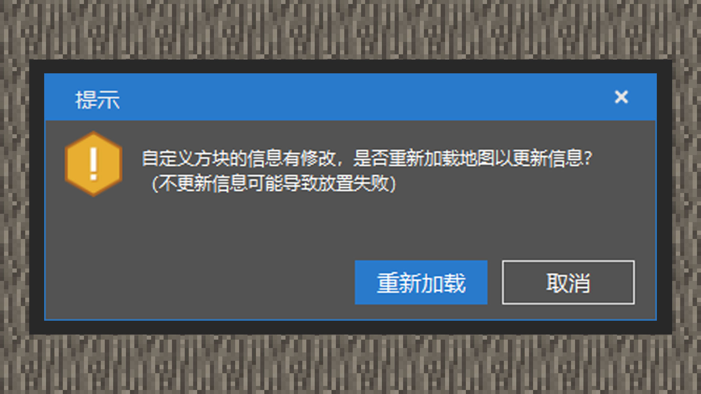
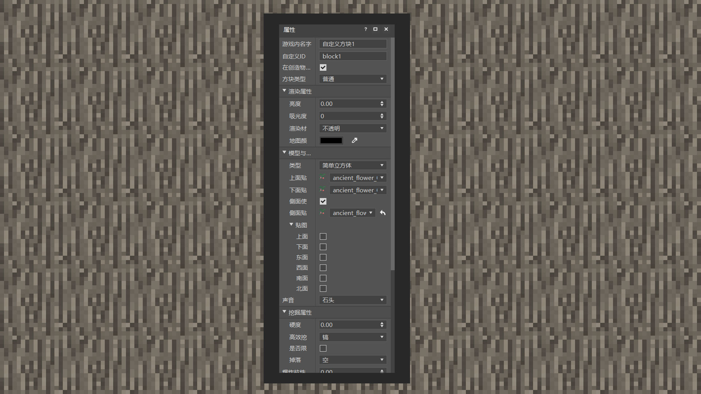
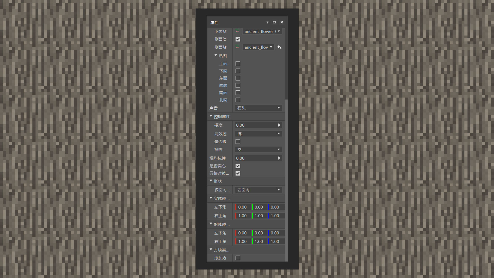

# 认识自定义方块

#### 作者：境界

方块是我的世界中元素构成的基本单位。大到地表、群系、植被，小到工作台、机器、篝火，全部都是以方块的形式去演绎。自定义方块为开发者提供了一条更方便的途径管道来定制内容玩法。诚然，当前自定义方块内容只提供了部分功能，并不是所有原版方块的细节都可以通过自定义方块来实现的。请期待在接下来的更新，由中国版和基岩版团队提供更加多元的方案吧！本章节将会阐述，自定义方块现在能够做到什么。

#### 自定义方块组件

目前自定义方块支持使用基岩版1.16.10提供的原版方块组件功能和中国版提供的额外方块组件功能。我们可以使用文本编辑器或者MCSTUDIO来进行制作。

#### MCSTUDIO

1）进入关卡编辑器，右键组件面板，创建方块组件。可以通过右边“+”号增加多个自定义方块。然后再点击右边的解锁按钮，在编辑器页面上左键放置自定义方块，按ESC退出放置模式。注意：每当开发者修改了自定义方块信息，需根据提示弹窗重新加载世界，更改后的信息才会生效。

2）当前编辑器支持自定义方块的组件内容为：

#### 游戏内名称：

修改方块物品显示在物品栏里的名称。

#### 自定义方块ID：

是该方块在游戏内的唯一性名称，必须只能带有英文和下划线。为了避免与其他模组、原版方块产生ID冲突，我们应当使用模组名称+下划线+方块名称的方式命名最为保险。

#### 在创造物品栏显示：

勾选选项会将方块注册到construction栏，即建筑方块分页下的创造物品栏内。

#### 方块类型：

当前可选的有普通、传送门、刷怪箱三种。

#### 渲染属性：

渲染属性下的四个组件功能分别是吸光度（可理解为透光度，值越大，则越不透光）、亮度（可理解为发光，值在0.0~1.0之间，值越大，在夜晚发光程度越大）、渲染材质（由方块贴图纹理决定，若贴图内带有透明图层，则选择透明材质，若有半透明图层，则选择半透明材质，否则选择不透明材质）、地图颜色（方块在地图里显示的颜色）。

#### 模型与贴图：

模型有两种类型，一种是简单立方体，即占据世界内一格高、一格宽、一格长的方块模型，默认情况下不需要指定方块模型；一种是自定义方块模型，需要开发者提供自定义方块模型文件。选择简单立方体时，若勾选上侧面使用同种贴图的话，开发者只需提供存放在资源管理器内，textures文件夹下的blocks文件夹内的上面、侧面、底面三类贴图纹理文件，若取消勾选，则可以指定方块的上下左右前后面，总共达6面的贴图。贴图随机纹理会帮助方块在游戏内被放置后，随机旋转设定好的那一面的贴图，在原版世界中使用到这个功能的方块有树叶、泥土、草方块等，随机旋转会在合适的条件下给玩家带来更好的视觉效果，而不容易产生审美疲劳。

#### 声音：

指方块的音效，包括生物踩在上面和破坏时的音效，方块音效属于硬编码的范畴，当前无法自定义方块音效，所以我们必须使用原版的方块音效。

#### 挖掘属性：

硬度决定了方块的破坏时间，硬度越大，方块需要挖掘的时间也越久，而高效挖掘工具可以设置成原版的镐、锄、斧、铲四种类型，同时支持这四种类型的自定义物品工具。限定工具等级掉落会影响方块是否掉落，它会添加一格工具等级的条件，高于工具等级才能挖掘后掉落方块掉落物。掉落可以指向组件面板建立的掉落物表。是否实心则会影响该方块是否会窒息生物，以及使用自定义方块模型时，取消一些难看的阴影。寻路时被当作障碍物选项，勾选时则会被生物当作是障碍物跳到上方走动，不勾选则会当作空气方块无视其存在来移动。

#### 形状:

面向决定方块是否是四面向或者六面向方块，设置为四面向方块，根据玩家放置的四个不同角度（东西南北）来改变方块朝向，六面向则多了上和下两个面。

实体碰撞箱会检测实体的体积是否与方块体积重叠，一般情况下实体会被挡在方块碰撞箱之外，若实体碰撞箱和实体重叠，有可能造成窒息伤害！

射线碰撞箱会检测玩家的视线是否与方块体积重叠，例如，绝大多数的方块的射线碰撞箱都是一个格子，因此当视线移动到格子之内时，这个方块就能够被挖掉！

#### 方块实体：

打开后可以让自定义方块保存复杂数据结构的功能。