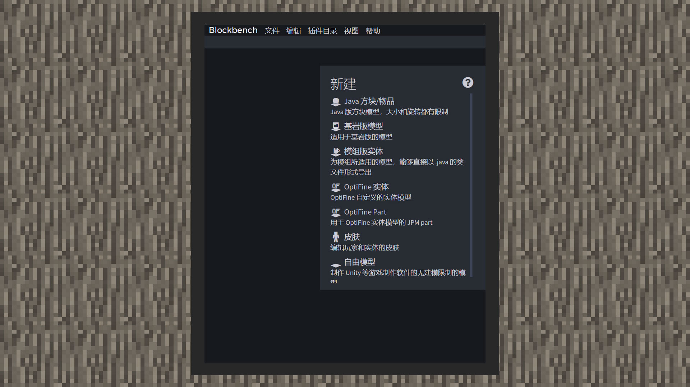
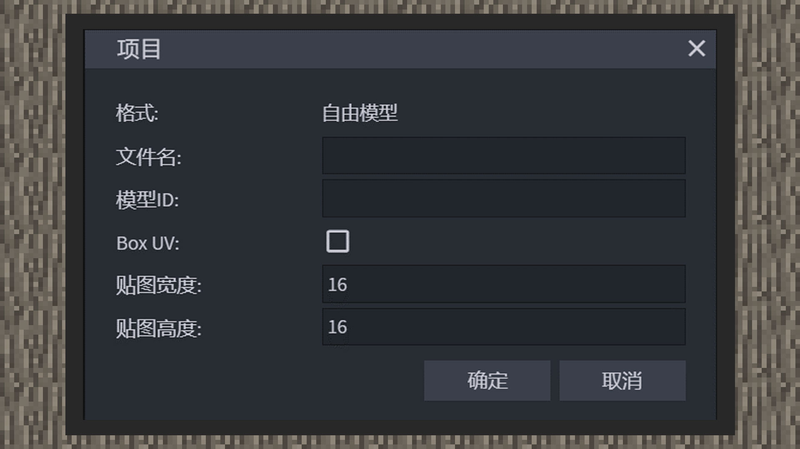
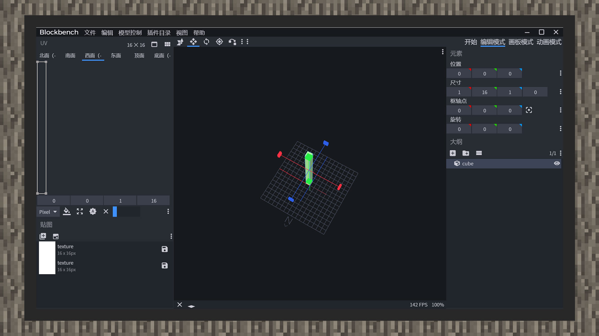

# 制作方块的特殊模型

#### 作者：境界

在制作方块模型前，首先要新建工程。但是必须提前告知的是，中国版的方块模型文件与原版的模型文件中的部分键对格式稍有出入，开发者可以在中国版开发者文档中自行比较。为了方便开发者，开花组团队通过Blockbench的自由模型格式开发了转化器，我们可以通过McStudio的特效编辑器下的资源管理面板，直接转化自由模型的工程文件为自定义方块模型文件，十分的方便。

#### BlockBench的工程选择

1）打开Blockbench，从新建栏目下选择自由模型。

2）项目中的文件名和模型ID指定好后，不勾选BoxUV，并将贴图宽度改为16x16。

3）进入项目后可以看到坐标系和网格，N方向即朝北方向。需要注意的是，从示例图可以看到红蓝线，它们的交点是方块的左上角。因此，方块模型需要从这里开始，向右下角伸展，进行素材搭建，而不是在网格范围内搭建。虽然这与正常的建模思维会有一定冲突，但是开发者也可以选择先在网格中央建好方块模型后，再往右下角移动即可。同样的，与建模自定义生物模型一样，网格长宽都有16格，16格在世界中代表一格方块格子。

4）每个立方体最后都会被骨骼包裹，这是建造我的世界模型的基本概念，与自定义生物模型无差。不过，由于目前自定义方块模型尚未支持动画，因此所有的骨骼锚点都需要设置在坐标0，0，0的位置上，否则对方块骨骼进行旋转时，可能会遇到预览效果与游戏中实际效果有偏差的情况！与此同时，方块模型中的立方体和骨骼都不支持膨胀功能，遇到立方块面重叠的问题时，当前只能通过移动立方体或者挤压/放大立方体大小来解决！

#### 方块模型的贴图规范

与生物模型的UV展开图方式不同的是，我们建议开发者建模自定义方块时取消生物模型的Box UV，转而使用以设置每一个方块面东、西、南、北、上、下的方式，并且贴图格式大小设置为16x16。如果遇到一张分辨率在16x16的纹理画布上无法满足开发者对模型的细节要求，可以在工程里再次新建一张16x16的贴图，这样的建模限制是为了引导开发者积极优化方块模型的资源消耗，毕竟玩家的硬件资源是有限的。