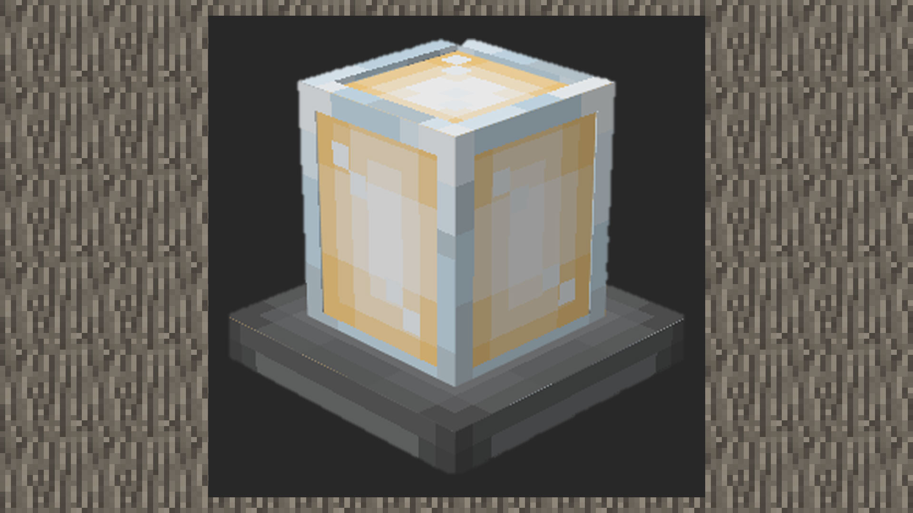
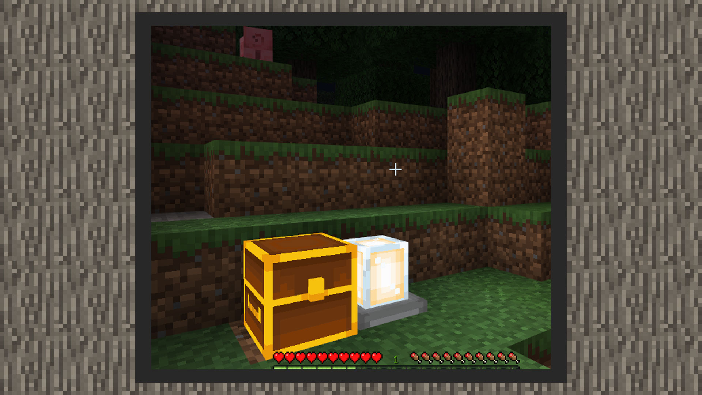

# 简易教学①：制作会发光的地灯


#### 作者：境界


#### 自定义方块行为包

```
{
    "format_version": "1.16.0",
    "minecraft:block": {
        "description": {
            "identifier": "design:lamp"
        },
        "components": {
            "minecraft:block_light_absorption": 0,
            "netease:tier": {
                "digger": "pickaxe",
				"level": 0
            },
			"netease:render_layer": {
				"value": "alpha"
			},
            "minecraft:block_light_emission": 1.0,
            "minecraft:destroy_time": 2.0,
            "minecraft:map_color": "#ffffff"
        }
    }
}
```

1）1.16.0是当前下界更新的自定义方块内容格式，所以我们在format_version里填1.16.0

2）identifier是自定义方块的名称域，这里可以由开发者自己定义。

3）components下的参数会储存方块的各项功能。

-将透光度调为0，减少环境光的影响。

-将该方块设置为被木镐以上等级的镐子挖掘有速度加成。

-由于使用了带有透明图层的贴图，将该方块的渲染材质设置为透明。

-将发光度设置为1.0，即发最强的光。

-将方块破摔时间设置为2.0

-自定义方块在地图上显示的颜色，这里可以由开发者自己定义。




#### 自定义方块资源包

1）在resourcepack/blocks.json中，添加该方块的名称域与模型资源名称，名称来自resourcepack/models/netease_block/内的模型文件里的名称域。将走在方块上和破坏方块的音效设置为玻璃音效。

```
{
  "format_version": [
    1,
    1,
    0
  ],
  "design:lamp": {
    "netease_model": "design:lamp",
	"sound": "glass"
  }
}
{
    "format_version": "1.13.0",
    "netease:block_geometry": {
        "bones": [
          …
        ],
        "description": {
            "identifier": "design:lamp",
            "textures": [
                "design:lamp"
            ],
            "use_ao": false
        }
    }
}
```


#### 实际游戏效果

