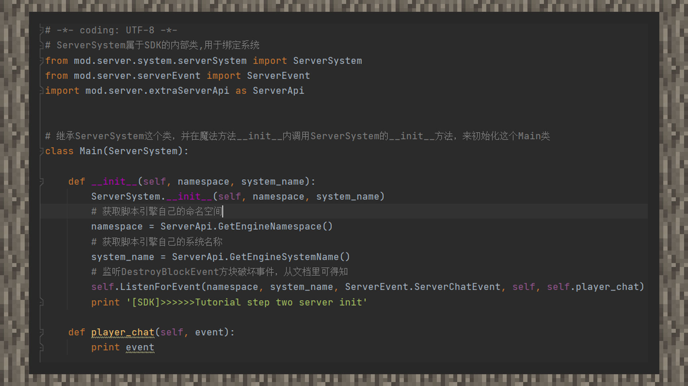

# MOD第一步：监听事件

#### 作者：境界

①在示例目录下新建TutorialStepThree目录，根据StepTwo的写法进行模仿。

②在_ init _函数下，将脚本引擎的命名空间和系统名称赋值给两个变量，使用ListenForEvent监听玩家聊天事件，并指定回调函数。回调函数的作用是，每当玩家打出聊天内容时，这个回调函数就会被调用，里面的相关代码就会执行。根据文档的信息可得知，它最后会回传一个包含6个参数的字典。因此在定义回调函数的时候，除了保证第一个参数为对象本身之外，还需要再额外增加一个参数，为了方便理解，我们将第二个参数命名为event。之后在函数体下，我们打印一下这个event，并在游戏内看到最终的效果。

