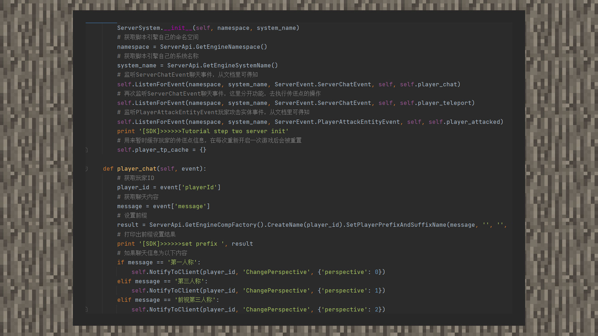
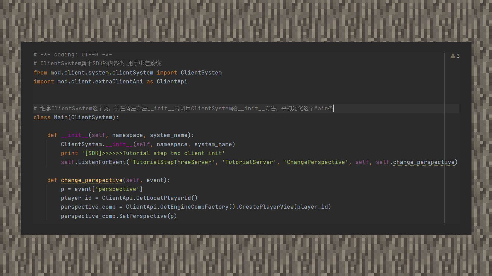

# MOD第三步：服务端与客户端通信

#### 作者：境界

①由于服务端和客户端属于两个不同的容器，对应支持的接口也各有不同。常有开发者问如何在服务端上使用客户端的方法，或者客户端上使用服务端的方法，但这实际上是行不通的，因为两个容器都各自有自己的轨道，为了让轨道之间可以产生合作，这就需要用到通信了。

②通信即是让服务端或者客户端将需要对方需要用到的数据以Python的基本数据类型进行包装，服务端通过NotifyToClient、BroadcastToAllClient，客户端通过NotifyToServer来传递。其中BroadcastToAllClient是广播到所有玩家客户端上，NotifyToClient是发送给一名指定的客户端玩家，NotifyToServer是发送到服务端上。

③还记得在监听事件的时候需要在第一个参数和第二个参数传入命名空间和系统名吗？并且注册系统的时候，我们就已经为客户端系统和服务端系统命名了，因此在一端上接收另一端的自定义事件，就是用modMain.py内注册系统时写下的命名。

④在示例中，我们在聊天事件内新增代码，使用条件语句判断聊天信息，传到客户端后让玩家改变自己的人称视角。

