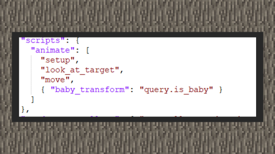
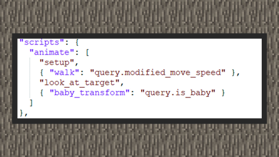

# 行为与动画组合

#### 作者：境界

我们希望生物会因某种行为而发生动作上的改变，这种改变更多是暴露在外给玩家看到的。比如希望生物在攻击时会表现攻击动画，希望它们在水面上移动时会做出游泳动画。在基岩版中，使用Molang语法配合动画控制器可以做出丰富的动画组合。Molang语言是基岩版独有的一种简易的表达式语言，它主要作用于计算和获取游戏系统内的属性值，由于设计的比较底层，因此在语言优化上的优势远远大于脚本引擎。能够从游戏内获得的属性绝大多数服务于自定义实体、自定义物品、自定义方块上，这些属性又由query函数所返回，它们就像MODSDK上的接口，根据不同query函数所服务的对象，可以返回它们携带的属性。例如我想知道某只羊是否是幼体，可以在molang中读取query.is_baby函数来获得羊是否是幼体。更多的query函数表可以从Minecraft wiki上找到！

#### 行为与动画示例①

①羊在幼体时，它看起来头特别的大，比成年的羊还大。这是因为羊这个生物注册了一个放大头部位的动画，判断羊是幼体使用了query.is_baby函数。从羊的生物定义文件中可以看到，放大羊头的动画资源名称为baby_transform，而baby_transform的播放条件是query.is_baby必须为1，文档告知这个函数只会返回1真或者0假。在Molang中，布尔值由数字代替，不为0为真，0为假。因此，{动画: molang语法}即告知游戏，当某只羊是幼体时，则放大头部的动画会播放。这里的molang语法简写为"query.is_baby"，相当于若query.is_baby不为0，则为真。

#### 行为与动画示例②

①猪在移动的时候，用到了walk这个动画，它被注册在了猪的定义文件里。同样使用molang语法，根据文档可以知道query.modified_move_speed会根据生物的速度返回0~1之间单位化取值，若速度慢慢地走出来，则返回1，若因为部分组件行为使用了速度调整的键对，可能不会刚好满足1，但是由于大于0的缘故，最后在上图中，每当猪移动的时候都会返回真，则播放walk动画。