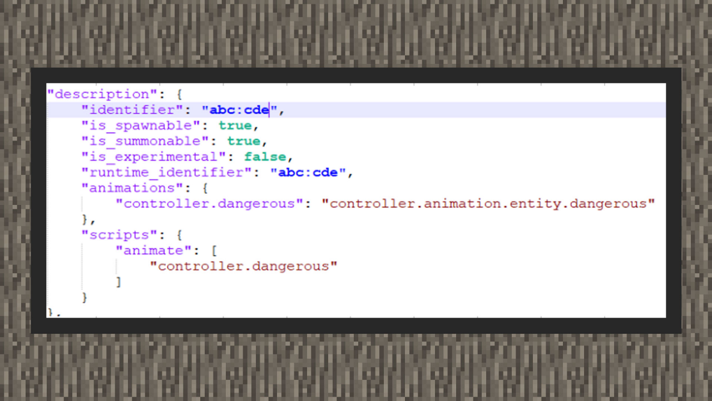

# 控制器与生物事件

#### 作者：境界

在前面的章节中，我们曾有提到动画控制器是存放在资源包的，因为它用来控制动画的状态切换。但实际上，行为包上也可以存在动画控制器，所存放的文件夹和大部分结构上的写法都没有太大的变化。但这又是用来做什么的呢？实际上，有许多开发者曾经希望，能够获得实体的状态后去执行行为包内的事件，亦或是直接从实体身上执行某段指令。由于这些内容都必须在服务端上运行，因此基岩版团队也为开发者在行为包上开放了另一种动画控制器，来根据生物的状态变化时，去执行一组指令或者触发生物的某个事件。

由于原版的实体都没有用到这个功能，它的格式和用途只存在于文档当中，因此寻找参考对象比较困难，以下整理了两种用途，为开发者指点迷津。

#### 行为包控制器的写法

① 在行为包根目录中创建animation_controllers的文件夹，控制器文件都会放在这里。

②根据上图可以看到与资源包类似，除了在每个状态下可以放置animations动画集合以外，还有两个新的集合，一个是“on_entry”，一个是“on_exit”，它们分别会在进入该状态下后，和离开该状态下前去执行里面的内容。内容可以填写一组指令，或者"@s 事件名称"的格式来执行一个使用了该动画控制器的实体的行为事件。

③在上图中，我们根据生物在发现目标的时候，给予一格10秒的1级强力状态效果，并在生物失去目标的时候，清理掉身上全部的状态效果。

④ 在生物行为文件里，注册动画控制器，并在scripts/animate下持续执行控制器，同样的执行控制器前，也可以额外通过Molang条件判断控制器是否需要执行。