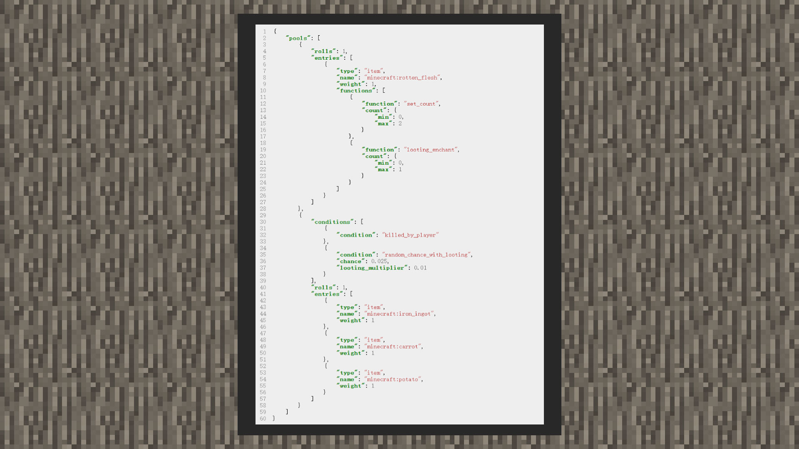

# 战利品条件


#### 作者：境界





当开发者希望筛选组合必须满足条件时才会掉落战利品，可以使用战利品条件功能。

```json
 {
    "conditions": [
        {
          "condition": "has_mark_variant",//当该生物的minecraft:mark_variant值为几时，条件通过，可以筛选
          "value": 1
        },
        {
          "condition": "entity_properties",//当该生物因着火或者落地而被击败时
          "value": {
            "on_ground": false,
            "on_fire": false
          }
        },
        {
          "condition": "killed_by_player",//当该生物是被玩家击败的
        },
        {
          "condition": "killed_by_player_or_pets",//当该生物是被玩家或玩家的宠物击败的
        },
        {
          "condition": "random_chance_with_looting",//当随机值满足时，且掠夺附魔会增加随机概率，取值范围在0.0~1.0
          "chance": 0.0,
          "looting_multiplier": 0.0
        },
        {
          "condition": "random_difficulty_chance",//当难度为下列某一难度时，值越大，越容易被筛选到，取值范围在0.0~1.0
          "default_chance": 0, //若没有设置游戏难度，则此段生效
          "peaceful": 0,//若游戏难度为和平难度
          "easy": 0,//若游戏难度为简单难度
          "normal": 0,//若游戏难度为正常难度
          "hard": 0//若游戏难度为困难难度
        },
        {
          "condition": "random_regional_difficulty_chance", //将最大区域难度随机机会满足指定值时，取值范围在0.0~1.0
          “max_chance”: 0.0
        }
    ]
}
```

