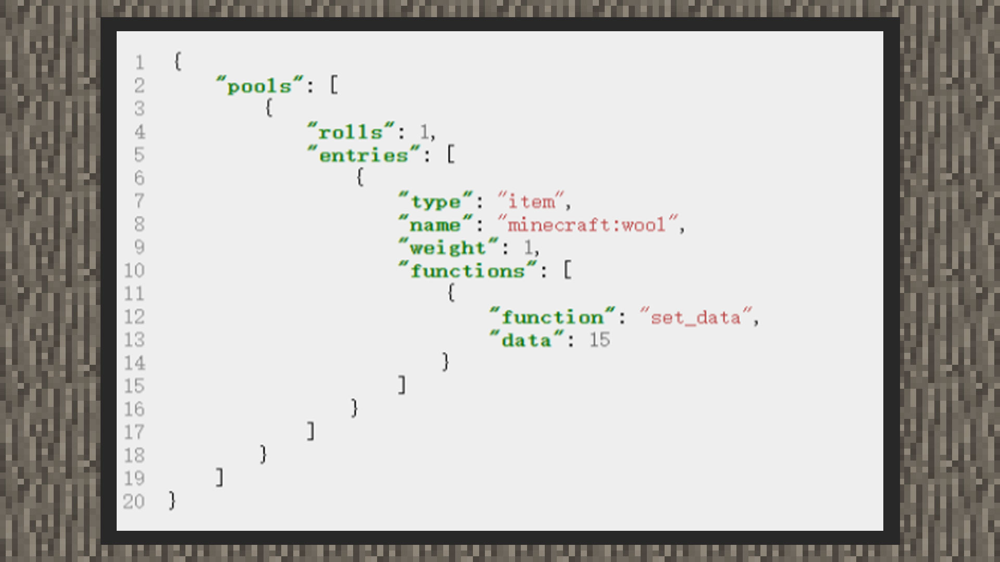

# 简易教学①:自定义掉落一种颜色的羊毛


#### 作者：境界





1）创建一个在行为包主目录中，loot_tables文件夹下的战利品配置文件。


2）根据内容格式写入

```
{
  "pools": [
      {
        "rolls": 1,
        "entries": []
      }
  ]
}
```

由于只掉落一种颜色的羊毛，筛选次数写1即可


3）插入战利品内容

```
{
  "pools": [
      {
        "rolls": 1,
        "entries": [
          {“type”: "item", "name": "minecraft:wool","function": [{"function": "set_data","data":15}]}
        ]
      }
  ]
}
```


将战利品类型设置为物品，将物品名称设置为minecraft:wool，最后再加入战利品功能，设置物品附加值为15，这样就会在战利品出现时，出现一个黑色羊毛。