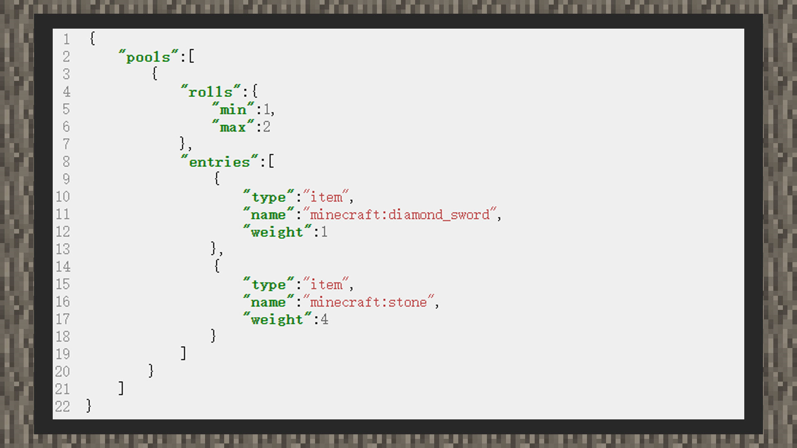

# 简易教学②:自定义多次筛选同个奖励池


#### 作者：境界





1）创建一个在行为包主目录中，loot_tables文件夹下的战利品配置文件。


2）根据内容格式写入

```
{
  "pools": [
      {
        "rolls": {
           "min":1,
           "max":2
        },
        "entries": []
      }
  ]
}
```

由于我们希望多次筛选同一个战利品池，但希望是在一个随机的区间里，因此筛选次数最小值填1，最大次数填2，则最终筛选次数会在1~2次之间。


3）插入战利品内容

```
{
    "pools":[
        {
            "rolls":{
                "min":1,
                "max":2
            },
            "entries":[
                {
                    "type":"item",
                    "name":"minecraft:diamond_sword",
                    "weight":1
                },
                {
                    "type":"item",
                    "name":"minecraft:stone",
                    "weight":4
                }
            ]
        }
    ]
}
```


投放两个物品类型的战利品，将物品名称设置为minecraft:diamond_sword钻石剑和minecraft:stone圆石。同时更加昂贵的钻石剑的权重被设置为了1，普通的圆石设置为4，这样单次抽取战利品的概率里，钻石剑抽中的概率为1/ (1 + 4) * 100% = 25%。