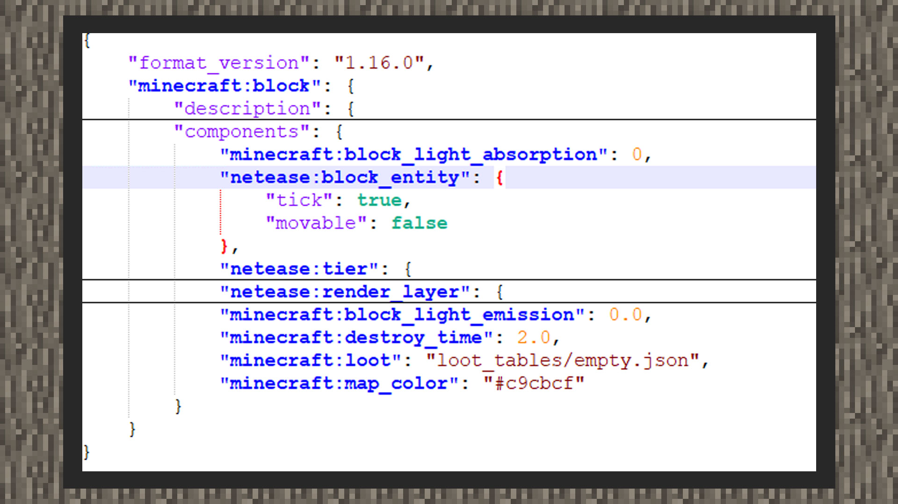

# 自定义方块实体


#### 作者：境界


自定义方块实体是一种可以保存复杂数据结构的方块类型。与方块状态不同的概念是，方块状态更多是保存一种单一的属性。以基岩版的铁砧为例，它带有一个方块状态："damaged"来代表铁砧的损坏程度，它接受四个值，broken（损坏的）、slightly_damaged（轻微受损的）、undamaged（完好的）、very_damaged（严重受损的）。而方块实体则可以保存更复杂的数据内容，如一个箱子方块里保存了一个物品数据。因此，方块实体就是方块的内容，方块状态更多看作是方块的属性。注意：自定义方块实体功能为中国版特供，所以开发者无法用同样的格式在国际板上自定义方块实体。


#### 如何自定义方块实体




```
{
    "format_version": "1.16.0",
    "minecraft:block": {
        "description": {
        },
        "components": {
			"netease:block_entity": {
			  "tick": true,
			  "movable": false
			}
        }
    }
}
```

在自定义方块的components下，开发者添加一个"netease:block_entity"的组件，其中有两个键对，"tick"设置为true时，当玩家进入方块tick范围时，该方块每秒会发送20次ServerBlockEntityTickEvent事件，设置为false时，则不会像脚本层发送事件。

"movable"用来设置该自定义方块实体是否可以被活塞推动。由于基岩版的设定，所有原版方块实体都可以被活塞推动，这里也为自定义方块实体提供了这一项功能。


#### tick与不tick

在需要方块保存数据而不需要实时更新方块内的数据时，可以选择将tick设置为false。

例如：玩家右键交互一个自定义方块实体，每20下会随机掉落一个战利品。这里的方块实体保存数据只是为了记录玩家点击自己的次数，因此可以将tick设置为false。


而当需要设置tick为true时，往往该自定义方块实体需要不断更新自身的数据，例如自定义一个熔炉方块，当方块内有燃料并且正在烧东西时，方块实体自身需要维护一个不断更新的燃烧物品时间，则可以将该方块实体的tick设置为true。

