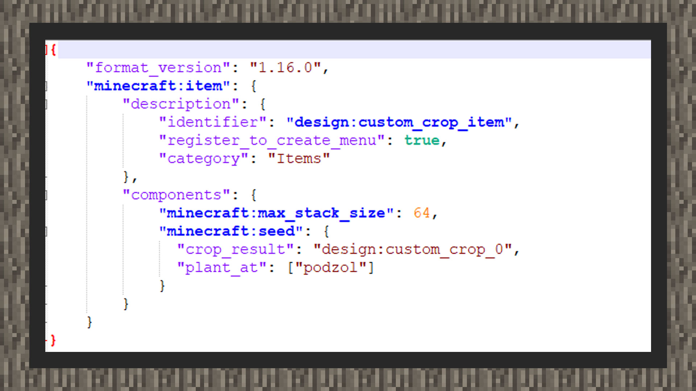
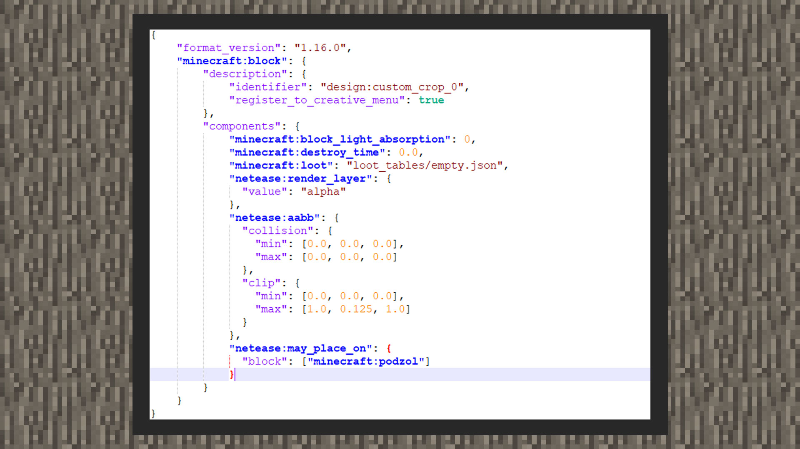
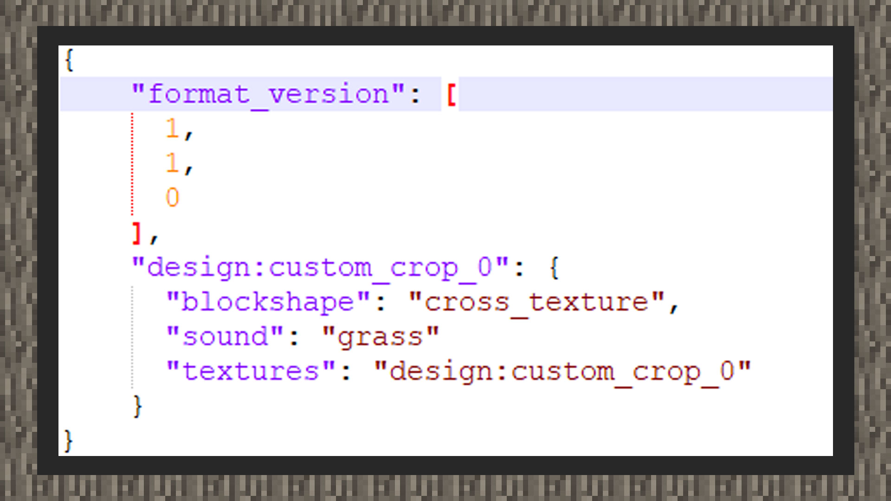
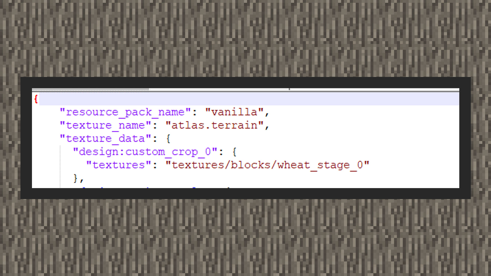
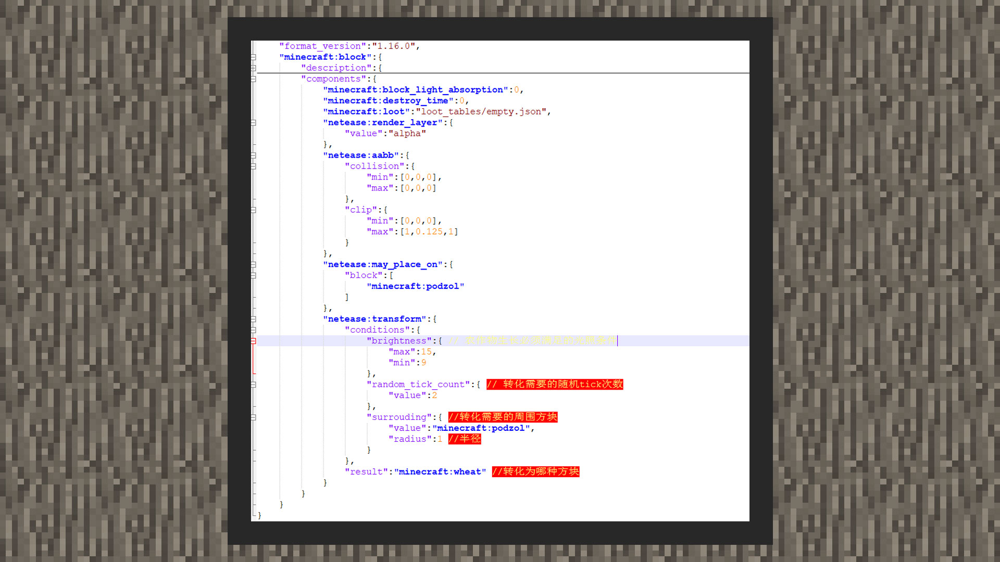
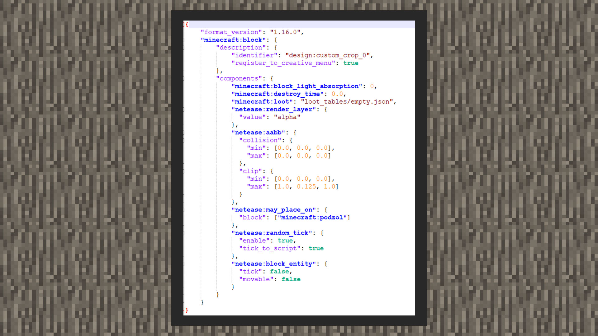
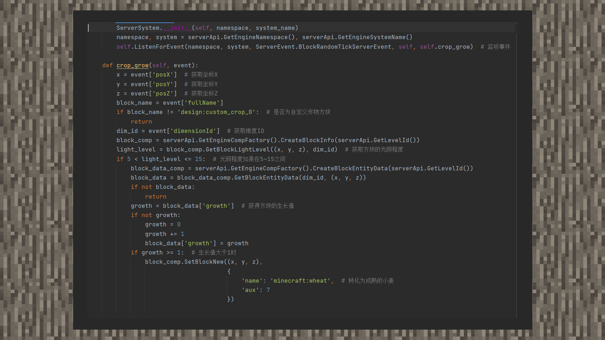

# 自定义作物


#### 作者：境界


在《我的世界》中，种植一个作物需要一颗种子。因此从开发的角度来说，自定义作物需要用到一个种子道具和一个自定义方块。实现自定义作物的常用方法一共有两种，一种可以通过纯组件方式实现，一种则需要用到MODSDK，本章将会为开发者提供这两种思路去实现自己的自定义作物。


#### 开始前的准备

#### 自定义种子




自定义一个种子道具，设置它的最大堆叠数为64个。加入"minecraft:seed"组件，其中有两个键对，"crop_result"指向种植的方块，这里命名为"design:custom_crop_0"，它将作为未成熟的自定义作物方块的名称域备用。"plant_at"指向可以种植的方块，这里设置只能种植在灰化土上。

```
{
	"format_version": "1.16.0",
	"minecraft:item": {
		"description": {
			"identifier": "design:custom_crop_item",
			"category": "Items"
        },
		"components": {
			"minecraft:max_stack_size": 64,
			"minecraft:seed": {
			  "crop_result": "design:custom_crop_0",
			  "plant_at": ["podzol"]
			}
		}
	}
}
```


#### 自定义农作物方块




```
{
    "format_version": "1.16.0",
    "minecraft:block": {
        "description": {
            "identifier": "design:custom_crop_0"
        },
        "components": {
            "minecraft:block_light_absorption": 0,
            "minecraft:destroy_time": 0.0,
            "minecraft:loot": "loot_tables/empty.json",
            "netease:render_layer": {
              "value": "alpha"
            },
            "netease:aabb": {
              "collision": {
                "min": [0.0, 0.0, 0.0],
                "max": [0.0, 0.0, 0.0]
              },
              "clip": {
                "min": [0.0, 0.0, 0.0],
                "max": [1.0, 0.125, 1.0]
              }
            },
			"netease:may_place_on": {
              "block": ["minecraft:podzol"]
			}
        }
    }
}
```


自定义未成熟的作物方块行为，用"minecraft:block_light_absorption"设置它的透光度为0，这样方块不会在世界中产生难看的阴影。用netease:aabb将碰撞箱和射线检测碰撞箱适配实际方块的形象。用netease:render_layer将方块材质设置为透明材质。用"minecraft:destroy_time"设置它的破坏时间为0.0，用"minecraft:loot"将掉落物指向原版的空战利品表，即不掉落任何掉落物。用“netease:may_place_on”设置方块只能生长在灰化土上，不是灰化土则自毁。





自定义未成熟的作物方块材质，设置它被破坏的音效为草的音效，与原版作物方块被破坏的音效一致。将它的方块形状设置为"cross_texture"，这样方块就会像原版的作物方块一样呈现一个交叉形状，适合对方块模型没有特殊要求的开发者。


```
{
    "format_version": [
      1,
      1,
      0
    ],
	"design:custom_crop_0": {
	  "blockshape": "cross_texture",
	  "sound": "grass",
	  "textures": "design:custom_crop_0"
	}
}
```





```
{
    "resource_pack_name": "vanilla",
    "texture_name": "atlas.terrain",
    "texture_data": {
	  "design:custom_crop_0": {
		"textures": "textures/blocks/wheat_stage_0"
	  }
	}
}
```


最后在textures/terrain_texture.json文件（如果没有就新建）里，设置作物的资源键和资源路径。





在自定义方块内加入"netease:transform"组件，"condition"内放置方块的条件，brightness光照控制方块在什么光照条件下生长，random_tick_count为转化需要的随机tick次数，surrounding为防转化需要的周围方块，radius是方块半径。result是方块转化后的结果方块。

```
{
    "format_version":"1.16.0",
    "minecraft:block":{
        "description":{
            "identifier":"design:custom_crop_0"
        },
        "components":{
            "minecraft:block_light_absorption":0,
            "minecraft:destroy_time":0,
            "minecraft:loot":"loot_tables/empty.json",
            "netease:render_layer":{
                "value":"alpha"
            },
            "netease:aabb":{
                "collision":{
                    "min":[0,0,0],
                    "max":[0,0,0]
                },
                "clip":{
                    "min":[0,0,0],
                    "max":[1,0.125,1]
                }
            },
            "netease:may_place_on":{
                "block":[
                    "minecraft:podzol"
                ]
            },
            "netease:transform":{
                "conditions":{
                    "brightness":{ // 农作物生长必须满足的光照条件
                        "max":15,
                        "min":9
                    },
                    "random_tick_count":{ // 转化需要的随机tick次数
                        "value":2
                    },
                    "surrouding":{ //转化需要的周围方块
                        "value":"minecraft:podzol",
                        "radius":1 //半径
                    }
                },
                "result":"minecraft:wheat" //转化为哪种方块
            }
        }
    }
}
```


#### 脚本实现自定义方块





```
{
    "format_version": "1.16.0",
    "minecraft:block": {
        "description": {
            "identifier": "design:custom_crop_0"
        },
        "components": {
            "minecraft:block_light_absorption": 0,
            "minecraft:destroy_time": 0.0,
            "minecraft:loot": "loot_tables/empty.json",
            "netease:render_layer": {
              "value": "alpha"
            },
            "netease:aabb": {
              "collision": {
                "min": [0.0, 0.0, 0.0],
                "max": [0.0, 0.0, 0.0]
              },
              "clip": {
                "min": [0.0, 0.0, 0.0],
                "max": [1.0, 0.125, 1.0]
              }
            },
			"netease:may_place_on": {
              "block": ["minecraft:podzol"]
			},
			"netease:random_tick": {
			  "enable": true,
			  "tick_to_script": true
			},
			"netease:block_entity": {
			  "tick": false,
			  "movable": false
			}
        }
    }
}
```


在自定义方块内加入"netease:random_tick"组件，其中enable为是否启用random_tick随机时间，tick_to_script为触发随机时间时，是否传递BlockRandomTickServerEvent事件到脚本层。启动随机时间组件后，方块会在每一个随机间隔内将事件发送到脚本层，为了达到更加拟真的效果，我们加入方块实体组件，这样可以用来保存方块状态，进行一个生长值的模拟。




在示例图中，我们通过监听BlockRandomTickServerEvent来判断是否可以转换到下一个阶段的自定义农作物，判断条件不限定于netease:transform中描述的光照、tick数量以及周边环境。同时，我们还可以借助blockEntityData组件来存储数据。最后满足条件结果，会将自定义作物方块转化为成熟的小麦，当然，也可以替换成开发者自定义的作物。

