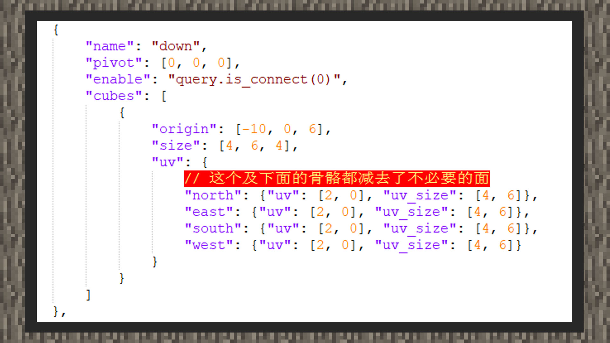
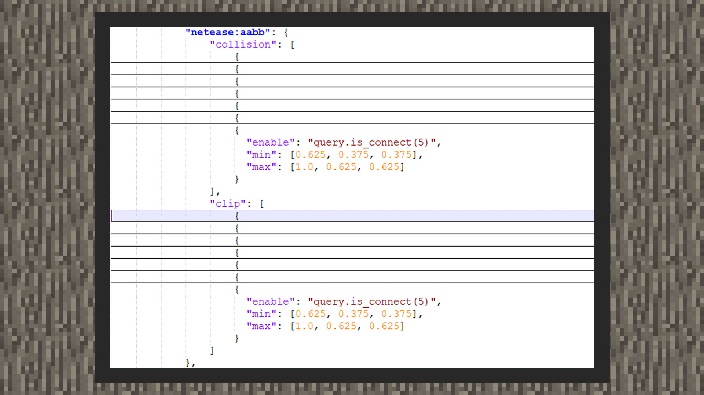

# 自定义管线方块

#### 作者：境界

管线方块作为一些知名模组的物质传输方块，常常出现在玩家面前。中国版当前支持制作根据接触其他方块的面显示对应连接部位的方块模型。注意：自定义连接功能为中国版特供，所以开发者无法用同样的格式在国际版为自定义方块添加该功能。

#### 资源上的定义

打开附件里bbmodel文件夹内的管道方块模型，可以看到连接6个面的方块骨骼和内部的方块位置。

root是管道的中心骨骼，当四面都没有可连接的方块时，应当只显示root骨骼。当方块的南面有可连接的方块时，应显示root和south骨骼，其他亦然。

捋顺模型的制作思路后，还要注意的是，为了让游戏知道模型在哪个面连接到相应方块时显示哪一面的接口，还需要在最终的模型文件上进行配置。

如上图所示，我们需要在骨骼名称的同级下打开键对“enable”，值为molang语法：query.is_connect(接触面)。其中接触面即方块朝向的固定值。“down”是管道下方的骨骼，与此同时，我们在它的骨骼同级下加入"enable": "query.is_connect(0)"，即仅当下方有可连接方块时，才显示该骨骼所携带的方块。

#### 功能上的定义

在自定义方块内加入"netease:connection"组件，"blocks"内放置连接的方块，只有连接到这些方块，模型才会显示出连接过去的一部分。

同时，自定义方块模型会携带一部分阴影，需要将"netease:solid"的值设置为false才能关闭阴影。

由于方块拥有了比基本方块更小的体积，我们需要将方块的射线检测和碰撞体积都契合它真实的模型。

首先将aabb组件内的collision碰撞体积和clip射线检测体积都改为数组形式，这样方块才能拥有多重的体积。

通过blockbench的世界坐标和方块位置、体积求得每个骨骼的实际体积，需要再加入enable键对来帮助游戏控制每个连接部位的显示与否。