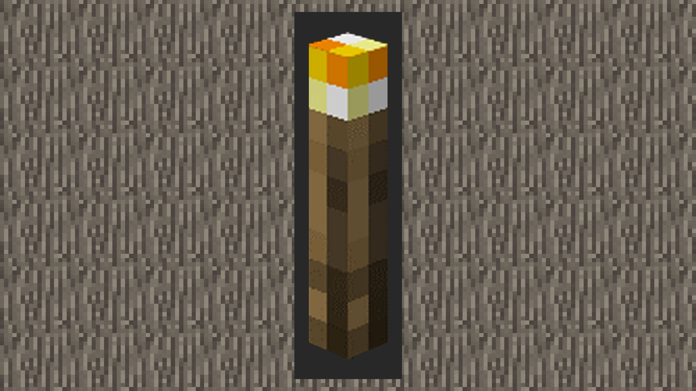
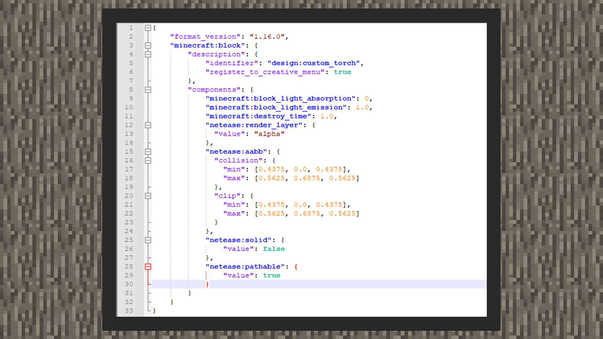

# 简易教程②：制作一个加速作物生长的火把方块


#### 作者：境界


加速火把示例包下载：下载[示例包](https://g79.gdl.netease.com/guidedemo-case13.zip) 。

#### 火把方块示意图：





#### 增加火把方块行为包




```
{
    "format_version": "1.16.0",
    "minecraft:block": {
        "description": {
            "identifier": "design:custom_torch"
        },
        "components": {
            "minecraft:block_light_absorption": 0,
			"minecraft:block_light_emission": 1.0,
            "minecraft:destroy_time": 1.0,
            "netease:render_layer": {
              "value": "alpha"
            },
            "netease:aabb": {
              "collision": {
                "min": [0.4375, 0.0, 0.4375],
                "max": [0.5625, 0.6875, 0.5625]
              },
              "clip": {
                "min": [0.4375, 0.0, 0.4375],
                "max": [0.5625, 0.6875, 0.5625]
              }
            },
			"netease:solid": {
				"value": false
			},
			"netease:pathable": {
				"value": true
			},
			"netease:block_entity": {
			  "tick": true,
			  "movable": false
			}
        }
    }
}
```


1）首先我们将方块的透光率设置为0，即将minecraft:block_light_absorption值写为0。这是由于火把方块用到自定义模型，游戏内的日夜光照会对模型进行阴影覆盖，我们希望方块受到阴影的程度的影响小一些，因此将值设置为0。开发者也可以根据自己的实际情况，在0~15间内进行微调，这是透光率组件允许接受的数值范围。

2）接着使用minecraft:block_light_emission组件，将发光程度调成1.0，使火把会在游戏内产生发光效果。开发者也可以根据自己的实际情况，在0.0~1.0间内进行微调，这是发光组件允许接受的数值范围。

2）接着用netease:render_layer将方块材质设置为透明材质，以允许方块模型使用带有透明图层的贴图。

3）之后在netease:aabb里，将碰撞体积和射线检测贴准火把方块真实的样子。组件中，每1点对应blockbench建模空间中16格，也就是每0.0625的长度对应blockbench内的一格空间。

4）接着将方块设置为非实心方块，这是由于我们希望避免玩家与苹果方块接触时，偶尔会因为碰撞盒重叠出现窒息扣血的情况。

5）紧接着，我们使用一个方块自定义的小技巧，即不设置方块的掉落物。那么在游戏内，方块默认会掉落方块物品本身。

6）最后，将方块设置为生物无视其继续循着自己的寻路路径走。


#### 增加火把方块材质包

1）使用MCSTUDIO导出火把方块工程文件，获得json模型文件

2）将模型文件的贴图资源指向原版的火把贴图"torch_on"，将环境光遮罩关闭("use_ao": false)

3）在材质包/blocks.json内配置火把方块的模型和破坏音效


#### 脚本实现自定义方块


```
{
    "format_version": "1.16.0",
    "minecraft:block": {
        "description": {
            "identifier": "design:custom_torch"
        },
        "components": {
			"netease:block_entity": {
			  "tick": true,
			  "movable": false
			}
        }
    }
}
```


在自定义方块内加入"netease:block_entity"组件，其中设置tick为真，movable为假。加速火把方块会在每一秒发送20次事件到脚本层，即 每一次事件间隔为1 / 20 = 0.05秒。


在示例图中，我们通过监听ServerBlockEntityTickEvent来判断是否可以将小麦变成下一个生长程度，判定条件为小麦是否是成熟状态，注意本加速火把示例中，只对小麦种子加速有效果，其他种子无效果。

```
    def torch_grow(self, event):
        x = event['posX']  # 获取坐标X
        y = event['posY']  # 获取坐标Y
        z = event['posZ']  # 获取坐标Z
        block_name = event['blockName']
        if block_name != 'design:custom_torch':  # 是否为自定义加速方块
            return
        dim_id = event['dimension']  # 获取维度ID
        block_comp = serverApi.GetEngineCompFactory().CreateBlockInfo(serverApi.GetLevelId())
        block_state_comp = serverApi.GetEngineCompFactory().CreateBlockState(serverApi.GetLevelId())
        block_entity_comp = serverApi.GetEngineCompFactory().CreateBlockEntityData(serverApi.GetLevelId())
        block_entity_data = block_entity_comp.GetBlockEntityData(dim_id, (x, y, z))  # 获取方块数据
        tick = block_entity_data['tick']  # 获取方块刷新次数
        if not tick:
            tick = 0
        tick += 1  # 加速火把方块会在每一帧自增一次刷新次数
        block_entity_data['tick'] = tick
        if tick % 20 != 0:  # 根据文档可知事件会在一秒刷新20次，当刷新次数与20求模为0时，即过了一秒钟
            return
        # 运用列表推导式，获得[(x - 1, y, z - 1), (x, y, z - 1), (x + 1, y, z - 1), (x + 1, y, z + 1), (x, y, z),
        # (x - 1, y, z + 1), (x, y, z + 1), (x - 1, y, z), (x + 1, y, z)]的坐标列表
        grow_poses = [(x + x_offset, y, z + z_offset) for x_offset in xrange(-1, 2) for z_offset in xrange(-1, 2)]
        grow_poses.remove((x, y, z))  # 由于坐标(x, y, z)是加速火把，所以移除这个坐标
        for grow_pos in grow_poses:
            block = block_comp.GetBlockNew(grow_pos, dim_id)
            if block and block['name'] == 'minecraft:wheat':  # 如果是小麦
                block_state = block_state_comp.GetBlockStates(grow_pos, dim_id)
                if block_state['growth'] < 7:  # 且小麦还未成熟，即成长值小于7
                    block_state['growth'] += 1  # 增加一级成长值
                    block_state_comp.SetBlockStates(grow_pos, block_state, dim_id)
```


#### 最终效果如下：

