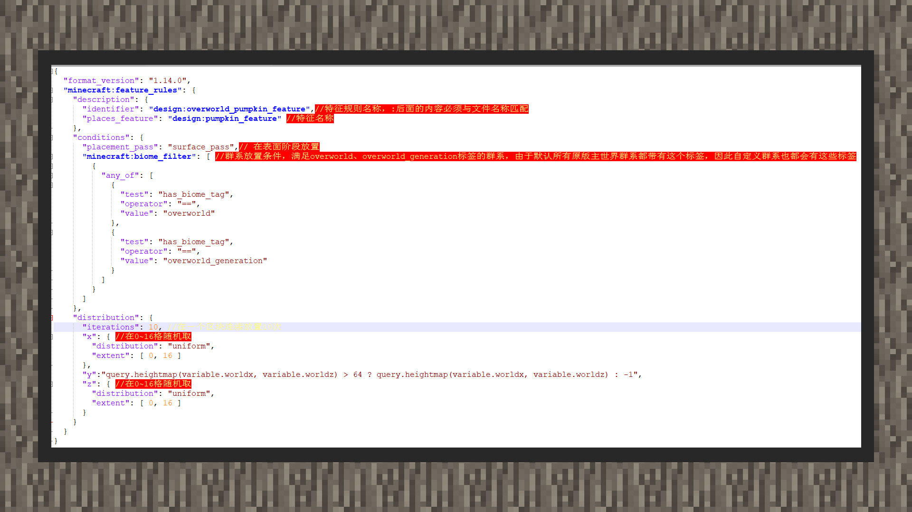

# 简易教程① 放置在高于水面的特征

#### 作者：境界

①原版世界的海平面在Y轴63格及以下，因此在放置某些自定义方块植物进入世界时，我们不希望它出现水面上。这里就用单方块组合和特征规则来展示如何放置一个高于水面的特征。

② 创建一个单方块特征，并将放置的方块类型设置为南瓜。

③新建一个特征规则，允许特征放置在全群系内，高度必须在64格以上而不包括64格，否则将特征放置在0格以下，即虚空位置。这里运用到了一种三元运算符，可以简单理解为条件 ？ 满足的话执行这里 : 不满足的话执行这里。