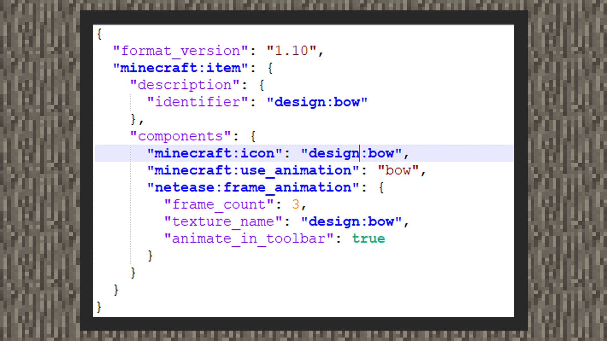
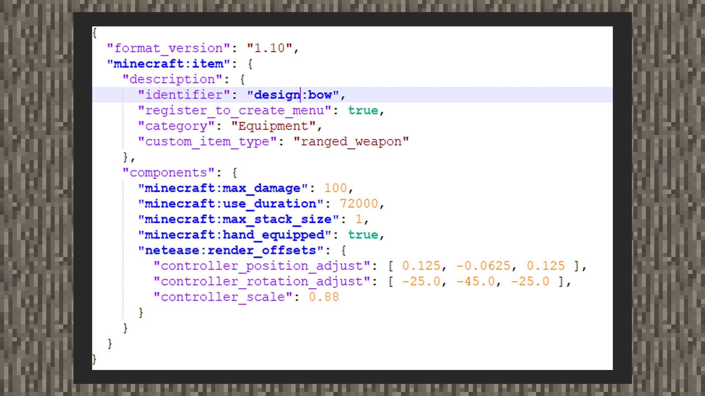
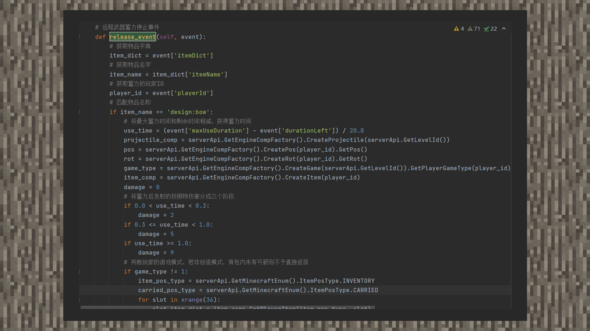
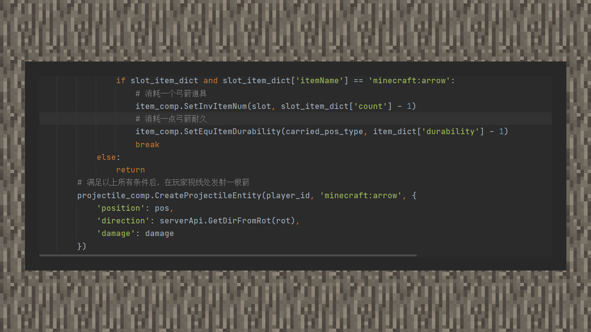

# 自定义远程武器

#### 作者：境界

目前，我的世界中国版支持以弓为主的自定义远程武器。使用附加包可以添加新的弓道具以及弓的手持位置与拉伸动画。使用弓的功能逻辑则会依赖MODSDK，我们将这两个部分各自拆解一下。

#### 材质包配置

①自定义弓的命名必须在符号“:”后以bow结尾，这样子才会在接下来为物品添加使用弓动画组件行为时，动画会正常播放。

②minecraft:icon会指向一个贴图资源短名路径，它会由开发者自己在textures文件夹下的item_texture.json定义。

③minecraft:use_animation会为物品在玩家使用时做出某个动画，这里我们添加bow这个值，以便玩家拉伸弓的时候默认下会慢慢移动，并且视角缩小。

④netease:frame_animation内有三个键对，frame_count指的是弓箭拉伸时一共有多少张序列图会播放，在原版的弓中，玩家拉伸弓到最底一共会播放三张贴图。

#### 行为包配置

①必须将custom_item_type设置为ranged_weapon

②minecraft:max_damage用来设置弓的最大耐久值。

③minecraft:use_duration用来设置弓的可拉伸蓄力的使用时间，我们需要将时间设置的足够长，以免出现在一段时间内出现重复蓄力的问题。

④minecraft:max_stack_size用来设置弓的堆叠数量，弓属于武器装备范畴，因此建议一个栏中只能堆叠一个。

⑤minecraft:hand_equipped用来将自定义弓在第三人称的渲染形象和原版弓一致。

⑥netease:render_offsets用来设置自定义弓在第一人称的手持位置，其中controller_position_adjust用来控制位置，controller_rotation_adjust用来控制角度，controller_scale用来控制大小缩放。

#### 发射投掷物功能

①监听ItemReleaseUsingServerEvent事件

②根据蓄力的时间，由开发者决定根据时间的长短来划分箭的伤害，以达到模拟出原版弓箭发射时的动态伤害效果。

③判断玩家的游戏模式，若为创造模式，不消耗弓的耐久和箭的数量的前提下，即可发射箭。若非创造模式，则会搜索背包内是否有箭道具，有则消耗并扣除一点弓耐久，否则直接返回，不执行后面发射箭的逻辑。