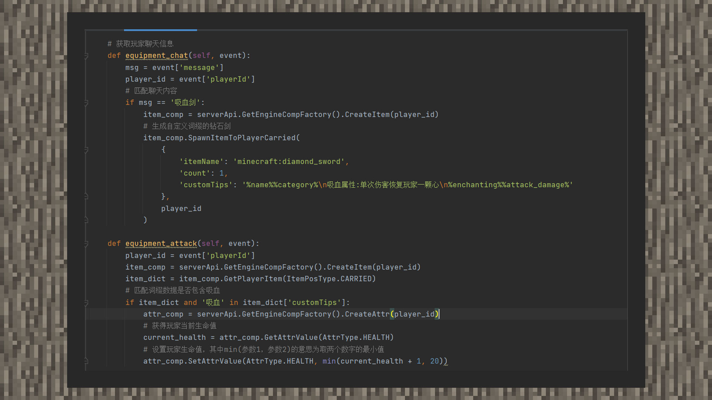
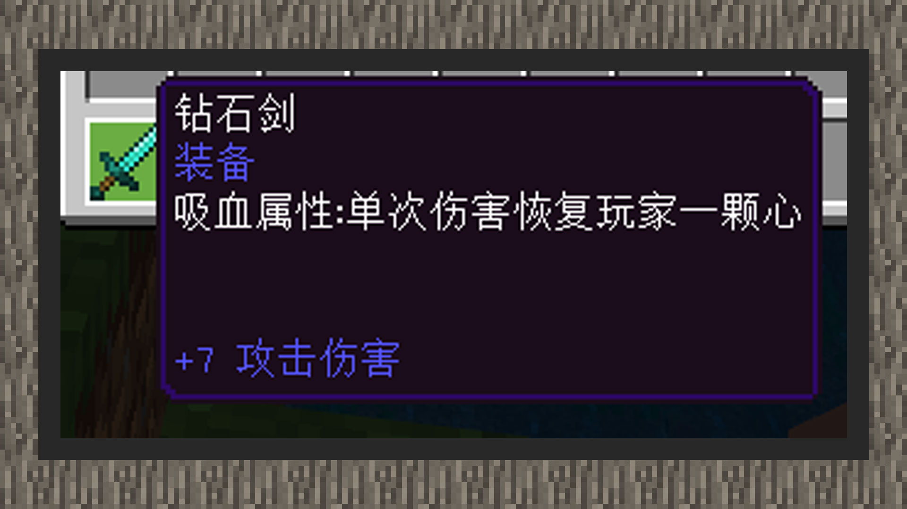

# 简易教程② 增加武器吸血属性

#### 作者：境界

吸血剑示例包下载：下载[示例包](https://g79.gdl.netease.com/guidedemo-case15.zip)。

#### 代码逻辑

①监听ServerChatEvent和PlayerAttackEntityEvent，通过输入聊天信息“吸血剑”，获得带有吸血词缀的钻石剑。

②在玩家攻击实体的事件回调函数内，获取手持物品并匹配词缀信息，然后通过attr组件来获得玩家生命值，并设置新的生命值。

#### 效果图如下：

