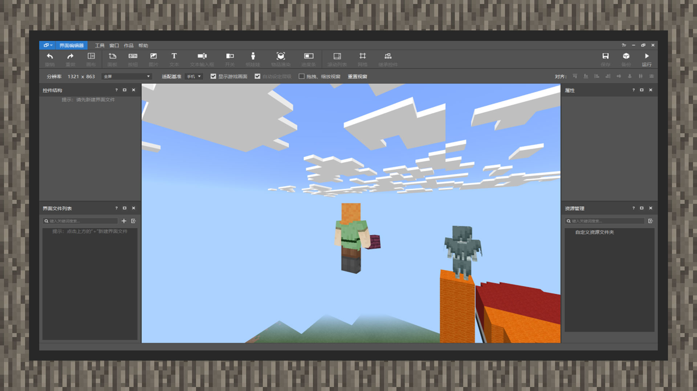
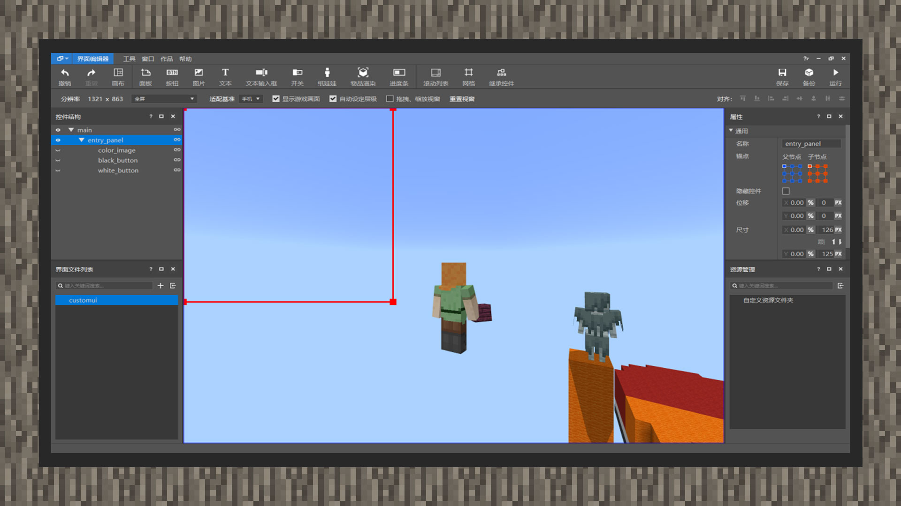
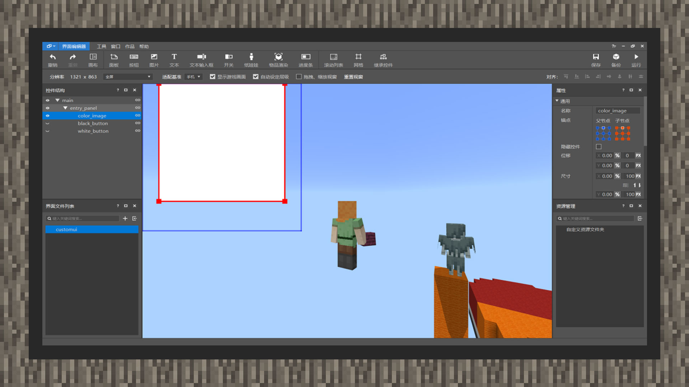
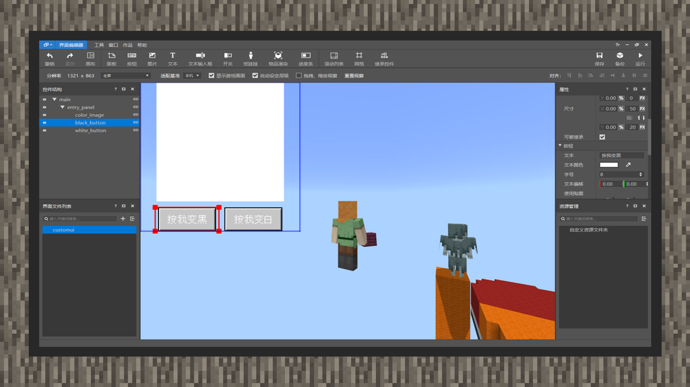

# 使用UI编辑器绘制基础界面

#### 作者：境界

①进入工程后，左上角的编辑器选项选择UI编辑器。

②UI内容最后会被放入一个JSON文件，它位于资源包的ui文件夹内。因此我们在左下角的界面文件列表右侧，点击“+”号新建一个界面文件，命名为custom_ui

③界面文件新建后，会自动在左上角的控件结构中，新增一个名为main的主画布，这个名字可以任意更改，在后续使用MODSDK声明界面的画布入口时，填对即可。为了统一辨识度，我们将在下面的内容中，对每个控件进行严格的命名，比以节点代称，方便开发者能够更好的阅读。

④在main节点下，新建一个面板控件，并将它的名称改为entry_panel，即入口面板。

⑤将entry_panel节点设置为125px长，125px宽，点击属性中的锚点，将锚点设置为左上角。它会自动对齐左上角，而无需通过拖曳的方式来对齐。

⑥在入口面板节点下挂载一个图片控件，我们将其命名为color_image。向下拉，将使用贴图设置为原生，轻击原生按钮入口，会跳出一个电脑的资源管理器，它会自动定位到原版资源文件夹下的textures文件夹，我们选择ui文件夹，并找到white_background.png贴图，选择它。

⑦在color_image节点属性下拉到最低，找到图片适配选项，将九宫格类型选择原版类型，在上、下、左、右四个栏的任意一栏将0像素点写为1像素点。这样贴图资源将会与节点大小匹配，平铺整个控件。

⑧将图片节点拉为100px长，100px宽，锚点的父节点和子节点都选择向中间上部对齐。

⑨在entry_panel节点下，新建一个名为black_button按钮，将大小设置为50px长，20px宽。此时按钮内文字会超过按钮的大小，显示不全，在black_button节点属性下，将文字字号设置为8号。并将文字设置为：按我黑色。

⑩在控件结构面板下，右键black_button节点，复制一次。紧接着选择entry_panel节点，粘贴上去。并将新的按钮控件名称改为white_button。将文字设置为：按我白色。

⑪将black_button、white_button节点锚点对齐中间下部，将两个按钮平行分开。在后面使用MODSDK创建界面时，我们将会学习如何绑定按钮，通过代码让白色贴图在黑色和白色之间来回变化。