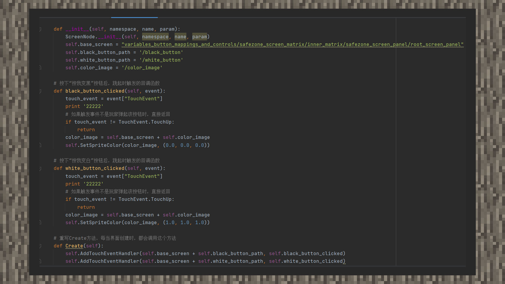

# 绑定界面控件和脚本

#### 作者：境界

①在 __ init __ 下新建四个实例变量，分别对应继承基础画布后出现的主节点路径，主节点路径下的color_image路径，主节点路径下的black_button路径，主节点路径下的white_button路径。

②重写Main类的Create方法，使用AddTouchEventHandler接口添加两个按钮的回调，第一个参数是路径，第二个是回调函数名。

③在回调函数内，将color_image图片设置为黑色或白色，其中白色的rgb值为255，255，255，除以255后为0.0,0.0,0.0。黑色的rgb值为0，0，0，除以255后为1.0，1.0，1.0。