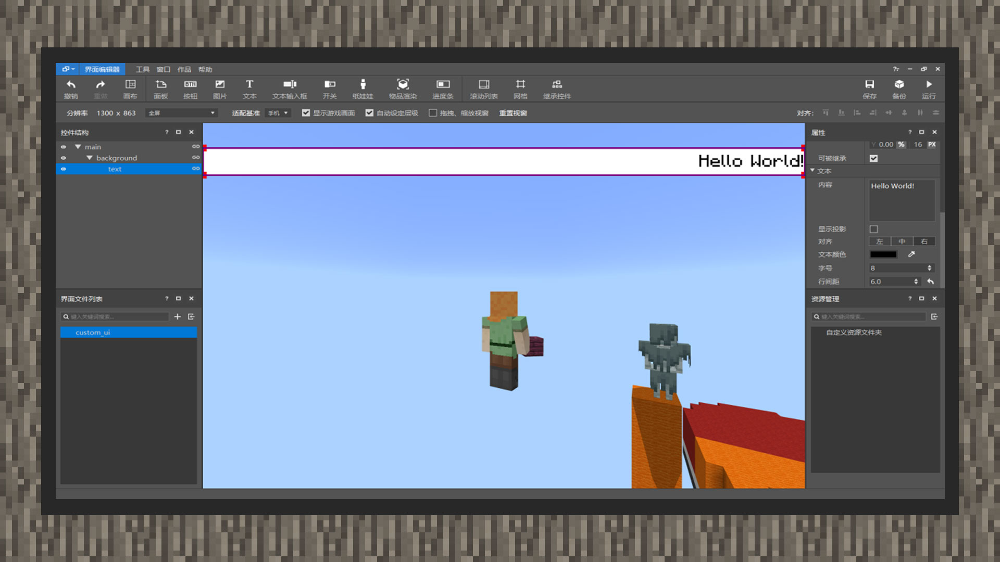
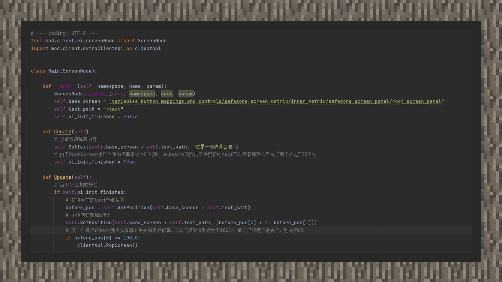

# 简易教程①：制作一个滚动弹幕

#### 作者：境界

#### 设计UI部分：

①在主节点下新建一个图片控件，命名为background，将图片资源类型改为原生，指向textures/ui/white_background.png。并打开原版九宫格，在“上"位置填入1px，使贴图可以被自由拉伸到与控件大小相符合。紧接着，将图片长度大小从固定大小改为百分比大小，设置为100%，将宽度大小设置为固定大小16px。

②将background节点的锚点设置为居中靠上，向下偏移15px。

③在background节点下，新建一个文本控件，命名为text，锚点设置为居中，长度大小同样设置为100%的百分比大小，宽度大小设置为固定大小16px。将字颜色设置为黑色，字号设置为8，添加6的行间距让字靠中对齐，并将字的对齐方式设置为向右对齐。

④将text节点偏移量设置为向左偏移100%的百分比大小，即-100%。这样字就会超出屏幕显示区域，同时顶在屏幕的左边。

⑤打开ui源文件，对background控件进行自定义，向里面加入alpha键对，值为透明度的值，1.0代表不透明，0.0代表全透明，这里设置为0.9。同时添加color键对，可以对图片进行颜色叠加，这里设置为"color": [0.3647, 0.3647, 0.3647]，即灰色的RGB值92，92，92除以255得出的结果。这样可以让白色背景变成灰色，并带有透明度。会更加的好看。

#### 脚本代码部分：

重写UI类的Create方法和Update方法，当UI每一游戏刻更新时，都会调用Update方法，我们在里面更新text节点的位置，让它从左边往右边移动。而Create方法会在UI创建后调用，在这里我们对文本内容进行设置。