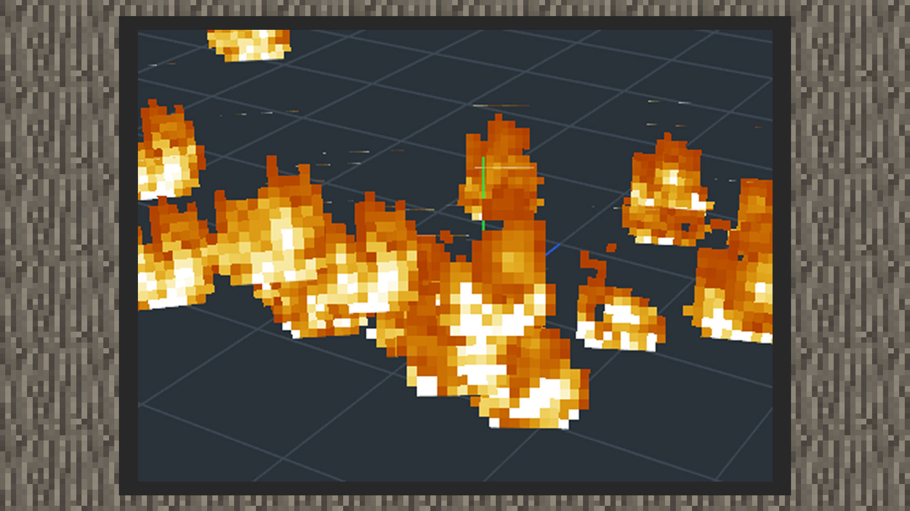

# 粒子和粒子发射器的关系

#### 作者：境界

在3D游戏世界中，许许多多模糊现象的视觉效果是由特效这一概念包装而成。经常用到这一概念的现象有火、爆炸、烟、水流、雪、尘等这些抽象视觉效果。粒子发射器是操控粒子在三维空间位移运动的典型实现，而其中各种动态变化的部分再由技术团队进行包装后提供粒子行为参数来操控。中国版目前的下界更新版本上，同时支持原版粒子自定义与MODSDK粒子自定义，虽然功能细节上可能略微带有差异，但制作粒子特效、序列帧特效的思路没有太多差异，学会其中一种后去迁移学习到另一种系统带来的学习成本会少很多，让我们来看看它们相同的地方吧。

|          | 原版粒子                                           | 特效粒子                                           |
| -------- | ------------------------------------------------------------ | ------------------------------------------------------------ |
| 发射器   | 1）原版粒子发射器一共有5种形状，它们分别是：点、球形、方形、平面形、生物碰撞箱形。 发射器形状使粒子沿着形状的表面分散，并控制粒子的发射方向和方向。例如，粒子发射器设置为方形，则粒子会在一个方型空间分散开来，若设置为点形，则粒子会在一个点上聚集。 2）可以通过设置发射器的大小来缩放特效的大小。 | 1）特效粒子发射器一共有4种形状，分别是球形、半球形、圆柱形、方形。 发射器形状使粒子沿着形状的表面分散，并控制粒子的发射方向和方向。例如，粒子发射器设置为方形，则粒子会在一个方形空间分散开来，若设置为点形，则粒子会在一个点上聚集。 2）可以通过设置发射器的大小来缩放特效的大小。 |
| 变化     | 1）粒子可以随参数调整加速度和阻力、旋转角度、旋转速度等，在三维空间内进行位移、旋转。 2）粒子具有数量概念，例如：将粒子形状变成火，通过改变数量可以增加或减少火的数量。 3）粒子具有大小的概念，例如：将粒子形状变成火，一团火在世界中的显示大小同样可以调整。 |                                                              |
| 朝向方式 | 1）粒子朝向方式可以设置为面向相机、面向地面、面向方向，是指粒子在玩家视线中朝向何种方向的参数。 面向相机是指粒子始终朝向玩家相机视角，无论在任何角度看向这个粒子都能看到它完整的样子。【图例1】 面向地面是指粒子会在Y轴方向始终朝向玩家视角，即玩家视角与地面平行时，可以看到完整的粒子效果。若头朝下方看向粒子，则无法看到粒子的完全样貌。【图例2】 面向方向是指粒子朝向某个特定方向，如：地面冒出一滩绿色液体，开发者希望粒子紧贴着地面，则将朝向方式设置为朝向Z轴。【图例3】 |                                                              |
| 持续时间 | 1）粒子具有生命周期存留的时间概念，当持续时间结束时，粒子会消失。 2）粒子具有循环播放和只播放一次的选项，当设置为循环时，粒子在持续时间结束后，会在初始位置重新出现。而设置为播放一次时，则粒子消失后就不再会出现。 |                                                              |
| 渲染     | 1）原版粒子同样需要贴图纹理和材质，单张粒子贴图导入进snowstorm编辑器时，会自动匹配贴图大小。若是由多张带有连续性变化的粒子贴图拼接而成序列帧，则需要将UV模式改成动画模式，通过设置uv起点、uv大小、uv步进、帧率、最大渲染帧数等参数来播放序列帧。 2）原版粒子当前支持的材质为透明、半透明、不透明。 3）原版粒子可以着色。 | 1）特效粒子需要贴图纹理，不需要额外设置材质种类。 2）开发者需要提前确定特效粒子种类是使用单张贴图还是序列帧，序列帧需要先用TexturePacker工具进行打包后输出配置文件搭配使用。 3）特效粒子可以着色，形式可以选择透明度叠加或者颜色值叠加模式。 |

#### 朝向相机【图例1】

#### 朝向地面【图例2】

#### 朝向Z方向【图例3】

