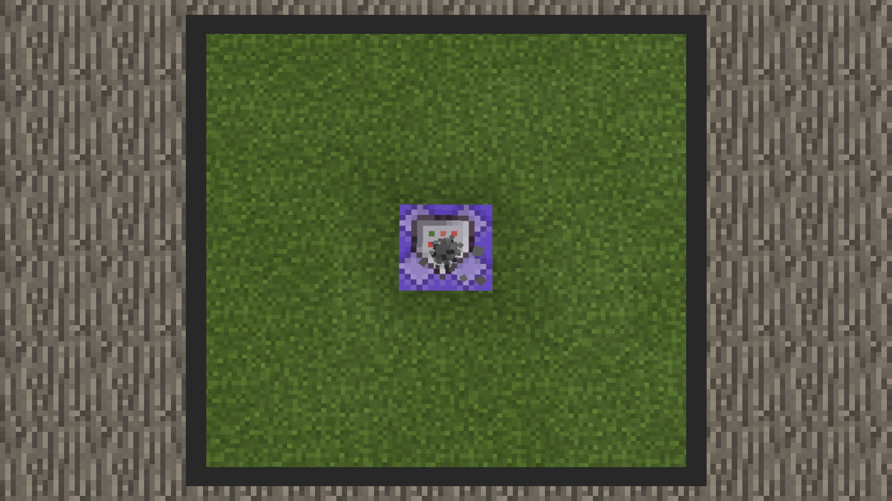
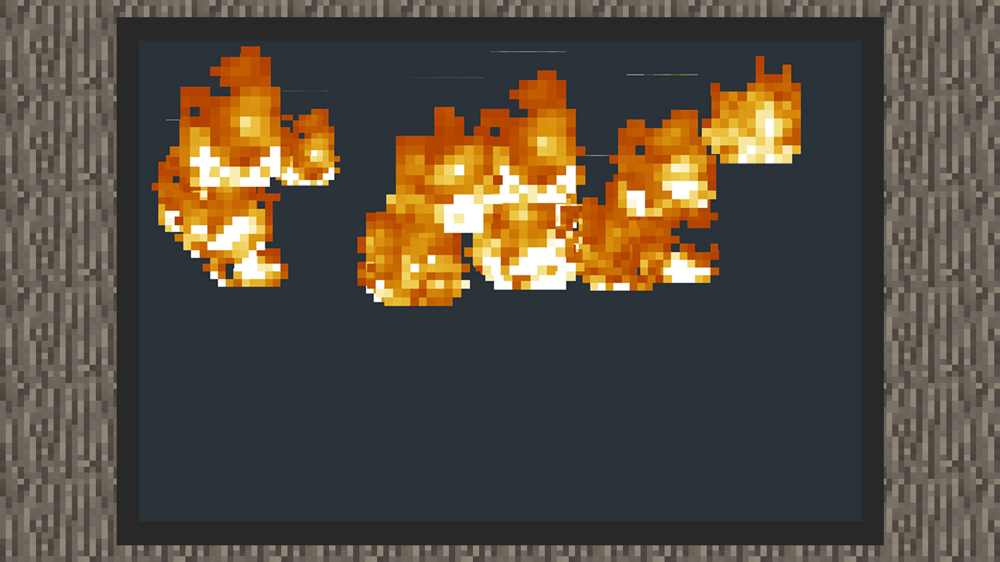
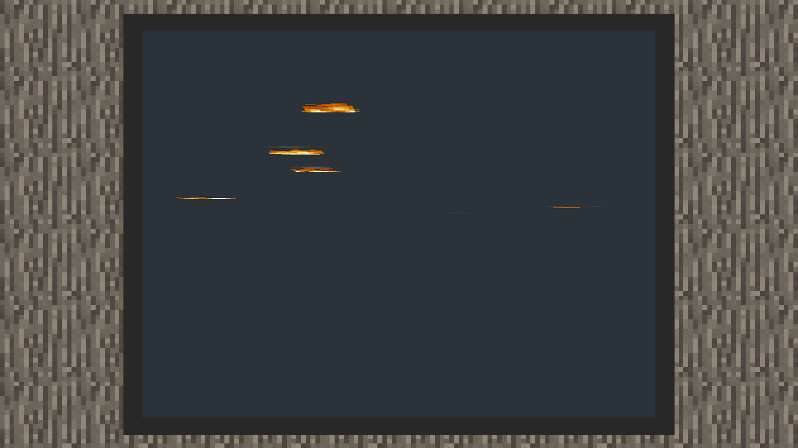
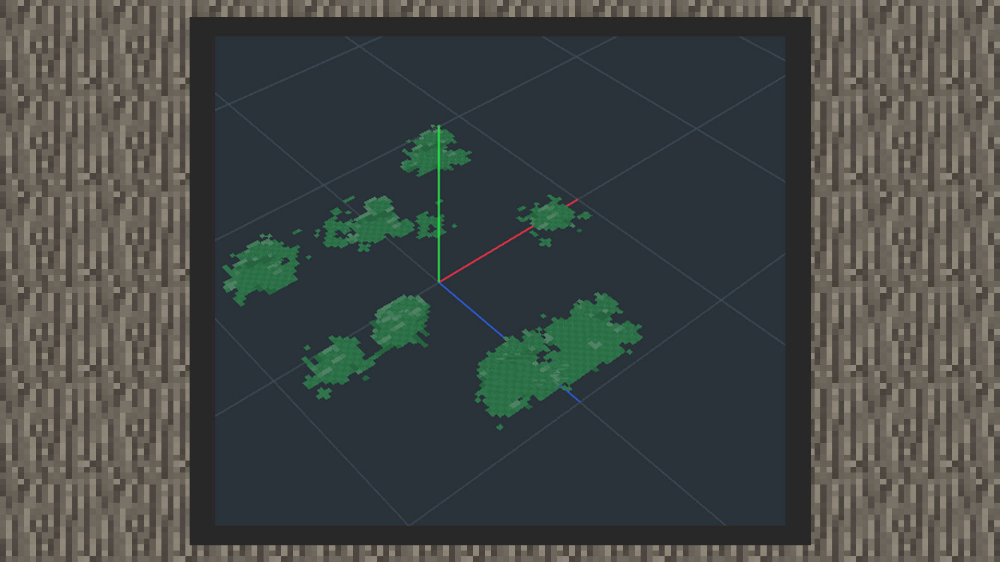

# 识粒子的朝向方式

#### 作者：境界

#### 面向相机

开发者如果希望粒子在玩家从任何角度过去都是最完整的样子，如原版世界中的烟雾粒子、爱心粒子、村民愤怒的粒子，在制作原版粒子或是特效粒子时，可以选择面向相机的朝向方式。

1）在snowstorm编辑器中，面向相机一共有Rotate xyz和lookat xyz两种朝向方式。

2）在MCSTUDIO的特效编辑器中，面向相机就是被称为面向相机的朝向方式，可以在朝向方式面板里找到。

#### 面向地面

开发者如果希望粒子朝向方式垂直于Y轴的，可以选择面向地面的朝向方式。在这个效果里，开发者可以看到低下头只能看到粒子的一部分，这是因为粒子的贴图是与水平地面垂直的。

1）在snowstorm编辑器中，面向相机一共有Rotate y、lookat y两种朝向方式。

2）在MCSTUDIO的特效编辑器中，面向地面的朝向方式可以在朝向方式面板里找到。

#### 面向方向

开发者如果希望粒子朝向方式面向某个方向，如希望粒子贴图纹理与地面紧紧贴合，或者希望粒子紧贴在一个广告牌上，就要用到面向方向的朝向方式。

1）在snowstorm编辑器中，面向方向的朝向方式有Direction x、Direction y、Direction Z三种。注意：使用这个模式需要将motion的mode改成Parametric，再设置Motion面板下的Direction，这样粒子才会在世界里正常显示。

2）在MCSTUDIO的特效编辑器中，水平朝向方式相当于原版粒子的Direction Z。