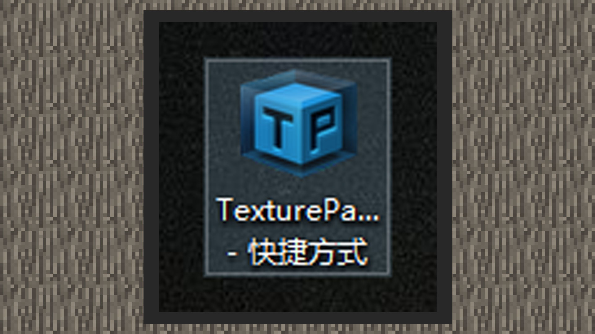

# 使用序列帧强化效果

#### 作者：境界

#### 配置序列帧文件

1）在制作原版粒子和特效粒子时，用带有连续性的动态贴图可以增强粒子的视觉效果。原版粒子的序列帧贴图不需要额外配置文件，只需用snowstorm编辑器设置好FPS、最大帧数、uv等参数即可，而特效粒子的序列帧，需要借用TexturePacker这个软件进行打包后输出一份配置文件才能被特效编辑器使用。

2）再用texturepacker打包序列帧时，需要注意的配置如下：

Allow rotation不要勾选；

Trim mode选择为None；

这样导出的大图中每一幅小图都一样大，当前特效编辑器支持的序列帧只支持大小相同的子图。

同时序列帧贴图有以下规范：

贴图格式为 png；

原版粒子单张贴图最大不超过2048x2048；

特效粒子单张贴图大小不超过512x512；