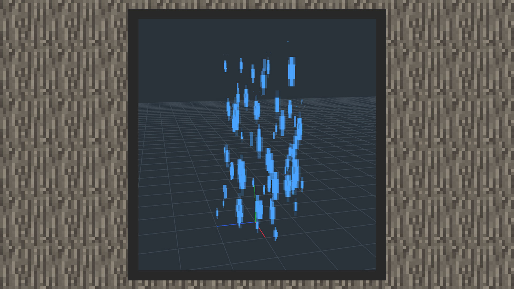
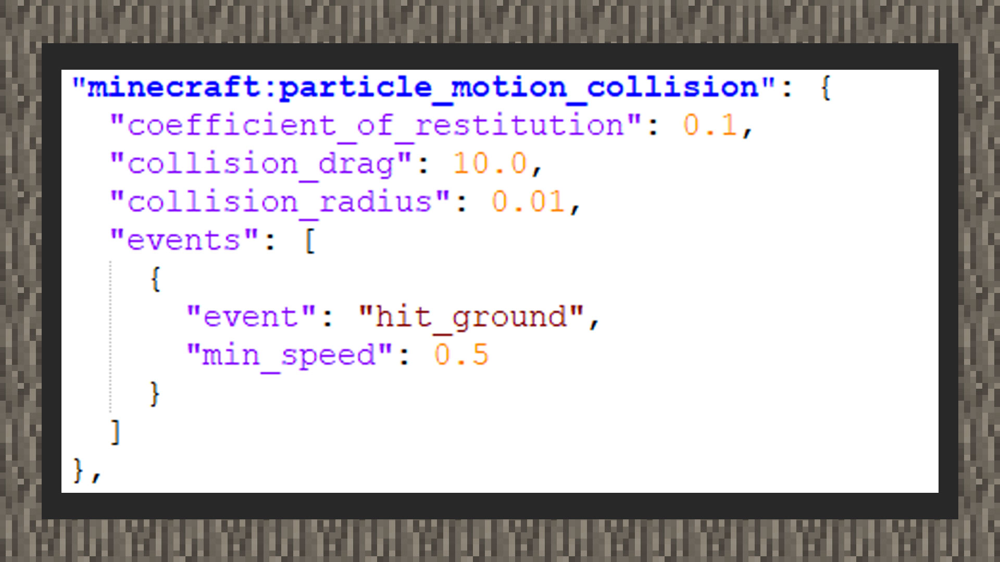
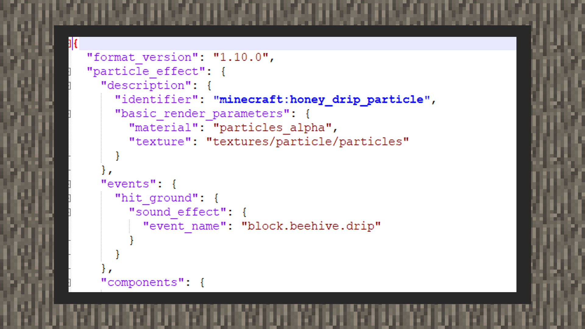

# 理解粒子碰撞与事件


#### 作者：境界


#### 产生碰撞

1）该功能只能作用于原版自定义粒子。

2）打开snowstorm编辑器，下拉到collision面板，在Enable窗口输入true，其中collision drag代表粒子与环境产生碰撞后，作用于粒子上的阻力。值越大，粒子碰撞环境后的阻力越大，粒子可能会减速到停止；值越小，粒子可能会顺着环境方块而贴着位移。Bounciness代表粒子于环境产生碰撞后的弹力，弹力越大，粒子与环境方块后的反弹力越大，弹力越小，粒子与环境方块后的反弹力越小，可能会出现多次弹跳的现象，取值范围在0.0~1.0之间。Collision Radius用于最小化粒子与环境方块的重叠问题，该值必须在0.0~0.5之间，不设置时，粒子贴图可能有部分区域会陷入方块内。Expire on Contact意为当粒子与环境产生碰撞时进行自我销毁。




【与环境产生碰撞而自行销毁的方型发射器雨水粒子，可以看到粒子掉落至坐标轴上后不会继续下渗】


#### 触发事件

1）该功能只能作用于原版自定义粒子，并且当前尚未实装于snowstorm编辑器中，需要开发者进行手写配置。




```
{
    "format_version":"1.10.0",
    "particle_effect":{
        "description":{
            "identifier":"...",
            "basic_render_parameters":{
                "material":"particles_alpha",
                "texture":"textures/particle/particles"
            }
        },
        "events":{
            "hit_ground":{
                "sound_effect":{
                    "event_name":"..."
                }
            }
        },
        "components":{
            "minecraft:particle_motion_collision":{
                "coefficient_of_restitution":0.1,
                "collision_drag":"10.0",
                "collision_radius":0.01,
                "events":[
                    {
                        "event":"hit_ground",
                        "min_speed":0.5
                    }
                ]
            }
        }
    }
}
```


2）需要minecraft:particle_motion_collision指定事件名称，可以触发多个事件，min_speed意为触发事件的最短时间。




```
{
    "format_version":"1.10.0",
    "particle_effect":{
        "description":{
            "identifier":"...",
            "basic_render_parameters":{
                "material":"particles_alpha",
                "texture":"textures/particle/particles"
            }
        },
        "events":{
            "hit_ground":{
                "sound_effect":{
                    "event_name":"block.beehive.drip"
                }
            }
        }
    }
}
```

3）在particle_effect下定义events，播放音效，音效以sound_definitions.json里的音效资源路径名称为准。