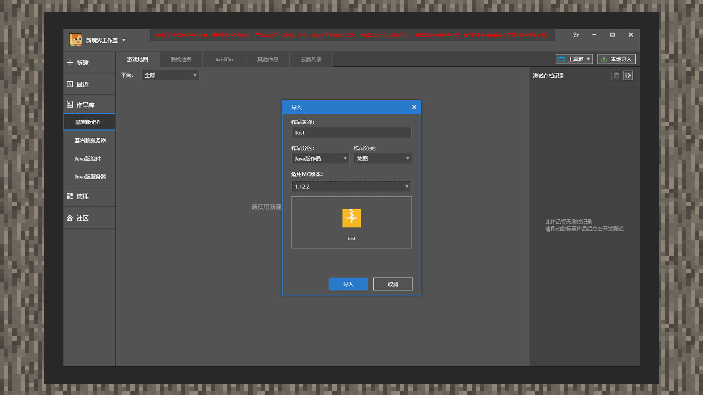
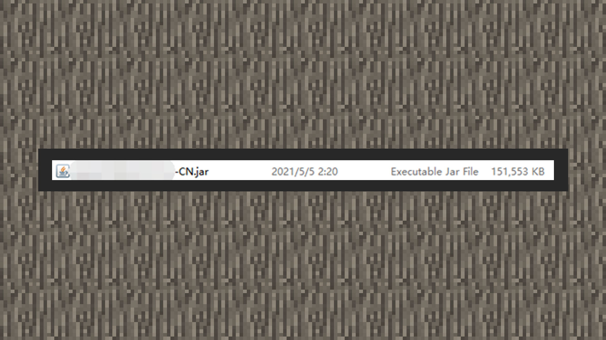
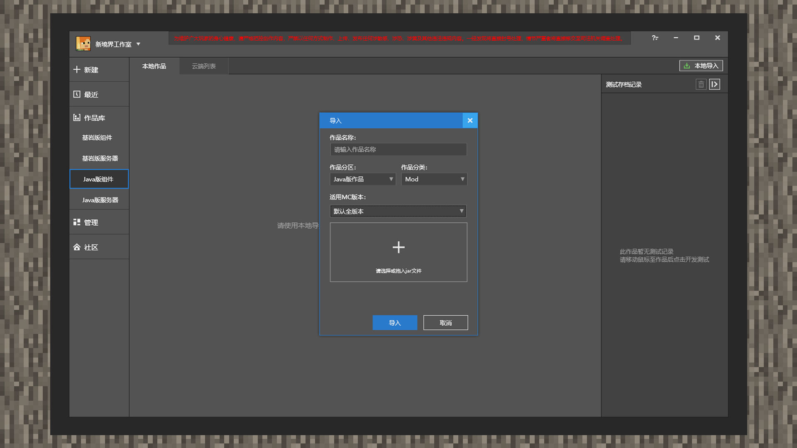
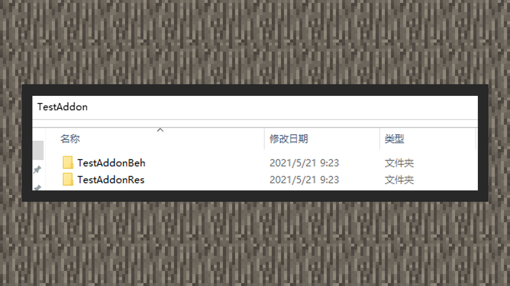

# 包体的结构和导入

#### 作者：境界

包体也被称为Package，它是由开发者将本地的JAVA版资源内容和基岩版资源内容进行压缩打包后的档案。在中国版开发者平台拿到上传的包体后，通过机器审核和人工审核后，包体最终会被推送至公共下载服务器。最后再由玩家下载后压缩包后，经客户端解压才能玩到组件资源。

在上传至平台前，开发者应确保在本地开发的内容达到了预期的运行效果。并遵照本章的打包方式进行压缩打包，降低机器审核的打回概率或审核时间。

### 认识JAVA包体结构

#### PC地图

1) 截图截选了我的世界JAVA版1.12.2游戏客户端生成的世界存档的内容。test文件夹下存放着名为test的世界信息。

2) 打开这个客户端可以看到test存档。

3) 返回到目录的上一级，saves文件夹下则会存放着这个客户端可以启动的所有存档文件夹，其中就有前面提到的test存档。

4) 打开MCSTUDIO，点击作品库后再点击Java版组件。在右上角点击本地导入，【作品分区】选择Java版作品。【作品分类】中选择地图。【适用MC版本】选择对应存档本版。若支持多个版本可以选择多个相应版本。

5) 点击导入窗体内的+号按钮，直接选择test文件夹后点击选择文件夹。

6) 最后点击导入按钮，即可由MCSTUDIO拷贝作品后导入进作品库内，进行后续的测试、发布、配置等操作。若开发者选择删除作品，也不会影响到最原先的存档文件夹。

7) 开发者不通过MCSTUDIO而选择自行打包时，请将存档文件夹使用7Z压缩工具打包成一个后缀为7z的压缩文档。再通过开发者平台进行上传操作。

#### PC MOD

1) 上传平台的MOD文件必须以jar格式作为分发给玩家游玩的标准文件格式。

2) 打开MCSTUDIO，点击作品库后再点击Java版组件。在右上角点击本地导入，【作品分区】选择Java版作品。【作品分类】中选择Mod。【适用MC版本】选择对应存档本版。若支持多个版本可以选择多个相应版本。

3）点击导入窗体内的+号按钮，直接双击或选择jar文件后选打开。

4) 最后点击导入按钮，即可由MCSTUDIO拷贝作品后导入进作品库内，进行后续的测试、发布、配置等操作。若开发者选择删除作品，也不会影响到最原先的jar文件。

5) 开发者不通过MCSTUDIO而选择自行打包时，请将jar文件放入一个文件夹内，将文件夹用7z压缩工具压缩成7z后缀格式的压缩包。再通过开发者平台上传组件资源源文档。

#### PC 材质

1) 截图主要展示JAVA版材质的目录和文件结构。

2) 直接将材质文件夹内的内容全部选取后右键保存成zip压缩文档。

3) 打开MCSTUDIO，点击作品库后再点击Java版组件。在右上角点击本地导入，【作品分区】选择Java版作品。【作品分类】中选择材质。【适用MC版本】选择对应存档本版。若支持多个版本可以选择多个相应版本。

4) 点击导入窗体内的+号按钮，直接双击或选择zip文档后选打开。

5) 最后点击导入按钮，即可由MCSTUDIO拷贝作品后导入进作品库内，进行后续的测试、发布、配置等操作。若开发者选择删除作品，也不会影响到最原先的材质压缩档。

6) 开发者不通过MCSTUDIO而选择自行打包时，请将材质压缩文档放入一个文件夹内，将文件夹用7z压缩工具压缩成7z后缀格式的压缩包。再通过开发者平台上传组件资源源文档。

#### PC 光影

1) 截图主要展示JAVA版光影的内容目录和文件结构。

2) 直接将文件夹内的所有文件全部选取后右键保存成zip压缩文档。

3) 打开MCSTUDIO，点击作品库后再点击Java版组件。在右上角点击本地导入，【作品分区】选择Java版作品。【作品分类】中选择光影。【适用MC版本】选择对应存档本版。若支持多个版本可以选择多个相应版本。

4) 点击导入窗体内的+号按钮，直接双击或选择zip文档后选打开。

5) 最后点击导入按钮，即可由MCSTUDIO拷贝作品后导入进作品库内，进行后续的测试、发布、配置等操作。若开发者选择删除作品，也不会影响到最原先的光影压缩档。

6) 开发者不通过MCSTUDIO而选择自行打包时，请将光影压缩文档放入一个文件夹内，将文件夹用7z压缩工具压缩成7z后缀格式的压缩包。再通过开发者平台上传组件资源源文档。

#### PC 皮肤

1) 截图主要展示PC皮肤资源支持的文件格式，为结尾png的图片文档。该格式的图片保存着一道透明通道。

2) 打开MCSTUDIO，点击作品库后再点击Java版组件。在右上角点击本地导入，【作品分区】选择Java版作品。【作品分类】中选择皮肤。【适用MC版本】选择默认选择全版本即可。

3) 点击导入窗体内的+号按钮，直接双击或选择png文档后选打开。

4) 最后点击导入按钮，即可由MCSTUDIO拷贝作品后导入进作品库内，进行后续的测试、发布、配置等操作。若开发者选择删除作品，也不会影响到最原先的图片文档。

5) 开发者不通过MCSTUDIO而选择自行打包时，请直接通过开发者平台上传皮肤组件源图片文档。

#### PC 玩法

1) 截图截选了我的世界JAVA版1.12.2游戏客户端生成的地图的内容。test文件夹下存放着名为test的世界信息。命令方块玩法、数据包等是用我的世界JAVA版地图作为承载。

2) 打开这个客户端可以看到test存档。

3) 返回到目录的上一级，saves文件夹下则会存放着这个客户端可以启动的所有存档文件夹，其中就有前面提到的test存档。

4) 打开MCSTUDIO，点击作品库后再点击Java版组件。在右上角点击本地导入，【作品分区】选择Java版作品。【作品分类】中选择玩法。【适用MC版本】选择对应存档本版。若支持多个版本可以选择多个相应版本。

5) 点击导入窗体内的+号按钮，直接选择test文件夹后点击选择文件夹。

6) 最后点击导入按钮，即可由MCSTUDIO拷贝作品后导入进作品库内，进行后续的测试、发布、配置等操作。若开发者选择删除作品，也不会影响到最原先的存档文件夹。

7) 开发者不通过MCSTUDIO而选择自行打包时，请将存档文件夹使用7Z压缩工具打包成一个后缀为7z的压缩文档。再通过开发者平台进行上传操作。

### 认识基岩版包体结构

#### PE地图

1) 截图截选了我的世界基岩版1.16.12游戏客户端生成的世界存档的内容。英文数字组合名称的文件夹下存放着该存档的世界信息。

2) 打开MCSTUDIO，点击作品库后再点击基岩版版组件，分类选择【地图】。若勾选【复制文件到默认文件夹】，MCSTUDIO会将地图完整拷贝一份至C:/MCStudioDownload/work/开发者ID/Cpp/Map下。若不勾选，则不会做出此操作。

3) 勾选选项时，点击窗体内的+号。不勾选选项时，点击窗体内的选择按钮。双击存档文件夹或选择文件夹后点击【选择文件夹】按钮。

4) 最后点击导入按钮，即可由MCSTUDIO拷贝作品后导入进作品库内，进行后续的测试、发布、配置等操作。若开发者选择删除作品并且作品勾选【复制文件到默认文件夹】，则会系统会将C:/MCStudioDownload/work/开发者ID/Cpp/Map下相应的拷贝文件夹删除。

5) 开发者不通过MCSTUDIO而选择自行打包时，请将整个存档文件夹使用任意压缩工具打包成一个后缀为zip的压缩文档。再通过开发者平台进行上传操作。

#### PE 联机地图

1) 截图截选了我的世界基岩版1.16.12游戏客户端生成的世界存档的内容。英文数字组合名称的文件夹下存放着该存档的世界信息。联机地图指代可以同时在本地、本地联机、联机大厅上使用的地图资源。

2) 若世界存档携带附加包玩法，请确保存档文件夹目录下存有world_behavior_packs.json和world_resource_packs.json文件。其中pack_id对应材质包或行为包manifest内，header下的uuid。version对应manifest内header下的version。若只携带材质包或行为包，可以在world_behavior_packs.json内或world_resource_packs.json将第一个方括号内的内容全部清除。若不携带附加包，则则不需要在存档文件夹下携带此类文件。

3) 开发者可以在存档中放置一个server.properties，指定玩家的游戏模式。这样在联机大厅玩这个联机地图时，玩家每次进入都是server.properties文件中设置的游戏模式。更多基岩版多人联机地图的配置设定，请参考网址[https://zh.minecraft.wiki/w/%E6%9C%8D%E5%8A%A1%E7%AB%AF%E9%85%8D%E7%BD%AE%E6%96%87%E4%BB%B6%E6%A0%BC%E5%BC%8F](https://zh.minecraft.wiki/w/%E6%9C%8D%E5%8A%A1%E7%AB%AF%E9%85%8D%E7%BD%AE%E6%96%87%E4%BB%B6%E6%A0%BC%E5%BC%8F)

4) 当前MCSTUDIO暂不支持导入联机大厅地图，请将整个存档文件夹使用任意压缩工具打包成一个后缀为zip的压缩文档。再通过开发者平台进行上传操作。

#### PE Addon

1) 截图截选了我的世界基岩版Addon的内容。Addon又被称作附加包，它由材质包和行为包组成。因此开发者在上架完整的附加包内容（包含附加包和行为包），需依照接下来的规范进行打包上传即可。请注意：上架至中国版平台的附加包中，行为包内必须携带entities文件夹，材质包内必须携带textures文件夹。

2) 打开MCSTUDIO，点击作品库后再点击基岩版版组件。若勾选【复制文件到默认文件夹】，请将行为包、材质包全部选取后右键使用压缩工具压缩成zip文档，MCSTUDIO会在导入zip文档后，将一份完整拷贝放至C:/MCStudioDownload/work/开发者ID/Cpp/AddOn下。若不勾选，则直接选择带有行为包或材质包的文件夹即可。最后点击导入即可，之后开发者可以在MCSTUDIO进行后续的测试、发布、配置等操作。

3) 若开发者不通过MCSTUDIO而选择自行打包时，请将行为包、材质包全部选取后右键使用压缩工具压缩成zip文档。再通过开发者平台进行上传操作。

#### PE 材质

1) 附加包是行为包和材质包的统称，因此材质包被算入附加包的一种类型。因此开发者在上架完整的材质包内容前，需依照接下来的规范进行打包上传。请注意：上架至中国版平台的材质包内必须携带textures文件夹。

2) 打开MCSTUDIO，点击作品库后再点击基岩版版组件，在右上角点击本地导入，分区选择【基岩版作品】，分类选择【皮肤】。若勾选【复制文件到默认文件夹】，请将材质包文件夹右键使用压缩工具压缩成zip文档，MCSTUDIO会在导入zip文档后，将一份完整拷贝放至C:/MCStudioDownload/work/开发者ID/Cpp/Material下。若不勾选，则直接选择带有材质包的文件夹即可。最后点击导入即可，之后开发者可以在MCSTUDIO进行后续的测试、发布、配置等操作。

3) 若开发者不通过MCSTUDIO而选择自行打包时，请将材质包文件夹右键使用压缩工具压缩成zip文档。再通过开发者平台进行上传操作。

#### PE 光影

1) 光影的内容都被保存在材质包文件夹中，因此在运行机制与打包机制上与材质包类似。因此开发者在上架完整的光影内容前，需依照接下来的规范进行打包上传。请注意：上架至中国版平台的材质包内必须携带textures文件夹。

2) 打开MCSTUDIO，点击作品库后再点击基岩版版组件，在右上角点击本地导入，分区选择【基岩版作品】，分类选择【光影】。若勾选【复制文件到默认文件夹】，请将光影材质包文件夹右键使用压缩工具压缩成zip文档，MCSTUDIO会在导入zip文档后，将一份完整拷贝放至C:/MCStudioDownload/work/开发者ID/Cpp/Light下。若不勾选，则直接选择带有光影的材质包文件夹即可。最后点击导入即可，之后开发者可以在MCSTUDIO进行后续的测试、发布、配置等操作。

3) 若开发者不通过MCSTUDIO而选择自行打包时，请将带有光影的材质包文件夹右键使用压缩工具压缩成zip文档。再通过开发者平台进行上传操作。

#### PE 皮肤

1) 截图主要展示PE皮肤资源支持的文件格式，为结尾png的图片文档。该格式的图片保存着一道透明通道。

2) 打开MCSTUDIO，点击作品库后再点击基岩版版组件，在右上角点击本地导入，分区选择【基岩版作品】，分类选择【皮肤】。直接点击+号选择png结尾的皮肤图片即可。

3) 若开发者不通过MCSTUDIO而选择自行打包时，请将带有皮肤文件直接通过开发者平台进行上传操作。

