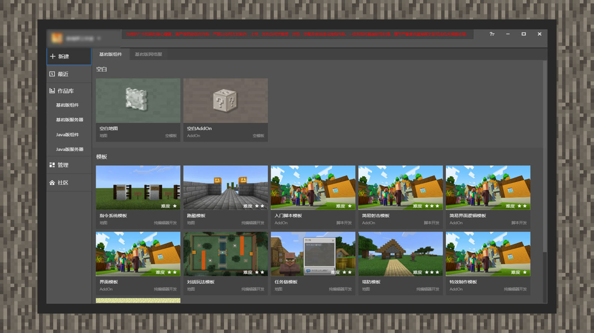

# 新建玩法项目

#### 作者：境界

进入MCSTUDIO后，系统默认停留在新建内容区域。当前工具只支持创建基岩版地图和基岩版Add-on。在基岩版组件-空白区域内，开发者可以选择创建地图模板或是Add-on模板。

它们的区别在于，创建地图模板后，你在编辑器内做的玩法，会与地图导出变成一个完整的玩法地图。建立Add-on模板时，最终只会导出Add-on玩法。

如果是一个新的Add-on玩法，开发者应当选择建立一个空白Add-on模板，点击启动编辑，就可以开始大展拳脚了。