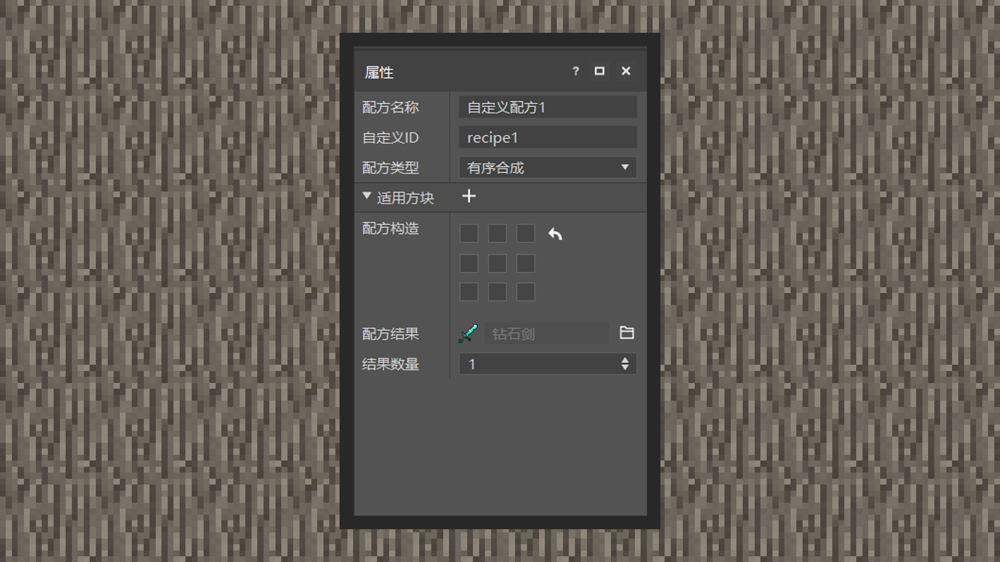
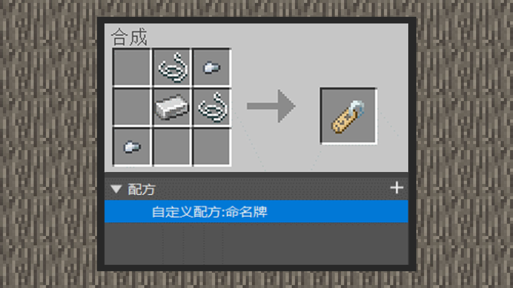
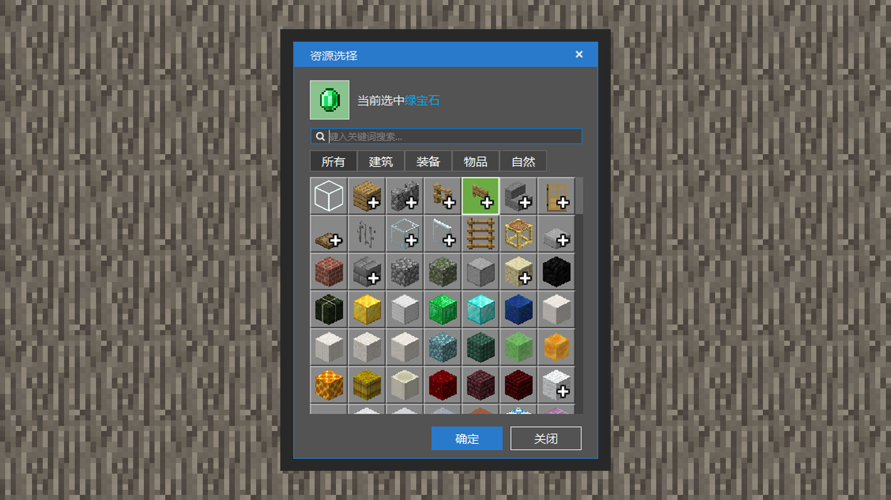

# 自定义一种新的配方

#### 作者：境界

#### 通过编辑器新建配方

移动鼠标点击添加组件，选择配方组件。

配方组件默认会自带一个新增配方，若开发者需要新增更多配方，点击配方组件右侧的“+”号按钮即可新增配方。

#### 了解配方的各个属性

配方名称只会在编辑器的组件区域显示。因此掌握良好的命名习惯可以帮助开发者在下次进入编辑器时快速回忆起配方的功能。

自定义ID是世界注册配方的唯一标识，若存在两个以上的配方标识一致，关联的配方会加载失败。因此命名可读性强的ID可以避免这一情况。注意：ID应以下划线/数字/英文为主，且对大小写不敏感，因此Aa和aa相同，开发者应以小写加下划线的格式为规范，例如：a_A，配方类型目前支持编辑有序合成、无序合成、熔炉配方。其中有序合成、无序合成适用在工作台中，熔炉配方适用于熔炉、高炉、篝火等中。

有序配方代表玩家需要按照格子顺序放好材料，工作台才会合成出配方道具。

无序配方代表玩家只需在格子上放好材料，工作台就会合成出配方道具。

配方结果是配方合成成功后，合成出的道具类型。

结果数量决定合成出的道具数量为几个。

#### 新建配方：可合成的命名牌

命名牌是游戏前期很难获得的道具，它只能在钓鱼、村民交易、和世界中的宝箱中找到。它可以给生物命名，防止生物被世界刷新掉。现在，通过MCSTUDIO的配方组件，开发者可以添加新配方来获得它。

新增一个配方组件，将默认的配方名称改为自定义配方：命名牌。

这里将自定义ID改为crafting_custom_nametag，开发者也可以输入自己认为可读性强的ID命名。

配方类型选择有序配方，适用方块选择工作台。

以上图例为配方构造示范，点击对应的网格，可以打开资源选择窗口。最快的方法是通过输入材料名称作为关键词搜素，选择好材料后，点击确认即可。

点击配方结果右侧的文件夹按钮，打开资源选择窗口再选择命名牌。

#### 新建配方：可合成的生物蛋

生物蛋是只有在创造模式下才能获得的道具。手持生物蛋点击方块可以生成一个对应的生物。现在，通过MCSTUDIO的配方组件，开发者可以添加新配方来获得它。

新增一个配方组件，将默认的配方名称改为自定义配方：村民蛋。

这里将自定义ID改为crafting_custom_villager，开发者也可以输入自己认为可读性强的ID命名。

配方类型选择无序配方，适用方块选择工作台。

以图例为配方成分示范，点击对应的“+”号按钮，选择成分右侧的文件夹按钮，可以打开资源选择窗口。最快的方法是通过输入材料名称作为关键词搜素。选择好材料后，点击确认即可。

点击配方结果右侧的文件夹按钮，打开资源选择窗口选择生成村民。